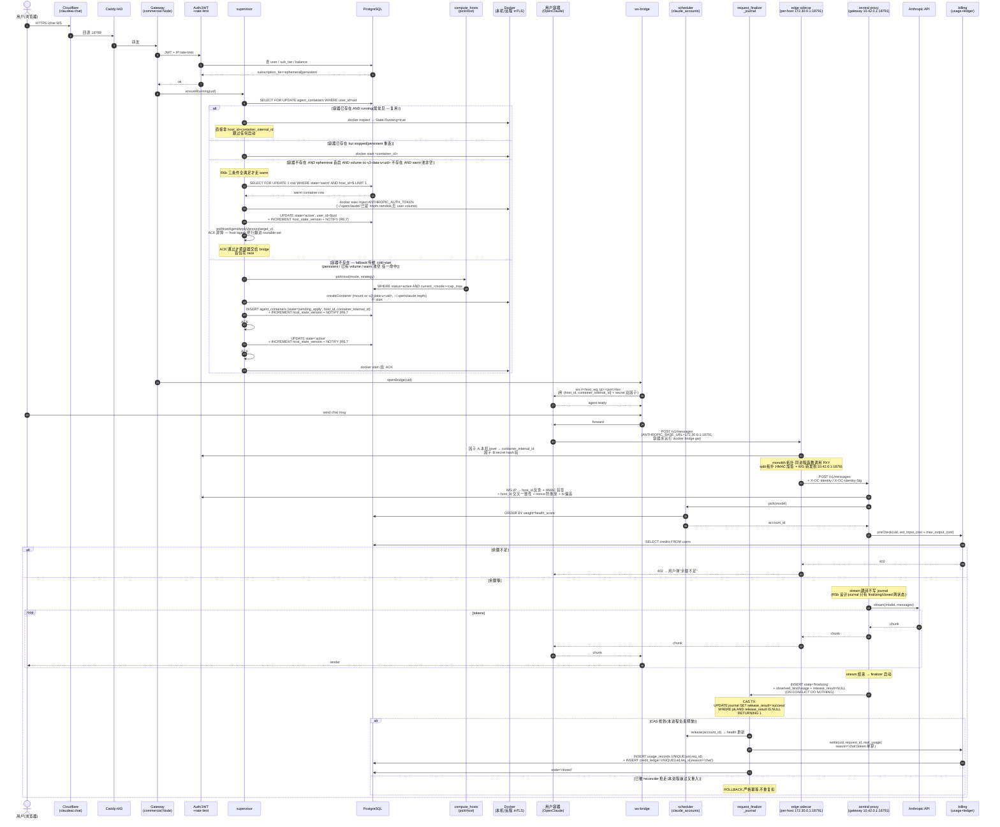

# OpenClaude v3 — 完整开发方案

> 创建: 2026-04-20
> 当前版本: **R6.11**(R6.10 → R6.11:闭合 codex 第二十一轮 2 FAIL + 2 WARN — **FAIL1** §4.2/§4.4 ws bridge / lifecycle 仍把"notExist/stopped/running"分支写在桥接层、直接 `supervisor.provision` / `supervisor.startAndWait`,与 §13.3 reader 唯一闸门冲突,实施时极易再次绕开 ledger 检查 → R6.11 把 §4.2/§4.4 全改为"桥接层唯一入口 = `await supervisor.ensureRunning(uid)`",分支下沉到 `ensureRunning` 内部子路径;**FAIL2** §9 3M CI lint 规则只是"5 行内出现 state 字符串",`SELECT ... FROM agent_containers WHERE state='active'` 不带 migration predicate 仍可通过 → R6.11 把 lint 升语义级"二选一"硬规则:reader 类调用栈要么调 `ensureRunning(uid)`(函数级 `// @oc-reader-entry` 标注白名单),要么 SQL 必须含 `NOT EXISTS (... agent_migrations ... phase NOT IN ('committed','rolled_back'))` predicate;新增 `scripts/lint-agent-containers-sql.test.ts` 三 fixture 负例验证(漏 predicate fail / 加 predicate pass / 白名单 pass);**WARN1** §13.3 仍含 `if (c.status==='stopped') return await this.start(c)` 旁路 docker start,与 R6.10 "docker start 单点 invariant" 写过头冲突 → R6.11 收窄不变量到 "**open migration 期间** docker start 单点由 reconciler 持有",非迁移期 reader 通过 `supervisor.startStoppedContainer(tx, c)` 合法触发(idle sweep / host restart 后拉起 stopped 容器,行状态本就 active 在 host-agent routable set,无需再 ACK);两条路径正交;**WARN2** 0019 schema 只有 `(phase, updated_at)` 服务 reconciler 扫描,新加的高频 `ensureRunning` 按 `agent_container_id` 点查会前缀失配 → R6.11 在 0019 加部分索引 `(agent_container_id) WHERE phase NOT IN ('committed','rolled_back')`,§2.5 + §6 + §14.2.6 CREATE 同步;新增 metric `reader_blocked_by_open_migration_total{phase}` 落入 §9 4L 健康面板"compute fabric"区块(持续 > 0/min 黄、> 5/min 红)。<br/><br/>**原 R6.9 → R6.10 闭合内容(已稳定,保留)**: 闭合 codex 第二十轮 1 FAIL + 0 WARN + 0 NIT — FAIL R6.9 `attached_route` Option A 留下的 reader 旁路:`§14.2.4` 把 `attached_route` 定义为 `state='active' + host_id=new`,⑥f 超时后 reconciler 必须重发 routing ACK + docker start 才算收敛;但 `§13.3 supervisor.ensureRunning` 老伪代码只看 `agent_containers.state IN ('active','pending_apply')` + `c.status='stopped'` 时直接 `docker start`,完全不查 `agent_migrations` 表,意味着用户在 ⑥f timeout 后立刻重连,`ensureRunning` 会把"`state='active' + phase='attached_route' + new host_id`"的行直接当成可复用容器返回 `{host:new, port}`,或当 stopped 时绕过 reconciler 路径直接 `docker start` —— 都打穿"docker start 必须在 routing ACK 通过后才能发"的主契约,等价 R6.9 才修好的"创建未应用就不放流量"约束被 reader 旁路漏出来。R6.10 闭合:① §13.3 重写 `ensureRunning` 必须 LEFT JOIN `agent_migrations` 上 `phase NOT IN ('committed','rolled_back')` 联合判定;② phase ∈ {`planned`,`created`,`detached`,`attached_pre`,`attached_route`,`started`} 任一未结束的迁移行 → 直接 throw HttpError(503, 'migration_in_progress', Retry-After=2),**绝不**返回 `{host,port}` 也**绝不** `docker start`,所有 docker start / route 决策由 §14.2.6 reconciler 单点驱动(单点 invariant);③ §9 3M reader matrix 把 `supervisor.ensureRunning` 行从 `state IN ('active','pending_apply')` 改为 `state IN ('active','pending_apply') AND NOT EXISTS (open migration)`,加 CI lint 规则锁死;④ §9.6 6G 新增 ⑭hex reconnect-during-attached_route e2e:在 ⑥f 超时后 100ms 内立刻重连,断言 (a) `ensureRunning` 在 reconciler 重发 routing ACK 成功前**必须**返回 503 `migration_in_progress`,(b) 整段时间 `docker start` spy 计数 == 0(只允许 reconciler 路径触发),(c) reconciler 周期跑完后下一次重连才返回新 host/port + 容器进程才 docker start;⑤ §14.2.6 contract bullets 加 R6.10 一条 "ledger 是 reader 的硬约束:任何 reader 路径(ensureRunning / chat 复用 / cold-start fallback)看到 open migration 必须返 503,docker start 单点 invariant 由 reconciler 持有";⑥ §14.2.4 (phase,state,host_id,next-action) 表加一列 "reader (ensureRunning) 行为" 显式标 `attached_pre/attached_route/started` 三行 = `503 migration_in_progress`,`planned/created/detached` 三行 = `503 migration_in_progress`(虽然 host_id=old + state=active/draining 看似可用,但 ledger 在锁,统一 503 让重试)。<br/><br/>**原 R6.8 → R6.9 闭合内容(已稳定,保留)**: 闭合 codex 第十九轮 2 FAIL — FAIL1 R6.8 `agent_migrations` ledger INSERT 落点过晚 + schema 跨节漏同步:R6.8 把 INSERT 放在 §14.2.4 ⑤bis(`docker create` **之后**),意味着 ③ pause + ⑤ docker create 与 ⑤bis 之间任一秒崩(pause-then-crash / create-then-crash)留下"旧 paused 容器 + 可能的新 created-not-started 孤儿 + PG `agent_containers.state` 仍 'active' + 无 ledger 行"的死区,§14.2.6 reconciler 既找不到 `pending_apply/draining` 也找不到 ledger 完全无信号可救;且 0019 schema 仅在 §14.2.6 局部叙述出现,从未进 §2.5 迁移表 + §6 schema 总览,落地时极易漏掉。R6.9 闭合:① §14.2.4 把 INSERT 提前到 ① pickHost 之后立即跑(`§14.2.4 ①bis`,在所有 rsync/freeze/create 之前),并新增 `planned` 作为最早 phase(7 改 8 phase);② `agent_migrations.new_container_internal_id` 列改 NULLABLE(planned 阶段尚未 docker create,无 cid 可填);③ `paused_at` 也改 NULLABLE 并在 ③ 实际 pause 时同事务 UPDATE 写入(reconciler 据 paused_at IS NULL/NOT NULL 决定是否需 unpause);④ §14.2.6 reconciler 加 `case 'planned'`(paused_at NOT NULL → unpause old;new_cid NULL → 新容器残留交给 §3H 1h orphan 兜底,因为没有 cid 反查不出来,但崩窗 < 5s 之内最多漏一个未 start 的新容器,可接受);⑤ §2.5 加 0019_v3_agent_migrations 行;⑥ §6 schema 列表加 `agent_migrations` 一行;⑦ §9.6 6G 加 ⑭quad / ⑭quint 两个 e2e 注入测试覆盖 pause-then-crash / create-then-crash;FAIL2 §9.6 ⑭bis/⑭ter 与 §14.2.4 / §14.2.6 phase/state/ACK 契约三处口径不一致:(i) ⑭bis(a) 写 phase='created' 但实际 ⑥a 同事务推进到 'detached',测试断言定义本身就错;(ii) ⑭ter 老版说 ⑥f 超时回滚到 `pending_apply` + ledger 'attached_route',但 §14.2.6 attached_route 恢复路径直接 docker start + commit,不经过 routing ACK 屏障 → "创建未应用就不放流量"主契约被打穿;(iii) §14.2.4 generic rollback 写"⑥d 之后 host_id 切回旧",但 §14.2.6 attached_pre/route 恢复策略是"以新 host 为准推前",两条路线互斥。R6.9 选 Option A(以新 host 为准推前)统一全篇:① 在 §14.2.4 开篇引入 **(phase, state, host_id, next-action)** 唯一对照表;② 修 ⑭bis(a) phase='detached';③ 重写 ⑥f 超时分支:**不**回退 state、**不**切 host_id,只 force-rm 旧 paused 容器 + 留 phase='attached_route' 等 §14.2.6 推前;④ 重写 §14.2.6 attached_route 恢复路径:**必须重发 routing ACK**(`tickHostAgentReconcile` 已确保 hot map 同步,但要主动 INCREMENT host_state_version + NOTIFY + ACK pollHostAgentApplyVersion 通过)再 docker start 再 commit;⑤ §14.2.4 generic rollback 措辞改为"⑥c 之后(host_id 已切到新)走 attached_pre/route 恢复路径,不再回滚 host_id";⑥ ⑭ter 测试断言改为"docker start 必须在 reconciler 重发 routing ACK 通过后才被调用"补 R6.9 主契约)
> 状态: codex 十轮 APPROVE(R5f) + R6.11 第二十四轮 APPROVE(R6.11.x 小补丁闭合第二十二轮 FAIL:§13.3 `tickIdleSweep` + `tickPersistentHealth` 显式 `state='active'` + `NOT EXISTS open migration`;R6.11.y 闭合第二十三轮 NIT:`tickIdleSweep` 注释 whitelist 口径与 §9 3M 对齐)
> 上一篇: [01-OVERVIEW.md](./01-OVERVIEW.md)(架构总览,差异见 §0)
> 全链路总览: §1.0 mermaid 主流程 + 后台任务图

## 0. 与 01-OVERVIEW.md 的差异(boss 2026-04-20 修订)

01-OVERVIEW 把 `account-pool` 标为"弃用",本方案**纠正**:

| 决策 | 01-OVERVIEW | 本方案(boss 修订) |
|---|---|---|
| 谁持有 Claude 凭据 | 每用户在自己容器内放自己的 OAuth/API key | **boss 维护共享账号池**,所有用户走 gateway 代理调 Anthropic |
| 模型/倍率/账号池配置 | (未明确) | **进管理后台**,前台用户看不到 |
| 前台设置范围 | (未明确) | **只保留与用户绑定的功能偏好**(主题/默认模型选择/通知/快捷键…) |
| 容器内 chat | 容器自己直连 Anthropic | 容器内 OpenClaude 设 `ANTHROPIC_BASE_URL=gateway 内部代理`,经账号池转发 |

其余决策(per-user docker、积分/支付、UI 基于个人版构建)保留。

## 1.0 全链路总览(R6 新增,boss 要求 — 一图看懂请求怎么进、怎么出、怎么计费)

### 1.0.1 主请求路径(用户 → 内部代理 → Anthropic → 计费)



### 1.0.2 后台周期任务(独立于请求路径)

```mermaid
flowchart LR
    A[reconciler 30s] -->|state=finalizing AND<br/>updated_at<now-2min| Jrn[journal 重扫]
    Jrn -->|CAS 抢释放槽| RetSettle[补 release+settle]

    B[idleSweep 60s] -->|mode=ephemeral AND idle>30min| Stop1[stop+rm 容器<br/>保留 volume]

    C[persistentHealth 60s] -->|mode=persistent AND down| Restart[docker restart]

    D[subRenewCron 1h] -->|subscription_renew_at<now| Charge[扣月费 dedup_key='renew:'+period_start<br/>仅租金,token 另算]
    Charge -->|余额不足| MarkFail[invoice failed → 等到期]

    E[subDowngradeCron 6h] -->|subscription_until<=now| Stop2[supervisor.stopAndRemove<br/>+保留 volume 90d]

    F[subReminderCron 1h] -->|T-3/T-1/T 各账期| Notif[INSERT subscription_notifications<br/>UNIQUE uid,period_end,kind,channel]

    G[hostHealth 30s] -->|docker.ping 失败| Drain[host degraded/down]
    Drain -->|persistent 容器| Migrate[freeze + 双 rsync<br/>跨 host 迁移]

    H[accountWeightRamp 30m] -->|新账号 success_rate>99%| Ramp[weight ×1.5 → 100]
    H -->|失败| Fallback[回退 10 + 1h cooldown]

    I[tlsRevoke 1d] -->|rotated_at>7d| ClearOld[清空 docker_tls_old_*_pem]

    I2[edgeSecretRevoke 1d] -->|edge_signing_secret_rotated_at>7d| ClearOldSecret[清空 edge_signing_secret_old_kms_blob<br/>+ NOTIFY central drop 旧 secret]

    I3[edgeSecretCacheResync 60s] -->|定期全量兜底| Resync[拉所有 active host 的<br/>edge_signing_secret_*_kms_blob<br/>对比缓存 generation 不符则 KMS unseal 重灌<br/>(NOTIFY 丢失兜底)]

    I4[hostAgentReconcile 30s] -->|host-agent 侧定期全量对账| ReconcileHA[PG agent_containers WHERE host_id=self<br/>+ docker ps -a + ipset list 三向 diff<br/>缺补多删,漂移 bump host_agent_reconcile_drift_total<br/>(NOTIFY/docker event 双盲点兜底)]

    J[warmPoolRefill 60s] -->|warm 数量<阈值| TopUp[docker create + start<br/>新 warm 容器进池<br/>R6.8: 必须 start,绑定时 docker exec 注入 secret 才能跑<br/>state='warm' edge sidecar 不路由,容器内 OpenClaude 待命]

    K[volumeGc 1d] -->|被降级用户 volume>90d<br/>OR banned 用户 volume>7d| RmVol[docker volume rm]
```

### 1.0.3 关键路径不变量(R6 总结)

| 不变量 | 强制点 | 失败兜底 |
|---|---|---|
| 容器身份双因子: `(host_id, container_internal_id)` 元组 + secret_hash | proxy 入口必跑;ipset 与 docker 容器 1:1 | 任一失败 → 401,journal 不写 |
| 计费三层幂等: usage_records `(uid, req_id)` + credit_ledger `(uid, req_id, reason)` + subscription_invoices `(uid, dedup_key)` | settle / debit / invoice 路径 | UNIQUE 冲突 → ON CONFLICT DO NOTHING,绝不重复扣 |
| release CAS: journal `release_result IS NULL → 'success'/'failure'` 抢占 | 单进程 + reconciler 共用 | 抢失败 → ROLLBACK 跳过 health 更新 |
| 月费 vs token 完全独立两套账户(R6 boss 拍板) | reason='subscription' vs reason='chat' | 月费扣完 token=0 → preCheck 402,容器仍持久化 |
| warm 容器**永远不挂用户 volume**(R6b:docker 不支持 hot-mount,改约束)+ **永远 running**(R6.8:refill 一律 `docker create + start`,否则绑定时 `docker exec` 注入 secret 跑不起来)| warm 池仅服务"首启 + 无既有 volume"用户;`~/.openclaude/` 走容器内 tmpfs;有 volume / persistent 用户全走传统 cold-start;warm 状态期间容器进程上线但 state='warm' → edge sidecar routable set 排除,无法路由,直到绑定 UPDATE state='active' + ACK 屏障通过 | 三条件任一不满足 → fallback 传统 cold-start,绝不排队等 refill;warm 容器在 idle / disconnect 后强制 `docker stop && docker rm`,绝不热回收 |
| 容器身份校验在第一跳本 host 完成(R6.2 拆 edge sidecar + central proxy 两段) | edge sidecar 绑 docker bridge gw `172.30.0.1:18791`,本机 ipset → container_internal_id + secret hash 验;通过则 HMAC 加签转发到 gateway central proxy;central 验签 + WG IP → host_id 交叉一致性 + nonce 防重放;单 host `proxy_topology=monolith` 同进程跳 HMAC | edge 失败 401(`unknown_container_ip_on_host` / `unknown_container_tuple` / `container_id_mismatch` / `bad_secret`);central 失败 401(`unknown_source_host` / `missing_identity_header` / `bad_identity_sig` / `host_id_mismatch` / `replay_detected` / `clock_skew`);**402** `insufficient_credits`(R6.6 与 503 显式拆开 — 钱不够);**503** `account_pool_all_down` / `host_agent_apply_timeout`(R6.6 新增) / `upstream_unavailable`。**完整 reject taxonomy 见 §3.2 末段总表**,任何新增码必须同步两处 |

---

## 1. 完整请求路径

```
浏览器
  │
  ▼ wss://claudeai.chat/ws  (JWT in subprotocol or query)
Caddy ──► Gateway @ 18789
              │
              ├─ JWT 验证 → uid
              ├─ preCheck 余额 ≥ MIN_CREDITS(默认 100 分 = ¥1)
              ├─ 启动/复用 docker 容器 agent-u<uid>(supervisor)
              ├─ 与容器内 OpenClaude WS(127.0.0.1:<dynamic>)建桥接
              └─ 双向转发帧
                   ▲
                   │  (容器侧)
                   │
            agent-u<uid> 容器:
              ├─ 完整 OpenClaude master 代码(npm run gateway)
              ├─ ANTHROPIC_BASE_URL=http://172.30.0.1:18791   (R6.2:docker bridge 网关上的 edge sidecar,容器内永远是这个地址)
              ├─ ANTHROPIC_AUTH_TOKEN=oc-v3.<container_id>.<base64url(secret)>  (R2 双因子方案,自解析,见 §3.2)
              ├─ 独立 sessions.db / cron / mcp memory / agents
              └─ 当 OpenClaude 要调 Anthropic 时:
                    │
                    ▼ HTTP /v1/messages?stream=true → 172.30.0.1:18791(本 host edge sidecar)
              Edge sidecar(per-host):
                    ├─ 因子 A:从 socket 拿容器 docker bridge IP → 本机 ipset 反查 container_internal_id
                    ├─ 因子 B:验 secret hash(timing-safe)
                    ├─ monolith 拓扑(单 host):同进程函数调用 central proxy
                    └─ split 拓扑(多 host):HMAC 加签 + WG 转发到 10.42.0.1:18791(gateway central proxy)
                          ▼
              Central proxy(gateway,集中):
                    ├─ R6.2 split 拓扑下:验 HMAC + WG 源 IP → host_id 反查 + payload host_id 交叉一致性 + redis nonce 防重放 + ts 偏差 ±30s
                    ├─ scheduler.pickAccount(mode=chat) → AccountPool
                    ├─ refresh.maybeRefresh(account) (token 即将过期就刷)
                    ├─ undici fetch Anthropic(走账号 egress_proxy 或本机出口)
                    ├─ stream 透传给容器(SSE,经 edge sidecar 回传)
                    └─ stream 结束:
                          ├─ 解析 usage → calculator.computeCost
                          ├─ 写 usage_records + debit credit_ledger
                          └─ scheduler.release(success/failure)
```

## 2. 后端模块改造清单

### 2.1 保留(基本不动)

| 模块 | 路径 | 说明 |
|---|---|---|
| auth | `commercial/src/auth/` | Argon2id + JWT/refresh + Resend mailer + Turnstile |
| billing | `commercial/src/billing/` | calculator / pricing / preCheck / ledger |
| payment | `commercial/src/payment/hupijiao/` | 虎皮椒微信扫码 |
| account-pool | `commercial/src/account-pool/` | store / health / refresh / scheduler / proxy |
| agent-sandbox | `commercial/src/agent-sandbox/` | docker container 调度(network/volume/supervisor) |
| crypto | `commercial/src/crypto/` | KMS-backed AES-256-GCM(账号池 token 用) |
| db | `commercial/src/db/` | migrate + queries + pool |
| middleware/rateLimit | `commercial/src/middleware/rateLimit.ts` | redis 令牌桶 |
| http/auth.ts | `commercial/src/http/auth.ts` | /api/auth/* |
| http/payment.ts | `commercial/src/http/payment.ts` | /api/payment/* |
| http/admin.ts + admin/* | `commercial/src/http/admin.ts` + `commercial/src/admin/` | /api/admin/* 全套 |

### 2.2 删除(v3 不需要)

| 模块 | 原因 |
|---|---|
| `commercial/src/ws/chat.ts` | v2 单连接 SSE 透传 chat,v3 走容器内个人版 chat,不需要 |
| `commercial/src/http/chat.ts` | 同上 |
| `commercial/src/chat/orchestrator.ts` | v2 chat orchestrator,v3 完全由账号池代理替代 |
| `commercial/src/chat/debit.ts` | 计费时机不同,v3 在代理层做 |

### 2.3 重做(命名相同但语义换)

| 模块 | 原职责 → 新职责 |
|---|---|
| `commercial/src/ws/chat.ts`(重写) | 不再透传 SSE,改为"用户 WS 桥接到容器 WS"。新名字: `commercial/src/ws/userChatBridge.ts` |
| `commercial/src/ws/agent.ts` | v2 是"用户 ↔ agent 沙箱单 RPC",在 v3 合并到 userChatBridge —— agent 在容器内是个人版的一部分,WS 复用同一桥 |

### 2.4 新增(R2 修订)

| 模块 | 路径 | 职责 |
|---|---|---|
| Anthropic 内部代理 — central | `commercial/src/http/anthropicProxy.ts` | R6.2 拆两段:**central** 端点 `POST /v1/messages`(绑 WG `10.42.0.1:18791`,split 拓扑下接 edge sidecar 加签请求;monolith 拓扑下同进程被 edge 函数调用),见 §3 |
| **Anthropic 内部代理 — edge sidecar**(R6.2 新增) | `commercial/src/http/anthropicProxyEdge.ts`(per-host 部署) | R6.2:绑 docker bridge gw `172.30.0.1:18791`,接容器请求;做因子 A+B 校验 + HMAC 加签 + WG 转发到 central;monolith 拓扑下跟 central 同进程函数调用,split 拓扑下独立进程跨 host 部署(由 6B bootstrap 安装 + systemd 守护),见 §3.2 |
| **容器身份双因子校验** | `commercial/src/auth/containerIdentity.ts` | **R2**: socket IP 反查 + per-container secret hash 校验,替代 R1 的 internalJwt 方案;R6.2:此模块由 edge sidecar 调用 |
| **Edge sidecar 加签 / Central 验签** | `commercial/src/auth/edgeIdentitySig.ts`(R6.2 新增) | R6.2:`signIdentity(payload, edgeSigningSecret)` + `verifyIdentitySig(payload, sig, hostId)`(双 secret 轮换窗口支持);`edgeSecretCache` 在 central startup KMS unseal `compute_hosts.edge_signing_secret_kms_blob` 进内存 + LISTEN/NOTIFY 增量刷 |
| 用户 WS ↔ 容器 WS 桥 | `commercial/src/ws/userChatBridge.ts` | 见 §4 |
| 用户偏好存储 | `commercial/src/user/preferences.ts` | 主题/默认模型/通知等,落 `users.preferences` JSONB |
| 模型列表对外接口 | `commercial/src/http/models.ts` | `/api/models`(用户可见的 enabled 模型,从 model_pricing 过滤) |
| Stream usage capture | `commercial/src/billing/streamUsage.ts` | `pipeStreamWithUsageCapture`:解析 anthropic SSE,识别 `message_start`/`message_delta`/`message_stop`,触发 final/partial/noUsage 回调 |

### 2.5 数据库迁移(R2 修订)

| 编号 | 内容 | 备注 |
|---|---|---|
| 0001-0010 | 保留 v2 现有 | 包括 claude_accounts / model_pricing / usage_records / topup_plans / orders / credit_ledger / agent_* / admin_audit |
| **0011_v3_user_preferences** | `ALTER TABLE users ADD COLUMN preferences JSONB DEFAULT '{}'` + GIN 索引 | 存默认模型/effort/主题等 |
| **0012_v3_agent_containers_secret** | `ALTER TABLE agent_containers ADD COLUMN secret_hash BYTEA NOT NULL`、`bound_ip INET`、`secret_issued_at TIMESTAMPTZ` | §3.2 因子 B 的 hash + 因子 A 的 IP 绑定 |
| **0013_v3_usage_records_status** | `ALTER TABLE usage_records ADD COLUMN status TEXT NOT NULL DEFAULT 'final' CHECK (status IN ('final','partial','pending_partial'))` + 复合唯一索引 `(user_id, request_id)` 防重 | §7 partial settlement 留痕 |
| **0014_v3_credit_ledger_idempotency** | 加复合唯一索引 `(user_id, request_id, reason)` on `credit_ledger`(参考 v2 `0009_chat_idempotency` 的形式,但作用于所有 reason 非仅 chat) | §7 finalizer 双层幂等 |
| **0015_v3_request_finalize_journal** | 新建 `request_finalize_journal` 表 (uid+request_id PK + state/account_id/lock_key/observed_kind/observed_usage/`release_result`(R5b CAS 释放槽,NULL/`'success'`/`'failure'`)/started_at/updated_at) + 索引 `(updated_at) WHERE state='finalizing'` | §7 finalizer 跨进程持久化,reconciler 重扫用,release CAS 幂等 |
| **0016_v3_container_modes**(R5c 新增,R5d 收紧) | 三件事:① `ALTER TABLE users ADD COLUMN subscription_tier TEXT NOT NULL DEFAULT 'ephemeral' CHECK (subscription_tier IN ('ephemeral','persistent'))` + `subscription_until TIMESTAMPTZ NULL`(NULL=未订阅)+ `subscription_renew_at TIMESTAMPTZ NULL`(下次续费扣款时刻); ② `ALTER TABLE agent_containers ADD COLUMN mode TEXT NOT NULL DEFAULT 'ephemeral' CHECK (mode IN ('ephemeral','persistent'))`; ③ 新建 `subscription_invoices` 表(id, user_id, period_start, period_end, amount_credits BIGINT, status: 'paid'/'pending'/'failed', paid_at, charge_ledger_id, **`dedup_key TEXT NOT NULL`**(R5d:首期=order_id,续费=`'renew:'\|\|period_start`,防 now() 漂移)) + UNIQUE `(user_id, period_start)` + UNIQUE `(user_id, dedup_key)` 双层防重扣月费 | §13 双模式容器策略 |
| **0017_v3_horizontal_scaling**(R5e 新增,R5f 修正去重键 + TLS 轮换列) | 五件事:① 新建 `system_settings(key TEXT PK, value JSONB, updated_at, updated_by)` 表(§13.6 配置全在这);② 新建 `compute_hosts` 表(§14.2.1 schema,name UNIQUE + docker_endpoint + TLS 凭据 KMS 加密 + capacity / current 计数 + status / health_status + **`docker_tls_rotated_at TIMESTAMPTZ NOT NULL DEFAULT now()`** + **`docker_tls_old_ca_pem BYTEA NULL` / `docker_tls_old_cert_pem BYTEA NULL` / `docker_tls_old_key_pem BYTEA NULL`**(R5f:§14.2.2bis double-cert 7 天窗口));③ `ALTER TABLE agent_containers ADD COLUMN host_id BIGINT REFERENCES compute_hosts(id)` + `volume_path TEXT`;④ 新建 `subscription_notifications(uid, period_end TIMESTAMPTZ NOT NULL, kind, channel, sent_at)` + UNIQUE `(uid, period_end, kind, channel)`(R5f:codex R5e FAIL 修正,原 `(uid, kind)` 会让首月后再不发);⑤ `ALTER TABLE users ADD COLUMN pinned_host_id BIGINT NULL REFERENCES compute_hosts(id)`(pinned 调度策略用) | §13.6 + §14 |
| **0018_v3_identity_warmpool**(R6 新增,R6.2 加 edge_signing_secret,R6.6 加 host_state_version) | 五件事:① `ALTER TABLE agent_containers ADD COLUMN container_internal_id TEXT NOT NULL DEFAULT ''`(MVP 单 host 阶段无遗留数据,默认空串;0018 完成后立即由 supervisor 启动时回填,且改成 NOT NULL + DROP DEFAULT)+ UNIQUE `(host_id, container_internal_id)`(B5:取代 `bound_ip` 作主身份键,§3.2);② `ALTER TABLE agent_containers ADD COLUMN state TEXT NOT NULL DEFAULT 'active' CHECK (state IN ('warm','active','draining','vanished','pending_apply'))`(R6.6:`pending_apply` 表示 supervisor 已写但 host-agent ACK 未到,见 §14.2.3)+ `user_id BIGINT NULL`(改为可空;warm 容器 user_id IS NULL,绑定瞬间 UPDATE 注入)+ 部分索引 `(host_id) WHERE state='warm'`(B4 warm 池 SELECT FOR UPDATE 用);③ 索引 `(state, updated_at)` 供 `tickWarmPoolRefill` cron 扫描;④ **R6.2 新增** `ALTER TABLE compute_hosts ADD COLUMN edge_signing_secret_kms_blob BYTEA NOT NULL DEFAULT '\x00'`(KMS sealed plaintext blob,central proxy unseal 进内存供 HMAC 计算)+ `edge_signing_secret_rotated_at TIMESTAMPTZ NOT NULL DEFAULT now()` + `edge_signing_secret_old_kms_blob BYTEA NULL`(7 天 double-secret 轮换窗口,套 §14.2.2bis TLS 同套路);0018 完成后立即由 bootstrap-compute-host.sh 回填真实 KMS blob 并 DROP DEFAULT;`system_settings.proxy_topology` 默认 `'monolith'`,Phase 6 多 host 部署完成后 admin 改 `'split'` 切边路 sidecar 拓扑(§3.2);⑤ **R6.6 新增** `ALTER TABLE compute_hosts ADD COLUMN host_state_version BIGINT NOT NULL DEFAULT 0` + `host_state_version_notified_at TIMESTAMPTZ NOT NULL DEFAULT now()`(§14.2 ACK 屏障的单调版本号 + 推送时间戳;supervisor 任一次写 agent_containers 在同事务尾 `UPDATE compute_hosts SET host_state_version = host_state_version + 1, host_state_version_notified_at = now() WHERE id = $host_id RETURNING host_state_version` 拿到 `target_version`,然后阻塞轮询 host-agent `GET /admin/state-version` 直到 `applied_version >= target_version` 或 timeout)| §3.2 + §3L + §14.2 |
| **0019_v3_agent_migrations**(R6.8 新增,R6.9 加 `planned` phase + `new_container_internal_id` / `paused_at` 改 NULLABLE,**R6.11 加 `(agent_container_id) WHERE phase NOT IN ('committed','rolled_back')` 部分索引服务 reader 高频点查**) | 新建 `agent_migrations` ledger 表(§14.2.4 / §14.2.6 supervisor crash 中间态恢复用;**注意:R6.9 把 INSERT 时机从 R6.8 老版"⑤bis docker create 之后"前移到 ① pickHost 之后立即跑**,所以 0019 schema 必须把 `new_container_internal_id` 改 NULLABLE — planned 阶段尚未 docker create,无 cid 可填;`paused_at` 同理 NULLABLE,③ 实际 pause 时同事务 UPDATE):`CREATE TABLE agent_migrations (id BIGSERIAL PK, agent_container_id BIGINT NOT NULL REFERENCES agent_containers(id) ON DELETE CASCADE, old_host_id BIGINT NOT NULL REFERENCES compute_hosts(id), old_container_internal_id TEXT NOT NULL, new_host_id BIGINT NOT NULL REFERENCES compute_hosts(id), new_container_internal_id TEXT NULL, paused_at TIMESTAMPTZ NULL, phase TEXT NOT NULL CHECK (phase IN ('planned','created','detached','attached_pre','attached_route','started','committed','rolled_back')), started_at TIMESTAMPTZ NOT NULL DEFAULT now(), updated_at TIMESTAMPTZ NOT NULL DEFAULT now(), committed_at TIMESTAMPTZ NULL)` + 部分索引 1: `(phase, updated_at) WHERE phase NOT IN ('committed','rolled_back')`(§14.2.6 reconciler 60s 周期扫超阈值未结束行) + **部分索引 2(R6.11)**:`(agent_container_id) WHERE phase NOT IN ('committed','rolled_back')`(§13.3 `ensureRunning` 每个 ws 连接都做一次按 `agent_container_id = ?` 的点查,99% 情况 0 行,需要这个部分索引才能保持 sub-ms;否则 reader 硬约束会把高频点查压到全表 / `(phase, updated_at)` 复合索引前缀失配)| §14.2.4 / §14.2.6 / §13.3 |

## 3. Anthropic 内部代理(关键模块,R2 重写)

### 3.1 端点 + 网络隔离(R6.2 双层端点)

```
[容器 → edge sidecar]   POST /v1/messages   绑 172.30.0.1:18791 (本机 docker bridge 网关)
[edge → central proxy] POST /v1/messages   绑 10.42.0.1:18791  (gateway,WG 内网)+ 必须带 X-OC-Identity / X-OC-Identity-Sig
```

- **edge sidecar**(per-host)监听 docker bridge gateway IP(`openclaude-v3-net` 自定义 user-defined bridge 的 gateway,例如 `172.30.0.1`),**绝不**绑公网网卡;**绝不**绑 host wg IP(防止 compute host 上跑的其他容器伪装跨 host)
- **central proxy**(gateway)监听 WG IP `10.42.0.1:18791`,只接受 `10.42.0.0/24` WG 内网来源(即 compute hosts 的 edge sidecar)
- Caddyfile 不出现任何 `/v1/*` `/internal/*` 路由(CI 加 grep 检测,误加直接 fail)
- ufw 规则:
  - 每 compute host 的 `172.30.0.1:18791` 只放行 `172.30.0.0/16`(本机 docker bridge subnet)来源
  - 主 host 的 `10.42.0.1:18791` 只放行 `10.42.0.0/24`(WG)来源
- 容器侧网络: 强制 `--network openclaude-v3-net`,禁用 `--network host` 和默认 `bridge`(避免容器跨网段伪装源 IP)
- monolith 拓扑(单 host)edge 跟 central 同进程,只起 `172.30.0.1:18791` 一个 listener;split 拓扑(多 host)edge / central 独立进程独立 listener,各自拓扑约束生效

### 3.2 容器身份方案(R2 关键修订:**网络身份 + 长生命周期 secret 双因子**;R6 强化因子 A 元组;R6.1 拆 per-host edge sidecar 才能在多 host 下工作)

**为什么改设计**: codex 指出容器是租户运行时,把 short-TTL JWT 注 env 等于把"身份"交给租户,且 env 启动后不能热轮转(子进程只继承启动时 env)。R2 改为**双因子绑定**,缺一不可。

**因子 A — 网络身份(R6 元组 + R6.1 拓扑修正)**

R6.1 关键认识:**身份校验必须发生在容器请求的"第一跳"(本 host),不能放到 gateway**。gateway 在 Phase 6 跑在控制面(WG `10.42.0.1`),容器请求要跨 WG 隧道才到 gateway,gateway 的 socket 看到的 remote IP 是 compute host 的 WG IP(`10.42.0.X`),**永远拿不到容器的 docker bridge IP**(那是 compute host 内部的 `172.30.0.X`)。R6 那版的"WG IP 直接喂给 ipset 反查"逻辑物理上不可能成立。

**正确拓扑(R6.1)— 两段式 anthropic-proxy**:

```
[容器]  ─http─▶  [compute host edge sidecar]  ─HMAC+WG─▶  [gateway central proxy]  ─https─▶  [Anthropic API]
 docker bridge      绑 docker bridge gw IP        WG 隧道 + 加签               账号池调度 / 计费 / journal
 172.30.0.X         172.30.0.1:18791             加 X-OC-Identity 头
```

- **edge sidecar(per-host, 新增模块)**: 跟 supervisor 同进程或同机的轻量服务(Node 进程,绑 `172.30.0.1:18791` docker bridge gateway IP)。它**只做身份校验 + 加签转发**,不做 account pool / 计费(那些仍集中在 gateway)
- **central proxy(gateway, 集中)**: 接 edge 加签请求,验 HMAC 拿到可信 `(host_id, container_internal_id, uid)`,继续 R3 主流程(账号池 / preCheck / fetch / finalize / journal)

**edge sidecar 校验流程**(请求第一跳本 host 完成):
- 容器内 `ANTHROPIC_BASE_URL=http://172.30.0.1:18791`(supervisor 启动时通过 docker `--add-host` 写死;`172.30.0.1` 是 docker bridge 网关,容器内永远是这个 IP,不存在跨 host 漂移)
- edge 从 `req.socket.remoteAddress` 拿**容器的 docker bridge IP**(此时是 `172.30.0.X`,真实容器 IP)
- 本机 ipset(`oc-v3-containers-local`)反查 `container_internal_id`(host-agent 维护,§14.2 双源同步:docker event watcher + PG NOTIFY);查不到走下方"单次回源 + reconcile"自愈链路,仍未命中 → 401 `unknown_container_ip_on_host`
- 本机 hot map 查 `(local_host_id, container_internal_id) → (container_id, uid, secret_hash)`(hot map 由 host-agent 启动时从 PG 加载本 host 的所有 `state IN ('active','draining')` 行,后续走 PG `agent_container_changed{host_id=self}` LISTEN/NOTIFY 增量刷);查不到走自愈链路,仍未命中 → 401 `unknown_container_tuple`
- **edge 自愈链路(R6.5 强约束,R6.6 钉死 per-key singleflight,与 `bad_identity_sig` 回源同形)**: 任何 `unknown_container_ip_on_host` / `unknown_container_tuple` / `container_id_mismatch` 命中前先做一次同步**单飞**回源刷新:
  - **per-key singleflight 语义**:每个 key(`unknown_container_ip_on_host` 用 `src_ip`,`unknown_container_tuple` / `container_id_mismatch` 用 `(host_id, container_internal_id)`)挂一个 `Map<key, Promise<refreshResult>>`;同一 key 的并发请求**全部 await 同一个 Promise**(后到的不另外发 docker inspect / PG SELECT)→ Promise resolve 后所有等待者一起拿结果再 retry 本次校验。这才是真正的"防 DoS",不是"前一个失败 5s 内后面全 fail-fast"
  - **5s 速率门只对"新一轮 refresh 的开启"生效**:`refresh(key)` 内部记 `lastAttemptAt[key]`,若 `now - lastAttemptAt[key] < 5s` 且上次 refresh 已 resolve,则**直接 fail-fast 返 401**(不再开新一轮 docker inspect,防新容器 burst 持续 hammer);`now - lastAttemptAt[key] >= 5s` 才允许下一轮 refresh
  - **流程**:① 看 `inflight.get(key)`,有就 await;② 没有 + 速率门通过 → 创建 promise + `inflight.set(key, p)` + 内部 docker `inspect` 该 IP / 容器(本机 socket,~ms 级)→ 拿到真实 internal_id;③ SELECT `agent_containers WHERE host_id=self AND container_internal_id=$1` → 拿到 `state` / secret_hash / container_id,**仅当 `state IN ('active','draining')` 才写 hot map + ipset**(`pending_apply` / `vanished` / `warm` 一律不写,继续返 401);④ promise resolve(无论成功失败)→ `inflight.delete(key)` + 更新 `lastAttemptAt[key]`;⑤ 所有 awaiters 拿到结果后**自己再 retry 一次本次校验**,仍不一致才返 401。配合 host-agent 每 30s 全量 reconcile(§14.2)兜住 NOTIFY 丢失 + docker event 漏接的双盲点
  - **不变量**:burst 1000 个容器同时打进来命中 `unknown_container_ip_on_host`,每个 src_ip 至多触发一次 docker inspect + 一次 PG SELECT(N 个不同 IP → N 次回源,但每个 IP 只 1 次);若 100 个请求来自同一 IP → 只 1 次回源,99 个 awaiter 复用结果,不撞 docker socket 也不撞 PG
- 验 secret(parseAuthHeader → timing-safe compare hash);失败 → 401 `bad_secret`
- 加签 header 后转发到 gateway:
  ```
  X-OC-Identity: <base64url(json{host_id, container_internal_id, container_id, uid, nonce, ts})>
  X-OC-Identity-Sig: HMAC-SHA256(身份 JSON, edge_signing_secret)
  ```
  - `edge_signing_secret` 由 bootstrap-compute-host.sh 生成,**KMS 密封**后落 `compute_hosts.edge_signing_secret_kms_blob`(plaintext sealed blob,**不是 hash**;HMAC 必须用明文,central proxy 启动时 KMS unseal 进内存缓存),**仅 host + gateway 知道**;租户读不到(在 sidecar 进程 env 里,容器没访问)
  - `nonce` 16 字节随机,`ts` 秒级时间戳;gateway 端 redis SETNX `nonce:{host_id}:{nonce}` EX 60 防重放;`ts` 偏差 ±30s 接受,超出 401 `clock_skew`
- edge 通过 WG 隧道把请求 POST 到 `http://10.42.0.1:18791/v1/messages`(gateway 的 central proxy)

**central proxy 验签**(gateway 入口,R6.1 改为只验签不查 ipset):
- 从 `req.socket.remoteAddress` 拿 `sourceHostId`(WG IP → host_id 反查,失败 401 `unknown_source_host`)— 防止任意机器伪造 edge 请求
- 解 `X-OC-Identity` JSON,从 `edgeSecretCache` 拿对应 host 的明文 secret(current + old 双 secret 窗口),验 HMAC
- **`edgeSecretCache` 三层一致性**(NOTIFY 丢失/网络分区兜底,R6.4 强约束):
  ① **Startup**: central proxy 启动时全量从 PG 拉所有 `status IN ('active','draining')` 的 host,KMS unseal 进内存,缓存 entry 携带 `(current_blob_sha256, old_blob_sha256, rotated_at)` 作 generation tag
  ② **NOTIFY 增量**: 监听 PG `edge_secret_changed`,收到 `<host_id>` → 重读该行 → KMS unseal → 替换 entry(主路径,毫秒级生效)
  ③ **定时全量 resync(60s, `tickEdgeSecretCacheResync`)**: 拉所有 host 的 `(id, sha256(current_blob), sha256(old_blob), rotated_at)`,跟内存 generation tag 比对;不一致则 KMS unseal 重灌 + 报警 metric `edge_secret_cache_drift_total`(NOTIFY 丢失硬兜底)
  ④ **`bad_identity_sig` 单次回源**: central 任何已知 `sourceHostId` 验签失败 → 同步触发该 host entry 的 KMS unseal 重读一次(限频:同 host 5s 内最多 1 次,防 DoS),重读后再验一次仍失败才返 401(配合 ②/③ 闭合"NOTIFY 丢 + 60s resync 还没到"的 30~60s 缝隙)
  ⑤ **状态版控**: host 进 `disabled` 立即 NOTIFY drop;`edgeSecretCache.get(hostId)` 看到 entry 已被 drop 直接 401 `unknown_source_host`(防 revoke 后 LRU stale 命中)
- **校验交叉一致性**: payload 中的 `host_id` 必须等于第一步反查出的 `sourceHostId`(否则就是 host A 的 sidecar 在伪造 host B 的身份),失败 401 `host_id_mismatch`
- nonce 重放检查 + ts 偏差检查(同 edge 描述);任一失败 401
- 通过则 `(host_id, container_internal_id, container_id, uid)` 进入主流程

**单 host(Phase 4 ~ Phase 5)兜底**: edge 跟 gateway 跑在同一进程(同 binary, internal mode 切换),走内存直传不经 HMAC + WG。具体:`anthropic-proxy.ts` 同时 export `runEdge(req, res)` + `runCentral(req, res)`;单 host 模式下 supervisor 配 `proxy_topology='monolith'`,容器请求直接到端口 18791,处理函数把 edge 校验完的元组直接函数调用 central → 跳 HMAC。**Phase 6 切多 host 时** boss 在 admin 后台或 system_settings 把 `proxy_topology` 改 `split`,supervisor 重启 edge sidecar(独立进程绑 docker bridge gw),gateway 重启 central proxy(只听 WG),整个链路换上 HMAC 通道,容器侧不感知(`ANTHROPIC_BASE_URL=172.30.0.1:18791` 不变)

**Schema 同步**(R6.1 增量,在 0018 上追加,或合并为 0018 整体):
- `compute_hosts` 加 `edge_signing_secret_kms_blob BYTEA NOT NULL`(KMS sealed plaintext)+ `edge_signing_secret_rotated_at TIMESTAMPTZ NOT NULL DEFAULT now()` + `edge_signing_secret_old_kms_blob BYTEA NULL`(7 天 double-secret 窗口轮换,复用 §14.2.2bis TLS 轮换流程套路)。central proxy 启动时按 host 列表把所有 active host 的 KMS blob unseal 进内存 cache,host 上下线 / rotate 由 PG LISTEN/NOTIFY 通知,central 重新 unseal 增量刷
- `agent_containers` 加 `container_internal_id TEXT NOT NULL` + UNIQUE `(host_id, container_internal_id)`(R6 已加,本次确认)
- `system_settings.proxy_topology` 默认 `'monolith'`,Phase 6 切 `'split'`

**因子 B — Per-container 长生命周期 secret**(R6.2 校验点搬到 edge sidecar)
- 容器启动/重建时,supervisor 生成 32 字节随机 secret,数据库存 SHA-256(`agent_containers.secret_hash`)
- 注入容器: `ANTHROPIC_AUTH_TOKEN=oc-v3.<container_id>.<base64url(secret)>`(自解析格式)
- edge sidecar 从 Authorization 头解出 container_id + secret,**timing-safe** compare hash;失败 401 `bad_secret`;`container_id` 与本机 hot map 不符 401 `container_id_mismatch`(校验落在 edge 不再是 central)
- secret **不轮转**(容器在 = secret 在;容器重建 = 新 secret)— 长生命周期不解决"租户读 env"的问题,但因子 A 兜底:就算 secret 泄露,攻击者得伪造源 IP 才能滥用 → 我们**显式不依赖** docker bridge 的"默认 anti-spoof"行为(docker 文档对此没有明确承诺),改靠以下显式约束保证:
  - 容器 cap-drop: `--cap-drop=NET_RAW --cap-drop=NET_ADMIN`(没了 raw socket 就无法构造任意源 IP 的包)
  - 容器只挂 `--network openclaude-v3-net` 一张网,禁止额外 `--network`
  - 部署后 e2e 验证: 在容器内尝试 spoof 别的 IP 调 edge sidecar,必须被 401 `unknown_container_ip_on_host`
  - ufw 入向规则只放行 bridge subnet 已知容器 IP 列表(supervisor 维护 ipset 联动)

**双因子校验逻辑**(R6.1 拆两段:edge 跑因子 A+B,central 跑签名验证):

```ts
// ============== EDGE SIDECAR(per-host, 绑 172.30.0.1:18791) ==============
async function runEdge(req, res) {
  const remoteIp = getSocketRemoteIp(req)              // 容器的 docker bridge IP (172.30.0.X)
  const localHostId = getCurrentHostId()               // 进程启动注入,本 host 唯一 ID

  // 因子 A:本机 ipset → container_internal_id
  const containerInternalId = await localIpset.lookup(remoteIp)
  if (!containerInternalId) return reject(401, "unknown_container_ip_on_host")

  // 本机 hot map(supervisor 启动加载本 host active 行 + LISTEN/NOTIFY 增量刷)
  const containerRow = await localContainerMap.byTuple(localHostId, containerInternalId)
  if (!containerRow) return reject(401, "unknown_container_tuple")

  // 因子 B:secret 验证
  const { container_id, secret } = parseAuthHeader(req)
  if (containerRow.container_id !== container_id) return reject(401, "container_id_mismatch")
  if (!await verifySecret(container_id, secret)) return reject(401, "bad_secret")

  // ── 加签后转发到 gateway central proxy ──
  if (config.proxy_topology === "monolith") {
    // 单 host:同进程函数调用,不走 HMAC + WG
    return runCentralInProcess({ ...req, ocIdentity: { hostId: localHostId, containerInternalId, container_id, uid: containerRow.uid } }, res)
  }

  const identity = { host_id: localHostId, container_internal_id: containerInternalId,
                     container_id, uid: containerRow.uid,
                     nonce: crypto.randomBytes(16).toString("base64url"),
                     ts: Math.floor(Date.now() / 1000) }
  const identityB64 = base64url(JSON.stringify(identity))
  const sig = hmacSha256(identityB64, edgeSigningSecret)  // host bootstrap 时 KMS unseal 进内存

  await pipeToGateway({ url: "http://10.42.0.1:18791/v1/messages",
                        headers: { "x-oc-identity": identityB64, "x-oc-identity-sig": sig },
                        body: req.body, signal: req.signal }, res)
}

// ============== CENTRAL PROXY(gateway, 仅在 split 拓扑下独立运行) ==============
async function runCentral(req, res) {
  const wgRemoteIp = getSocketRemoteIp(req)            // 应该是 compute host 的 WG IP (10.42.0.X)
  const sourceHostId = computeHostMap.byWgIp(wgRemoteIp)  // 内存映射 + pubsub 增量
  if (!sourceHostId) return reject(401, "unknown_source_host")

  const identityB64 = req.headers["x-oc-identity"]
  const sig = req.headers["x-oc-identity-sig"]
  if (!identityB64 || !sig) return reject(401, "missing_identity_header")

  // 拿对应 host 的 edge_signing_secret(支持 7 天 double-secret 轮换)
  // edgeSecretCache:central 启动时从 PG 拉所有 active host 的 KMS blob,KMS unseal 进内存;
  // host 上下线 / rotate 由 PG LISTEN/NOTIFY 增量刷
  const { current, old } = await edgeSecretCache.get(sourceHostId)
  const expected = hmacSha256(identityB64, current)
  const expectedOld = old ? hmacSha256(identityB64, old) : null
  if (!timingSafeEqual(sig, expected) && !(expectedOld && timingSafeEqual(sig, expectedOld))) {
    return reject(401, "bad_identity_sig")
  }

  const identity = JSON.parse(base64urlDecode(identityB64))
  // 交叉一致性:payload host_id 必须等于 socket 反查出的 sourceHostId
  if (identity.host_id !== sourceHostId) return reject(401, "host_id_mismatch")

  // 时钟偏差 ±30s
  if (Math.abs(Date.now() / 1000 - identity.ts) > 30) return reject(401, "clock_skew")

  // 防重放:redis SETNX,EX 60s
  const ok = await redis.set(`nonce:${identity.host_id}:${identity.nonce}`, "1", "NX", "EX", 60)
  if (!ok) return reject(401, "replay_detected")

  // 通过,(identity.host_id, identity.container_internal_id, identity.uid) 进入主流程
  return runChatPipeline({ uid: identity.uid, hostId: identity.host_id,
                           containerInternalId: identity.container_internal_id, body: req.body }, res)
}
```

> 单 host 模式下 `runEdge` 走 `runCentralInProcess` 内存直传,跳过 HMAC + WG;切 split 模式时只翻 `system_settings.proxy_topology` 配置 + 重启 sidecar/central,容器侧 `ANTHROPIC_BASE_URL` 不变。

> **为什么不用 mTLS / Unix socket 挂载**: codex 评估这两种方案不改变"租户容器内通道可被使用"的事实,反而增加运维复杂度。维持 HTTP + 双因子。

**Reject taxonomy(R6.4 总表 — 与 §1.0.3 不变量列同步,新增码必须双向更新)**:

| HTTP | 错误码 | 触发位置 | 触发条件 | 容器侧应行为 |
|---|---|---|---|---|
| 401 | `unknown_container_ip_on_host` | edge | `localIpset.lookup(remoteIp)` 未命中(spoof / docker event 未及时同步) | 不重试,SDK 报 401 给上层 |
| 401 | `unknown_container_tuple` | edge | `localContainerMap.byTuple(host_id, internal_id)` 未命中(PG 行已被 vanish / state 不在 active) | 不重试 |
| 401 | `container_id_mismatch` | edge | header 解出的 `container_id` 跟 hot map 不符(注 env 错配 / 旧 secret) | 不重试,告警 |
| 401 | `bad_secret` | edge | `verifySecret` timing-safe compare 失败 | 不重试 |
| 401 | `unknown_source_host` | central | WG IP 反查 host_id 失败 / 命中已 disabled host(`edgeSecretCache` 摘掉) | 不重试,告警 |
| 401 | `missing_identity_header` | central | split 拓扑下没收到 `X-OC-Identity` 或 `X-OC-Identity-Sig`(R6.6 钉死 401,**不再写 400/401 二选一** — 401 与其他身份失败码并列,工具处理一致)| 不重试 |
| 401 | `bad_identity_sig` | central | HMAC 验签失败(double-secret 都不通过)— 已触发 §3.2 ④ 单次回源刷新仍失败才返 | 不重试,告警(可能 secret 泄露/篡改) |
| 401 | `host_id_mismatch` | central | payload `host_id` ≠ socket 反查 sourceHostId(host A sidecar 伪造 host B 身份) | 不重试,严重告警 |
| 401 | `replay_detected` | central | redis SETNX nonce 命中(60s 内重复) | 不重试 |
| 401 | `clock_skew` | central | `|now - identity.ts| > 30s` | 不重试,告警 NTP 漂移 |
| **402** | `insufficient_credits` | central | preCheck 余额不足 / 透支保护触发(R6.6 与 503 显式拆开 — **402 = 用户钱不够**,前端 UX 应弹"充值"对话框) | **不**走个人版"换账号重试",直接报给用户;前端拿 402 跳充值页 |
| **503** | `account_pool_all_down` | central | 账号池所有 active claude_accounts 全 cooldown / 全 down(R6.6 拆) | 按个人版重试策略,SDK 间隔指数退避;持续 5 min 触发告警 `rule_account_pool_all_down` |
| **503** | `host_agent_apply_timeout` | central | §14.2 ACK 屏障超时(R6.6 新增) | 短重试 OK;持续触发表示 host-agent 假死 |
| **503** | `upstream_unavailable` | central | Anthropic API 5xx / TLS / DNS / connect timeout | 按个人版重试策略 |

### 3.3 代理策略强制(R3 关键修订:**显式 body schema + 双侧 cost 估算**)

> codex R2 指出: R2 版只挡 `model + max_tokens`,但 `messages/system/tools` 不限大小、preCheck 只估 output 不估 input → 用户可以塞超大 input 烧 token 绕过额度。R3 改用**显式 allowlist body schema**,并把 preCheck 改成 `estimated_input_cost + max_output_cost` 双侧估算。

**字节预算口径(R3 落地约定)**: 所有字段字节数都按 `Buffer.byteLength(JSON.stringify(field), 'utf8')` 计,即"序列化后的 UTF-8 字节",base64 image content block 也走这个口径,自动计入预算上限。v1 只支持 text 与 base64 image content block;若后期开放 url-image,需补 image-aware token estimator(Phase 2 落地时考虑)。

**Body schema(zod 严格 strip,unknown 字段直接拒)**:
```ts
const BodySchema = z.object({
  model: z.string().refine(m => ALLOWED_MODELS.has(m)),
  max_tokens: z.number().int().positive().refine(n => n <= MAX_OUTPUT_TOKENS_PER_MODEL[body.model]),
  stream: z.literal(true),                                          // 强制 stream
  messages: z.array(z.any()).max(MAX_MESSAGES_COUNT /* 2000 */),    // 限条数
  system: z.union([z.string(), z.array(z.any())]).optional(),
  tools: z.array(z.any()).max(MAX_TOOLS_COUNT /* 64 */).optional(),
  stop_sequences: z.array(z.string().max(64)).max(8).optional(),
  metadata: z.object({ user_id: z.string().optional(), session_id: z.string().optional() }).strict().optional(),
  temperature: z.number().min(0).max(2).optional(),
  top_p: z.number().min(0).max(1).optional(),
  top_k: z.number().int().nonnegative().optional(),
}).strict() // ← 关键: unknown 字段拒掉

// 额外字节预算(防 messages/system/tools 单字段超大)
const SIZE_LIMITS = { messages: 256*1024, system: 32*1024, tools: 64*1024 }
```

**Header allowlist(值也限,不只字段名)**:
```ts
const ALLOWED_BETA_VALUES = new Set([/* boss 维护的白名单 */])
const safeHeaders = {
  "anthropic-version": req.headers["anthropic-version"], // 仅放过预设值
  "content-type": "application/json",
}
const beta = req.headers["anthropic-beta"]
if (beta && !beta.split(",").every(v => ALLOWED_BETA_VALUES.has(v.trim()))) return reject(400, "beta_not_allowed")
if (beta) safeHeaders["anthropic-beta"] = beta
```

**preCheck 改双侧估算(R3 修订)**:
```ts
// 不再只 estimateMaxCost(maxTokens),而是 input + output 两侧
const inputTokens = countInputTokens(body) // 用 anthropic tokenizer / 估算函数 (chars/4 兜底)
const estimatedInputCost = pricing.input_per_mtok * inputTokens * mul / 1e6
const maxOutputCost = pricing.output_per_mtok * body.max_tokens * mul / 1e6
const totalMaxCost = estimatedInputCost + maxOutputCost
const pre = await preCheck(redis, { userId: uid, requestId, model: body.model, maxCost: totalMaxCost })
// 注: preCheck.ts 需要小改,或写 preCheckV3 包装,让 caller 直接传 maxCost 而不是 maxTokens
```

**主流程(R3 修订:single finalizeOnce 收口,杜绝 double-release)**:
```ts
async function handleProxy(req, res) {
  const uid = await verifyContainerIdentity(req)                       // §3.2

  if (!await rateLimiter.tryAcquire(`proxy:uid:${uid}`)) return reject(429, "rate_limited")
  using slot = await concurrency.acquire(`proxy:uid:${uid}`, MAX_CONCURRENT_REQ_PER_UID /* 4 */)

  const body = BodySchema.parse(await readBoundedJson(req, MAX_BODY_BYTES /* 256KB */))
  enforceFieldByteBudgets(body, SIZE_LIMITS)

  const requestId = req.headers["x-request-id"] ?? crypto.randomUUID()
  const pre = await preCheckV3(redis, { uid, requestId, body, pricing })  // 双侧估算
  const pick = await scheduler.pickAccount({ mode: "chat", sessionId: body.metadata?.session_id })
  await refresh.maybeRefresh(pick)

  // ── single-shot finalizer (R3): release 只在这里发生一次 ──
  const finalize = makeFinalizer({
    uid, requestId, pick, lockKey: pre.lockKey, redis, scheduler,
    // settle* 只产出结算结果,不再调 release
  })

  const ac = new AbortController()
  req.on("close", () => ac.abort())
  res.on("close", () => ac.abort())

  let observed: UsageObservation = { kind: "noUsage" }
  try {
    const upstream = await fetch("https://api.anthropic.com/v1/messages", {
      method: "POST",
      headers: { authorization: `Bearer ${pick.token.toString("utf8")}`, ...safeHeaders },
      body: JSON.stringify(body),
      dispatcher: pick.egress_proxy ? new ProxyAgent(pick.egress_proxy) : undefined,
      signal: ac.signal,
    })
    await pipeStreamWithUsageCapture(upstream.body, res, {
      onFinalUsage:   (u) => { observed = { kind: "final", usage: u } },
      onPartialUsage: (u) => { observed = { kind: "partial", usage: u } },
    })
    await finalize.commit(observed)        // success path
  } catch (err) {
    await finalize.fail(observed, err)     // error path,observed 可能仍是 noUsage 或 partial
    throw err
  } finally {
    pick.token.fill(0); pick.refresh?.fill(0)
  }
}

// finalizer 用 once-flag,确保 commit/fail 只执行一次,内部:
//   1. settle 写 usage_records (status=final/partial/pending_partial)
//   2. settle 写 credit_ledger debit (failed → kind=failure 不扣费)
//   3. scheduler.release(success/failure) — 唯一调用点
//   4. releasePreCheck(redis, lockKey)
//   每步都用 (uid, requestId) 做 ON CONFLICT DO NOTHING 幂等
function makeFinalizer(deps): { commit, fail }
```

**关键不变量(R3)**:
- **release 唯一调用点 = finalizer**:proxy `catch` 块 / settle 三态都不直接 `scheduler.release`,杜绝 double-release
- finalizer 内部 once-flag(同一 requestId 第二次调用直接 noop)
- `usage_records` 唯一索引 `(user_id, request_id)` + `credit_ledger` 唯一索引 `(user_id, request_id, reason)` **两层幂等**
- usage capture 失败不阻塞向用户的 stream
- 扣费写库失败 alert metric `billing_debit_failures_total`,**不**回滚已发 stream
- 容器/用户断开 → ac.abort() → fetch reject → catch 走 finalize.fail
- preCheck 释放兜底:Redis TTL=300s 即使 finalize 漏调也自动清

## 4. 用户 WS ↔ 容器 WS 桥接(关键模块)

### 4.1 当前个人版 `/ws` 协议

读 `packages/gateway/src/server.ts` 知道:个人版 WS 没有用户隔离,
默认按 sessionId 路由到 sessionAgent。`pendingRequests` 已有 `userId` 字段,
但 master 上 `userId` 是空字符串(单租户)。

### 4.2 v3 桥接策略(R6.11:`ensureRunning` 是桥接层 reader 唯一入口)

```
浏览器 WS (公网) ──► Gateway WS handler
                      │
                      ├─ 读 query ?token=<jwt> 或 Sec-WebSocket-Protocol: v3.<jwt>
                      ├─ 验 JWT → uid
                      ├─ ★ const { host, port } = await supervisor.ensureRunning(uid)
                      │    ↑ 唯一入口。`notExist`/`stopped`/`running` 三个分支
                      │    全部下沉到 `ensureRunning` 内部(§13.3),桥接层不再
                      │    分支也不再直接调 `supervisor.provision` /
                      │    `supervisor.start*`。这是 R6.11 的 reader 硬约束:
                      │    任何对 `agent_containers` 的读 + 任何对 `docker start`
                      │    的触发都必须经过 `ensureRunning`,后者会先查
                      │    `agent_migrations` ledger,open migration 时 throw 503
                      │    'migration_in_progress' 让客户端重试(详见 §14.2.6 R6.11
                      │    bullet 与 §14.2.4 唯一对照表 reader 列)
                      │  ⤷ 503 → 关 ws + 推 close code 4503 / Retry-After 让前端 2s 后重连
                      ├─ 内部 fetch ws://127.0.0.1:<port>/ws
                      └─ 双向 pipe message frames
```

> **R6.11 强约束**: gateway 任何 chat / preCheck / billing / metrics 路径若要拿用户当前容器的 `host`/`port`,**必须**通过 `supervisor.ensureRunning(uid)`,**禁止**自己 SELECT `agent_containers`(CI lint 见 §9 3M)。仅 reconciler / §3H orphan / GC 路径在白名单内可裸 SELECT。

### 4.3 容器内的 OpenClaude 改动(R2 关键修订: **最小适配,非"零改动"**)

**为什么改**: codex 核了 master 代码:
- Bearer 认证走 `ANTHROPIC_AUTH_TOKEN`,**不是** `ANTHROPIC_API_KEY`(`src/utils/auth.ts:164`)
- `ANTHROPIC_BASE_URL` 在 master 里**没**显式传给 `new Anthropic(...)`,只 staging OAuth 特例显式传
- 而且容器还要防 `~/.claude/settings.json` 里的 provider 设置覆盖 host 注入

**R2 最小适配清单**(三件事,必须做):

1. **个人版改一行**(`packages/gateway/src/clients/anthropic.ts` 或类似入口): 在创建 SDK 客户端时显式传 `baseURL: process.env.ANTHROPIC_BASE_URL || undefined`,把"环境变量优先"行为钉死,不再赌 SDK 版本默认行为。**这是个人版本身就该做的小改进**(也方便 boss 自己 debug 时换 baseURL),master 与 v3 都受益。

2. **supervisor.provision 注入 3 个 env**(R6.2 路径同步):
   ```
   ANTHROPIC_BASE_URL=http://172.30.0.1:18791       # docker bridge 网关上的 edge sidecar(§3.2),路径直接 /v1/messages
                                                    # 不再用 /internal/anthropic 子路径(R6.2 统一,monolith/split 拓扑都直打 18791)
   ANTHROPIC_AUTH_TOKEN=oc-v3.<container_id>.<base64url(secret)>   # §3.2 因子 B
   CLAUDE_CODE_PROVIDER_MANAGED_BY_HOST=1                          # 防 settings.json 覆盖
   ```
   **不**注入 `ANTHROPIC_API_KEY`(避免它跟 `ANTHROPIC_AUTH_TOKEN` 路径冲突)。

3. **容器 entrypoint 防御(R5b 修订)**: 不再扫单一 `~/.claude/settings.json` 文件(R2 写法太窄)。改成:
   - **强制 `CLAUDE_CONFIG_DIR=/run/oc/claude-config`** 指向容器专用空目录(mount tmpfs)
   - 启动时 entrypoint 用 `claude-code-best/src/utils/managedEnvConstants.ts` 暴露的 `isProviderManagedEnvVar(key)` helper 遍历 `process.env` 把所有匹配项 `unset`(注:该文件**只导出 helper**,内部的 `PROVIDER_MANAGED_ENV_VARS` set 和 `PROVIDER_MANAGED_ENV_PREFIXES` 数组是 module-private —— Phase 2 落地时,如需在 v3 commercial 端枚举常量集合,要先在 personal-version 加 `export`,否则统一通过 helper 调用)
   - 只保留我们注入的 `ANTHROPIC_AUTH_TOKEN` + `ANTHROPIC_BASE_URL` + `CLAUDE_CODE_PROVIDER_MANAGED_BY_HOST=1`
   - `CLAUDE_CODE_PROVIDER_MANAGED_BY_HOST=1` 是关键: 它会让个人版 settings 加载器(`utils/settings/settings.ts`)主动剥掉 user/flag/policy 三种 settings source 中的 provider-routing env,镜像里残留任何 settings 文件都失效

> **不再宣称"零改动"**。但应用层只动 1-2 行(`getAnthropicClient` 显式传 baseURL),容器层只是 env + entrypoint 修订,改动面可控。

**镜像构建注意**:
- 不挂载宿主 `/root/.openclaude/`(那里有 boss 自己的 OAuth)
- 容器内 `~/.claude/`、`~/.openclaude/` 都是新建的空目录(volume 持久化)
- 不复制宿主任何 `*.json` 凭据文件进镜像

### 4.4 容器双模式 lifecycle(R5c 新增,详细策略见 §13)

**两种模式**(用户绑定):

| 模式 | 触发 | 30min 闲置后 | 资源占用 |
|---|---|---|---|
| `ephemeral` | 默认/免费 | 容器 stop+remove,**仅保留 volume**(sessions/skills/memory/.claude config) | 0(无 RAM/CPU 占用) |
| `persistent` | 用户付月费 | 容器**继续运行**,只在崩溃/host restart 时拉起 | 持续占 RAM/CPU(预算 ~256MB/容器) |

**通用 lifecycle**(R6.11:全部下沉 `ensureRunning` 单入口,以下分支只是 `ensureRunning` 内部子路径,桥接层不直接分支):
- 用户首次连 WS → 桥接层调 `await supervisor.ensureRunning(uid)`,内部按 `users.subscription_tier` + 行状态分支:
  - `ephemeral` + 容器不存在或已 remove → `provision(uid, 'ephemeral')`(冷启 5-10s,内部走 §14.2.3 双 ACK)
  - `persistent` + 容器 stopped(host 重启后)→ 内部 `startStoppedContainer(c)`(R6.11 名:reconciler-owned 非迁移路径,前提是 ledger 无 open migration;若有 open migration,函数 throw 503 由 §14.2.6 reconciler 持有 start)
  - 容器已 running → 直接拿端口
- 用户被封禁 → `supervisor.removeContainer` + volume 标 deleted,7 天后 GC
- volume 命名 `oc-v3-data-u<uid>`,**两种模式共用 schema**(切换模式不丢数据)
- **R6.11 注**:`ensureRunning` 内部任何"复用既有 active 行 / 拉起 stopped 容器"分支都必须先查 `agent_migrations` ledger,open migration 时 throw 503 `migration_in_progress`(§13.3 伪代码 + §14.2.4 reader 列)— 这是堵 R6.10 reader 旁路漏洞的核心防线

## 5. 前端拆分

### 5.1 前台(融入个人版 index.html)

**保留个人版**(`packages/web/public/index.html` + `modules/*.js`):
- 多 session 侧边栏 / chat / agent / skill / memory 全部能力
- 现有的设置面板(主题、键盘、通知偏好等)

**新增模块**(都按个人版 modules 结构挂):

| 模块 | 文件 | 职责 |
|---|---|---|
| auth | `packages/web/public/modules/auth.js` | 注册/登录/邮箱校验/密码找回 模态 + token 管理 |
| billing | `packages/web/public/modules/billing.js` | 余额显示(顶栏 pill)、充值面板模态、流水查看 |
| user-prefs | `packages/web/public/modules/userPrefs.js` | 默认模型选择、effort 默认值、其他用户偏好(读 /api/me/preferences) |

**前台设置内容**(只用户绑定):
- 主题(暗/亮)
- 语言
- 默认模型(下拉框,从 `/api/models` 拿 enabled 列表)
- 默认 effort 模式(low/medium/high/xhigh/max)
- 通知开关
- 快捷键自定义
- 密码修改 / 邮箱修改 / 注销账号

**前台不出现**:
- 模型启用/禁用、价格、倍率
- 账号池
- 充值套餐定义(只能选,不能改)
- 用户管理
- 容器/系统监控

### 5.2 管理后台(独立路由 `/admin`,风格沿用个人版设计)

**入口**: `packages/web/public/admin.html`(新写,**不是**复用 v2 的 admin.html)
**风格**: 沿用个人版 `style.css` + 设计 token,看着跟个人版是一套(暗色卡片 / 侧栏 / 字体一致)
**鉴权(R2 修订)**: 静态 `admin.html` 公开可访问(只是 UI 壳);进入后第一件事拉 `/api/me`,role≠admin 则前端 302 → `/`(纯 UX)。**真正的安全边界在 `/api/admin/*` 后端 handler 层**,每个 endpoint 都必须校验 `role=admin`,**绝不**依赖 Caddy 路由层挡。

**管理后台的 tabs**(沿用 v2 admin 数据结构,但 UI 重做):

| Tab | 数据源 | 操作 |
|---|---|---|
| 用户 | `/api/admin/users` | 看列表 / 调积分 / 封禁 / 改 role |
| 充值套餐 | `/api/admin/plans` | 增/改/启停 |
| 账号池 | `/api/admin/accounts` | 加/换 token/禁用/出口代理 |
| 模型 | `/api/admin/pricing` | 启停/价格/倍率 |
| 容器 | `/api/admin/containers` | 看状态/强停/重建 |
| 积分流水 | `/api/admin/ledger` | 按用户/reason 筛选 |
| 审计日志 | `/api/admin/audit` | admin 操作历史(append-only) |

> 后端 API(`commercial/src/admin/*` + `http/admin.ts`)v2 已写好,直接复用。
> 只前端 UI 要按个人版风格重写。

## 6. 数据库 schema(v3 终态)

```
users               (id, email, password_hash, role, created_at, ...)
                    + ALTER ADD preferences JSONB DEFAULT '{}'                    (0011)
                    + ALTER ADD subscription_tier TEXT DEFAULT 'ephemeral'        (0016, R5c)
                      CHECK in ('ephemeral','persistent')
                    + ALTER ADD subscription_until TIMESTAMPTZ NULL               (0016, R5c)
                    + ALTER ADD subscription_renew_at TIMESTAMPTZ NULL            (0016, R5c)
                    + ALTER ADD pinned_host_id BIGINT NULL                        (0017, R5e)
                      REFERENCES compute_hosts(id)
refresh_tokens
email_verifications

claude_accounts     ← 共享账号池(boss 维护)
model_pricing       ← admin 配置(用户只读)
topup_plans         ← admin 配置(用户只读) 包括充值 + 月费套餐(plan_type='topup'/'subscription')
orders              ← 用户充值订单
credit_ledger       ← append-only 账本
usage_records       ← 每次 anthropic 请求扣费记录(链接 user/account/model)
                    + ALTER ADD status TEXT DEFAULT 'final' CHECK in (final,partial,pending_partial)
                    + ADD UNIQUE (user_id, request_id) 防重 settle

subscription_invoices ← 月费扣款记录(R5c 新增,0016)
                    (id, user_id, period_start, period_end, amount_credits BIGINT,
                     status: 'paid'/'pending'/'failed', paid_at, charge_ledger_id,
                     dedup_key TEXT NOT NULL)                  (R5d:首期=order_id, 续费=renew:period_start)
                    + UNIQUE (user_id, period_start) 防重扣
                    + UNIQUE (user_id, dedup_key)              (R5d 双层防重)

subscription_notifications ← 续费提醒去重(R5e 新增,0017,R5f 修正去重键)
                    (uid, period_end TIMESTAMPTZ NOT NULL,
                     kind: 'T-3'/'T-1'/'T'/'failed'/'expired',
                     channel: 'banner'/'email'/'telegram',
                     sent_at)
                    + UNIQUE (uid, period_end, kind, channel)
                      ↑ 以"账期 × 提醒点 × 渠道"为唯一键,
                        跨月不阻塞、多渠道独立记录

system_settings    ← 全局可配项(R5e 新增,0017)— §13.6 那张表全在这
                    (key TEXT PRIMARY KEY, value JSONB, updated_at, updated_by)

compute_hosts      ← R5e 新增,0017 — 横向扩容多 host(R5f:加 TLS 轮换列;R6.2:加 edge_signing_secret)
                    (id, name UNIQUE, ip_internal INET, docker_endpoint,
                     docker_tls_ca_pem / docker_tls_cert_pem / docker_tls_key_pem BYTEA NOT NULL (KMS 加密),
                     docker_tls_rotated_at TIMESTAMPTZ NOT NULL DEFAULT now(),  -- R5f: §14.2.2bis
                     docker_tls_old_ca_pem / docker_tls_old_cert_pem / docker_tls_old_key_pem BYTEA NULL,  -- R5f: 7 天 double-cert 窗口
                     edge_signing_secret_kms_blob BYTEA NOT NULL,                                          -- R6.2: §3.2 edge sidecar HMAC 签名 secret(KMS sealed plaintext blob,central 启动 unseal 进内存)
                     edge_signing_secret_rotated_at TIMESTAMPTZ NOT NULL DEFAULT now(),                    -- R6.2: 轮换时间戳
                     edge_signing_secret_old_kms_blob BYTEA NULL,                                          -- R6.2: 7 天 double-secret 窗口,旧 secret KMS blob(rotate 后保留供 central proxy 验签兜底,7 天后 cron 清空)
                     host_state_version BIGINT NOT NULL DEFAULT 0,                                         -- R6.6: §14.2 ACK 屏障单调版本号(supervisor 写完 agent_containers 后同事务 INCREMENT,host-agent applied_version 必须 >= 此值才算落地)
                     host_state_version_notified_at TIMESTAMPTZ NOT NULL DEFAULT now(),                    -- R6.6: 上次 INCREMENT 落库的时间,supervisor 算 host_agent_apply_lag_seconds 用(now() - notified_at,仅当 applied_version < host_state_version 才算 lag)
                     ram_gb, cpu_cores,
                     persistent_capacity_max, ephemeral_capacity_max,
                     current_persistent, current_ephemeral,
                     status: 'provisioning'/'active'/'draining'/'disabled',
                     health_status: 'unknown'/'healthy'/'degraded'/'down',
                     last_health_check_at, added_at, drained_at)

agent_containers    ← 每用户的 docker 容器元数据
                    + ALTER ADD secret_hash BYTEA NOT NULL    (§3.2 因子 B)
                    + ALTER ADD bound_ip INET                 (§3.2 因子 A R6 之前;R6 起被 (host_id, container_internal_id) 元组替代,bound_ip 仍存供反查诊断)
                    + ALTER ADD secret_issued_at TIMESTAMPTZ
                    + ALTER ADD mode TEXT DEFAULT 'ephemeral'  (0016, R5c, ephemeral/persistent)
                    + ALTER ADD host_id BIGINT REFERENCES compute_hosts(id)  (0017, R5e)
                    + ALTER ADD volume_path TEXT              (0017, R5e, 跨 host 迁移用)
                    + ALTER ADD container_internal_id TEXT NOT NULL    (0018, R6,§3.2 因子 A 主键)
                    +   UNIQUE (host_id, container_internal_id)         (0018, R6,B5 元组身份)
                    + ALTER ADD state TEXT NOT NULL DEFAULT 'active'   (0018, R6b/R6.6,CHECK IN ('warm','active','draining','vanished','pending_apply'))
                    + ALTER ALTER user_id DROP NOT NULL                (0018, R6b,warm 容器 user_id IS NULL,绑定瞬间注入)
                    + 部分索引 (host_id) WHERE state='warm'            (0018, R6b,warm 池 SELECT FOR UPDATE)
                    + 索引 (state, updated_at)                          (0018, R6b,tickWarmPoolRefill 扫)
agent_audit         ← agent 行为审计

admin_audit         ← admin 后台操作 append-only
rate_limit_events   ← redis token-bucket 落地
schema_migrations   ← 迁移历史
```

新增/调整(R2-R6.2):
- `users` ADD `preferences JSONB DEFAULT '{}'`(0011)
- `agent_containers` ADD `secret_hash BYTEA` + `bound_ip INET` + `secret_issued_at`(0012)
- `usage_records` ADD `status` + `(user_id, request_id)` 唯一索引(0013)
- `credit_ledger` ADD UNIQUE `(user_id, request_id, reason)`(0014,§7 双层幂等)
- `request_finalize_journal` 新表 + `release_result` CAS 列(0015)
- `users` ADD `subscription_tier/until/renew_at` + `agent_containers` ADD `mode` + 新建 `subscription_invoices` 表(0016,R5c §13 双模式容器)
- `system_settings` 新表 + `compute_hosts` 新表(含 docker_tls_* + double-cert 7d 窗口)+ `agent_containers` ADD `host_id` / `volume_path` + `subscription_notifications` 新表 UNIQUE `(uid, period_end, kind, channel)` + `users` ADD `pinned_host_id`(0017,R5e/R5f §13.6+§14)
- `agent_containers` ADD `container_internal_id` + UNIQUE `(host_id, container_internal_id)` + ADD `state` CHECK warm/active/draining/vanished/**pending_apply**(R6.6:ACK 屏障未通过时的 PG 持久化中间态)+ `user_id` 改 NULLABLE + warm 池索引(0018,R6/R6b/R6.6 §3.2 B5 + §9 3L + §14.2.3)
- `compute_hosts` ADD `edge_signing_secret_kms_blob` + `edge_signing_secret_old_kms_blob` + `edge_signing_secret_rotated_at`(0018 R6.2,§3.2 edge sidecar HMAC + §14.2.2ter 7d 双 secret 轮换)
- `compute_hosts` ADD `host_state_version BIGINT NOT NULL DEFAULT 0` + `host_state_version_notified_at TIMESTAMPTZ NOT NULL DEFAULT now()`(0018 R6.6,§14.2 ACK 屏障的单调版本号 + 推送时间戳)
- `agent_migrations` 新表(0019,R6.8/R6.9 §14.2.4 + §14.2.6 supervisor crash 中间态恢复 ledger,8 phase: planned/created/detached/attached_pre/attached_route/started/committed/rolled_back;`new_container_internal_id` + `paused_at` 均 NULLABLE — R6.9 INSERT 前移到 ① pickHost 之后,planned 阶段尚未 create 也未 pause;**R6.11 加部分索引** `(agent_container_id) WHERE phase NOT IN ('committed','rolled_back')` 服务 §13.3 `ensureRunning` reader 高频点查)
- 不删 `claude_accounts`/`model_pricing`/`usage_records`(v3 仍然用)
- 不强行删 `0009_chat_idempotency` 索引(无害)
- v2 `agent_subscriptions` 表(若存在)被 0016 的 `users.subscription_tier` + `subscription_invoices` 替代,保留只读不再写

## 7. 计费规约(R2 关键修订: **复用 v2 preCheck + abort 绑定 + partial settlement**)

### 7.1 单位
- `credit_ledger.amount`: BigInt,单位 = 分(1 积分 = 100 分)
- 前台显示统一 `Number(credits) / 100` → `¥X.XX`
- 跟 memory `claudeai.chat (v2) credits 单位 = 分` 一致

### 7.2 时机(三段式)

**(1) WS 入口 / proxy 入口 — 软预扣**

复用 v2 已有 `commercial/src/billing/preCheck.ts`(完整实现):
- 估上限成本: `estimateMaxCost(maxTokens, pricing)` 按 output 单价 + 倍率,向上取整到分
- 读 pg 实时余额 + Redis SCAN 聚合"该 uid 已预扣的 max_cost 总和"
- 若 `balance < 已预扣 + 当前maxCost` → 抛 `InsufficientCreditsError`(映 402)
- 否则 Redis `SET precheck:user:<uid>:<requestId> <maxCost> EX 300`
- TTL 5min 自然清,正常 settle 时显式 `releasePreCheck` 提前释放

> v2 preCheck 已经做完所有这些事,**v3 直接 import**,不重写。

**(2) Stream 结束 / 中断 — finalizer 单点收口(R3 修订;**实际实现以下方 R5b CAS TX 为准**)**

R2 版三个 settle 函数各自调 release,跟 proxy catch 里也 release 重复。R3 改为 **single-shot finalizer**,所有 release 集中在一处。

> ⚠ 下面这段是 R3 概念 pseudo-code,展示 "single-shot once-flag + 三态 settle 分支" 的形状。
> **scheduler.release 的实际调用方式以下方 R5b 持久化 journal + CAS TX 段为准**(`done` 内存 flag 在 R5b 已被 journal `release_result IS NULL` 替代,此处 `await deps.scheduler.release(...)` 行不应直接照抄)。

```ts
function makeFinalizer(deps: {
  uid, requestId, pick, lockKey, redis, scheduler, db, pricing
}) {
  let done = false  // once-flag

  async function commit(observed: UsageObservation) {
    if (done) return; done = true
    try {
      if (observed.kind === "final") {
        const cost = calculator.computeCost(observed.usage, await deps.pricing.getSnapshot(observed.usage.model))
        // 双层幂等: usage_records (uid,request_id) UNIQUE + credit_ledger (uid,request_id,reason) UNIQUE
        await deps.db.tx(async (tx) => {
          await insertUsageRecord(tx, { ...observed.usage, status: "final", cost, on_conflict: "do_nothing" })
          await debit(tx, deps.uid, cost.cost_credits, "chat", { type: "request", id: deps.requestId, on_conflict: "do_nothing" })
        })
        await deps.scheduler.release({ account_id: deps.pick.account_id, result: { kind: "success" } })
      } else if (observed.kind === "partial") {
        const cost = calculator.computeCost(observed.usage, ...)
        await deps.db.tx(async (tx) => {
          await insertUsageRecord(tx, { ...observed.usage, status: "partial", cost, on_conflict: "do_nothing" })
          await debit(tx, deps.uid, cost.cost_credits, "chat", { type: "request", id: deps.requestId, on_conflict: "do_nothing" })
        })
        await deps.scheduler.release({ account_id: deps.pick.account_id, result: { kind: "failure", error: "stream incomplete" } })
      } else {
        // noUsage: 留痕不扣费
        await insertUsageRecord(deps.db, { uid: deps.uid, account_id: deps.pick.account_id, status: "pending_partial", cost: 0n, request_id: deps.requestId, on_conflict: "do_nothing" })
        await deps.scheduler.release({ account_id: deps.pick.account_id, result: { kind: "failure", error: "no usage observed" } })
      }
    } finally {
      await releasePreCheck(deps.redis, deps.lockKey).catch(() => {})  // Redis TTL 兜底
    }
  }

  // fail 路径(上游/proxy 抛错): 仍按 observed 状态 settle,只是 release 时 kind=failure
  async function fail(observed, err) {
    if (done) return; done = true
    try {
      if (observed.kind === "final" || observed.kind === "partial") {
        // 已观测到 usage,按观测扣
        const status = observed.kind
        const cost = calculator.computeCost(observed.usage, ...)
        await deps.db.tx(async (tx) => {
          await insertUsageRecord(tx, { ...observed.usage, status, cost, on_conflict: "do_nothing" })
          await debit(tx, deps.uid, cost.cost_credits, "chat", { type: "request", id: deps.requestId, on_conflict: "do_nothing" })
        })
      } else {
        await insertUsageRecord(deps.db, { uid: deps.uid, account_id: deps.pick.account_id, status: "pending_partial", cost: 0n, request_id: deps.requestId, on_conflict: "do_nothing" })
      }
      await deps.scheduler.release({ account_id: deps.pick.account_id, result: { kind: "failure", error: String(err) } })
    } finally {
      await releasePreCheck(deps.redis, deps.lockKey).catch(() => {})
    }
  }

  return { commit, fail }
}
```

**双层幂等保证**:
- `usage_records` 复合唯一索引 `(user_id, request_id)`(0013 迁移)
- `credit_ledger` 复合唯一索引 `(user_id, request_id, reason)`(参考 v2 `0009_chat_idempotency.sql`),`reason` 维度上**统一用 `'chat'`**,**不**按 `final/partial/failure` 拆细 — 否则同一 requestId 可能被以不同 reason 重复 debit
- 所有 insert 走 `ON CONFLICT DO NOTHING`,即使 finalizer 在某种重试场景被调两次,也不会重复扣费

**finalizer 持久化二阶段(R5 修订:codex R4 指出 R4 文案给的二阶段只在内存,进程崩了状态丢)**:

R3/R4 用内存 `done` flag(只描述了"二阶段"语义,没写存哪),gateway 崩在 settle 中间会丢上下文,reconciler 启动后没东西可扫。R5 落实成**持久化 journal**:

- 新增 `request_finalize_journal` 表(0015 迁移):
  ```sql
  CREATE TABLE request_finalize_journal (
    user_id BIGINT NOT NULL,
    request_id TEXT NOT NULL,
    state TEXT NOT NULL CHECK (state IN ('finalizing','closed')),
    account_id BIGINT NOT NULL,
    lock_key TEXT NOT NULL,                 -- Redis preCheck key
    observed_kind TEXT NOT NULL CHECK (observed_kind IN ('noUsage','partial','final')),
    observed_usage JSONB,                   -- 重放 settle 用
    release_result TEXT NULL                -- NULL=未释放, 'success'/'failure'=已释放(release 的 CAS 标记)
      CHECK (release_result IS NULL OR release_result IN ('success','failure')),
    started_at TIMESTAMPTZ NOT NULL DEFAULT now(),
    updated_at TIMESTAMPTZ NOT NULL DEFAULT now(),
    PRIMARY KEY (user_id, request_id)
  );
  CREATE INDEX idx_journal_finalizing ON request_finalize_journal (updated_at) WHERE state='finalizing';
  ```

**关键不变量(R5b 修订:codex R5 指出 release 不幂等)**:

`scheduler.release()` 的副作用是 `UPDATE claude_accounts SET health_score = ...`,**本身不幂等**。R5 第一稿没把 release 跟 journal 状态原子绑定,导致以下崩溃序列丢正确性:
> finalizer settle ✅ → release ✅(已扣 health) → 进程崩 → reconciler 看 state='finalizing' → 又调 release → 健康分被扣两次

R5b 改为 **CAS 释放**: `release` 必须包在一个 PG 事务里,先用 `UPDATE journal SET release_result=? WHERE pk AND release_result IS NULL RETURNING 1` **抢占释放槽**,只有当 RETURNING 拿到 1 行时才执行 health 更新和 state='closed':

```sql
BEGIN;
-- (1) 抢释放槽。失败说明已被前一次 release 抢过 → ROLLBACK,跳过 health 更新
UPDATE request_finalize_journal
   SET release_result = $kind, updated_at = now()
 WHERE user_id = $uid AND request_id = $rid AND release_result IS NULL
RETURNING 1;
-- (若 0 行 → 应用层 ROLLBACK,不再继续)

-- (2) 抢到才执行 health 更新(也是 PG UPDATE,跟 journal 同一 TX 原子)
UPDATE claude_accounts
   SET health_score = LEAST(100, health_score + $delta), ...
 WHERE id = $account_id;

-- (3) 标 closed
UPDATE request_finalize_journal
   SET state = 'closed', updated_at = now()
 WHERE user_id = $uid AND request_id = $rid;
COMMIT;
```

这要求 `health.onSuccess/onFailure` 接受外部 `tx` 句柄(短期改造,Phase 2 task 2I-1 一并落)。

**finalizer commit/fail 步骤序**:

1. **journal INSERT** `state='finalizing' + observed_kind/usage + release_result=NULL`(ON CONFLICT DO NOTHING)
2. **settle**: usage_records + credit_ledger(双层 UNIQUE 幂等,ON CONFLICT DO NOTHING)
3. **release CAS TX**: 上面 SQL 块,原子完成 release_result 抢占 + health 更新 + state='closed'
4. **releasePreCheck**(Redis,naturally 幂等;失败有 5min TTL 兜底)

**Reconciler**(每 30s 跑一次):
- `SELECT * FROM request_finalize_journal WHERE state='finalizing' AND updated_at < now() - interval '60s' LIMIT 100`
- 对每条:重放上面 step 2(settle,幂等)→ step 3(release CAS TX,幂等:若 release_result 已被前次 finalizer 写过 → CAS 失败 → 跳过 health 更新,直接 UPDATE state='closed')→ step 4(releasePreCheck)
- 重放失败 → log + alert metric `finalizer_reconcile_failures_total`,留待运营人工介入

**Closed 行 GC**: 每天凌晨 cron `DELETE FROM request_finalize_journal WHERE state='closed' AND updated_at < now() - interval '7 days'`(7 天审计窗口)

**(3) 异常断流 / 用户主动断 WS — abort 必须双向**

参考 v2 `commercial/src/ws/chat.ts:352` 已有模式:
```ts
const upstreamAbort = new AbortController()
req.on("close", () => upstreamAbort.abort())   // proxy 入口 req close
res.on("close", () => upstreamAbort.abort())   // proxy 出口 res close
// 把 signal 传给上游 fetch
fetch(anthropic, { signal: upstreamAbort.signal })
```

- **WS bridge 层**: 用户 WS close → bridge 主动 close 容器 WS → 容器 OpenClaude 进程感知到 → 它的 fetch 也会断
- **proxy 层**: 容器 fetch 断 → req.on("close") 触发 → upstreamAbort.abort() → 立即停止烧 Anthropic quota
- **结算时刻**: pipeStreamWithUsageCapture 已观测到的最后 usage event 决定 final/partial/noUsage 状态

### 7.3 透支保护

- preCheck **同步阻塞**第一道门:用户没钱根本进不来
- proxy 入口 + WS 入口都跑 preCheck(WS 用 MIN_CREDITS 默认门;proxy 用真 maxCost)
- 余额 < 0 仍允许写 ledger(append-only),但下次 preCheck 必挡
- 后台告警 metric:
  - `billing_negative_balance_users_count` — 透支用户数
  - `billing_pending_partial_count_24h` — pending_partial 积压数
  - `billing_debit_failures_total` — 写库失败次数
- 运营脚本每天扫 `usage_records.status='pending_partial'` 超 7 天的,人工裁定补扣或注销

### 7.4 关键不变量

- 同一 `requestId` 多次 settle 必须幂等(usage_records 唯一索引 `(uid, request_id)`)
- preCheck 失败不进 fetch,容器看到 402,前端显示"余额不足,请充值"模态
- partial settlement 也写 `account_id`,便于按账号维度看"哪个账号被中断的 token 烧得多"

### 7.5 月费扣款(R5c 新增,§13 双模式容器配套;R6 加产品定位)

#### 7.5.0 产品定位:**月费 = 容器长跑费,token 完全另算**(R6 新增,boss 拍板)

`persistent_monthly_credits`(默认 2000 分=¥20/月)**仅购买"持久化容器长跑权"**:

- ✅ **包含**: 容器长期常驻不被回收(免冷启动)、`~/.openclaude/` 数据持久化(memory / archival / agent / cron / sessions)、迁移期间无丢数据保证、专属 Telegram bot 绑定不变
- ❌ **不包含**: 任何 token 用量。每次 chat 走 `usage_records → credit_ledger reason='chat'` 按 model_pricing 单价独立扣费,与月费**完全独立两套账户**(月费走 `reason='subscription'`,chat 走 `reason='chat'`)
- 💡 **两套账单分开展示**: 前端"账单"页两栏:**月费扣款记录**(从 subscription_invoices 拉)+ **token 用量记录**(从 usage_records 拉),用户看得清楚 ¥20 是租位费、token 是消耗费;月费扣款邮件 / Telegram 通知文案必须显式说"本月持久化容器租金已扣 ¥X,token 用量另计"
- 🚦 **极端 case**: 月费扣成功但 token 余额为 0 → 容器仍持久化保留(可看历史 / 可改 setting),但任何 chat 请求 preCheck 立即 402;不会因 token 余额 0 就降级 ephemeral
- 🛡 **法律 / 客服心智**: 商业页 / FAQ / 充值卡片必须明示"租金 + 用量 双计费",避免上线后用户付 ¥20 以为包月

落地约束: §13.6 system_settings 的 `persistent_monthly_credits` 描述同步;§5.1 充值 UI 加副标题"含持久化容器租金,token 按实际用量另计";`subscription_invoices` 的 `amount_credits` 列只代表**租金**,绝不混入 token 估算。

#### 7.5.1 订阅持久化容器的用户走 **预付月费 + 按用量再扣** 模型:

- **首次开通**: 用户在前端"购买持久化容器"页 → 订单走原 v2 虎皮椒充值流(到账后落 credit_ledger)→ 服务端再发起"月费首期扣款":
  - **首期稳定幂等键**(R5d 修正):不能用 `period_start=now()`(用户重试 / 进程崩重入时 now() 漂)。用**虎皮椒 order_id** 作为开通的稳定键 — 整个开通流封装在一个"以 order_id 为 dedup key"的事务包里:`INSERT subscription_invoices(uid, period_start=date_trunc('hour', order.paid_at), period_end=period_start + 1month, amount_credits, status='pending', dedup_key=$order_id)` + 加 UNIQUE `(user_id, dedup_key)`(0016 一并加),手动重试 / 崩溃重入都安全
  - `db.tx`: 调 `debit(uid, $plan_price, 'subscription', { type:'invoice', id:$invoice_id, on_conflict:'do_nothing' })` + `UPDATE subscription_invoices SET status='paid', paid_at=now(), charge_ledger_id=...`
  - 同 TX `UPDATE users SET subscription_tier='persistent', subscription_until=$period_end, subscription_renew_at=$period_end - 1day`(提前 1 天准备续费)
  - debit 成功 → 通知 supervisor 把 `agent_containers.mode='persistent'` 并 promote 当前容器(若存在)
- **续费 cron**(每小时跑一次):
  - `SELECT * FROM users WHERE subscription_tier='persistent' AND subscription_renew_at IS NOT NULL AND subscription_renew_at <= now() LIMIT 100`(只续 `renew_at` 非 NULL 的)
  - 对每条:invoice 流(`dedup_key='renew:'||period_start`,即每个 period 一个稳定键 → 双扣防护)
  - **余额不足** → invoice status='failed' + 记 metric `subscription_renewal_failures_total` → 不立即降级,等 `subscription_until` 到点再降
- **降级 cron**(独立,每 6h 跑一次,**R5d 显式覆盖 4 种降级 case;R5e boss 改:到期立即 stop**):
  - `SELECT * FROM users WHERE subscription_tier='persistent' AND subscription_until IS NOT NULL AND subscription_until <= now()`(覆盖:① 余额不足续费失败 ② 用户主动取消(renew_at IS NULL)→ subscription_until 自然到点 ③ admin 后台手动 expire ④ cron 漏跑后补)
  - `UPDATE users SET subscription_tier='ephemeral'` + 同 TX `UPDATE agent_containers SET mode='ephemeral' WHERE user_id=$uid`
  - **R5e: 立即 supervisor.stopAndRemove(uid)**(不再等 idle sweep)+ **保留 volume**(`oc-v3-data-u<uid>` 留 90 天)
  - 容器停止后下次用户连 → 走 ephemeral cold-start(5-10s);用户感知到"已降级"
- **续费提醒**(R5e 新增): 续费 cron 同时顺带跑提醒逻辑,按多个时间点提醒用户:
  - **T-3 天**: 通知用户"持久化容器将于 3 天后续费,需 ¥X,余额 ¥Y" — 渠道:前端首屏 banner + 邮件(若已验证)+ Telegram(若 bot 启用)
  - **T-1 天**: 同上,文案改成"明天扣款"
  - **T 当天 + 续费失败**: "扣款失败,请充值,否则 N 天后转临时模式"
  - **T+0(到期立即降级)**: "已到期,容器已停;充值后可重新升级"
  - 提醒落 `subscription_notifications(uid, period_end, kind, channel, sent_at)` 表,UNIQUE `(uid, period_end, kind, channel)` 防重发(R5f 修正:codex R5e FAIL — `(uid, kind)` 会让用户首月收一次 T-3 后第二个月再也收不到,且无法多渠道并发记录;`period_end` 区分账期,`channel` 区分 banner/email/Telegram)
  - **cron 查询锁当期**(R5f 主流程口径,与 §10.5 第 8 项同步):提醒查询 SQL 必须是 `INSERT ... WHERE NOT EXISTS (SELECT 1 FROM subscription_notifications WHERE uid=$1 AND period_end = users.subscription_until AND kind=$2 AND channel=$3)`,绝不能只按 `(uid, kind)` 查 — 否则跨账期 INSERT 会因为前账期记录冲突而被吞
- **手动取消**: 用户点"取消订阅" → `UPDATE users SET subscription_renew_at=NULL`,`subscription_until` 不变(用户付过的月份用完为止),到点由上面降级 cron 立即停容器
- **Reconciler 与幂等**: invoice debit 失败(进程崩) → 下一轮 cron 看到 `subscription_invoices.status='pending' AND created_at < now()-5min` 重放,credit_ledger UNIQUE `(uid, request_id, reason)` 兜底防双扣(`request_id` = invoice_id,`reason='subscription'`)

**积分单位**: 月费金额按"分"存,`topup_plans` 加 `plan_type='subscription'` 行表达月费档位(例如 `id='persistent_basic', credits=2000, period='month'` 表示 ¥20/月)。

## 8. 安全模型

| 维度 | 措施 |
|---|---|
| Claude 凭据 | KMS-backed AES-256-GCM,只在调 Anthropic 那一刻解密,Buffer.fill(0) |
| 用户密码 | Argon2id (m=64MB, t=3, p=4) |
| JWT secret | env var,refresh token 在 PG 可吊销 |
| 容器隔离 | non-root(uid=1000)+ seccomp + cap-drop + tmpfs /tmp + readonly rootfs(部分)+ 384MB/0.2CPU 硬限 |
| 出口流量 | 默认走宿主网卡;账号可选注入 egress_proxy(undici ProxyAgent) |
| 内部代理 | R6.2:edge sidecar 只监听本机 docker bridge gw `172.30.0.1:18791`;central proxy 只监听 WG `10.42.0.1:18791`;Caddy 不转 `/v1/*` `/internal/*` |
| 容器身份(R6.2) | 双因子(本机 ipset + per-container secret hash,edge 校验)+ split 拓扑下 edge → central HMAC 加签(`X-OC-Identity` payload + `X-OC-Identity-Sig`,`compute_hosts.edge_signing_secret_kms_blob` KMS sealed,7 天 double-secret 轮换);旧 R1 internal JWT 已被替代 |
| admin 操作 | PG RULE 强制 append-only `admin_audit`,不可改/删 |
| Turnstile | 注册 / 登录 / 充值入口都过 |
| rate limit | Redis 令牌桶,按 IP + uid |

## 9. 阶段路线图(精修)

| 阶段 | 内容 | 验收 |
|---|---|---|
| **Phase 1** ✅ | Fork v3 + 导入 v2 commercial + 删 v2 UI 页面 + 文档 | 已 commit `45e9a24`/`d8378f3` |
| **Phase 2** | 后端清理 + 数据库迁移 + 内部代理骨架 | 见 §9.2 |
| **Phase 3** | 容器调度 + 个人版镜像 | 见 §9.3 |
| **Phase 4** | 前台 UI 融合(auth/billing/user-prefs) + 管理后台 | 见 §9.4 |
| **Phase 5** | 部署到 45.76.214.99 + 数据迁移 + 切流 | 见 §9.5 |

### 9.2 Phase 2 拆解(R2 重排:**先定身份/策略,再做 proxy/bridge**)

| Task | 内容 | 依赖 |
|---|---|---|
| **2.0** | **设计落地**: 把 §3.2 (容器身份) + §3.3 (代理策略) + §7 (计费) 三套规约写成 ADR(`docs/v3/adr/01-container-identity.md` 等),boss 签字后才能写代码 | — |
| 2A | 删 `commercial/src/{ws,http,chat}/chat*` + chat orchestrator/debit + 测试 | — |
| 2B | 加 0011-0015 迁移: user_preferences、agent_containers secret_hash/bound_ip、usage_records status+UNIQUE、credit_ledger UNIQUE、request_finalize_journal | — |
| **2I-1** | **Request-id / log schema 提前**(R3 修订:必须在 2C/2D/2E 之前): 在 commercial 内引入 `requestId` 中间件 + pino structured log schema,贯穿 bridge/proxy/preCheck/finalize/Anthropic call,所有 log 必带 `requestId` + `uid` + `containerId`(不带 prompt body) | 2A |
| 2C | 写 `commercial/src/auth/containerIdentity.ts`(双因子校验: socket IP 反查 + secret hash timing-safe compare)+ 测试 | 2.0, 2B, **2I-1** |
| 2D(R6.2 拆两段) | ① 写 `commercial/src/http/anthropicProxyEdge.ts`(per-host edge sidecar:`POST /v1/messages` 绑 `172.30.0.1:18791`,做容器身份双因子校验 + monolith 拓扑同进程函数调用 central / split 拓扑 HMAC 加签 + WG 转发);② 写 `commercial/src/http/anthropicProxy.ts`(central proxy:`POST /v1/messages` 绑 `10.42.0.1:18791`,split 拓扑下验 HMAC + WG IP → host_id + nonce + ts + 交叉一致性);③ 写 `commercial/src/auth/edgeIdentitySig.ts`(签/验 + edgeSecretCache);**两段都包含** zod strict body schema + 字段字节预算 + 双侧 cost 估算 + header 值 allowlist + per-uid rate limit + concurrency cap + preCheck + 上游 fetch + 双向 abort + **single-shot finalizer**;实现 `pipeStreamWithUsageCapture`;Phase 2 默认 monolith 拓扑(`system_settings.proxy_topology='monolith'`),不起 split listener | 2C, **2I-1** |
| 2E | 写 `commercial/src/ws/userChatBridge.ts`(用户 WS ↔ 容器 WS 桥)+ 测试 | **2I-1** |
| 2F | 写 `commercial/src/http/models.ts`(GET /api/models 公开列表,从 `model_pricing` 过滤 enabled) | — |
| 2G | 写 `commercial/src/user/preferences.ts`(GET/PATCH /api/me/preferences) | 2B |
| 2H | gateway server.ts 接入 commercialHandle + WS upgrade 路由 + 加 `/healthz` 包含 commercial 状态 | 2A-2G |
| **2I-2** | **Metrics**: prom-client 暴露 `/metrics`,TTFT、stream duration、settle 三态分布、preCheck reject、billing_debit_failures_total、ws_bridge_buffered_bytes 等;留 Phase 2 末尾做 | 2H |
| **2J-1** | host 侧网络隔离验证: ufw 规则 + Caddyfile grep CI 检查(`/internal/` 不能出现在 site config)+ `openclaude-v3-net` 子网创建 + IPv6 显式禁用 | 2D |

### 9.3 Phase 3 拆解(R2 加 readiness/orphan/healthcheck)

| Task | 内容 | 依赖 |
|---|---|---|
| 3A | 写 `Dockerfile.openclaude-runtime`(基于 node:22-slim,COPY 个人版 packages,ENTRYPOINT 跑 entrypoint.sh — 按 `isProviderManagedEnvVar()` 全量 `unset` provider 路由 env(无论 settings 来源)→ 强制 `CLAUDE_CONFIG_DIR=/run/oc/claude-config` tmpfs → `npm run gateway`,EXPOSE 内部 WS 端口) | — |
| 3B | 写镜像 build 脚本(本地 build,本机 docker save/load,无私有 registry 简化) | 3A |
| 3C | supervisor.provisionContainer R2 改造: 用 `--ip` 强制分配 IP, 注入 `ANTHROPIC_BASE_URL` + `ANTHROPIC_AUTH_TOKEN=oc-v3.<cid>.<secret>` + `CLAUDE_CODE_PROVIDER_MANAGED_BY_HOST=1` + `CLAUDE_CONFIG_DIR=/run/oc/claude-config`,加 `--cap-drop=NET_RAW --cap-drop=NET_ADMIN`,落 `agent_containers` 的 `bound_ip` + `secret_hash` | 2C, **3A** |
| 3D | userChatBridge 接入 supervisor.ensureRunning | 2E, 3C, **3E** |
| 3E | 容器健康检查: HTTP `/healthz` + WS upgrade probe + 启动 readiness 等待(supervisor poll 直至就绪或超时) | 3A |
| 3F | 容器 lifecycle(idle 30min stop / on-demand restart)— **R5c 修订**:加 `agent_containers.mode` 过滤,`tickIdleSweep` 只回收 `mode='ephemeral'`,`mode='persistent'` 走单独的 `tickPersistentHealth`(每 60s 健康检查 + 失败 restart) | 3C, **3E** |
| 3G | volume GC(删除超 7 天的 banned 用户 volume + 90 天无登录用户的 volume,**两种 mode 共用 volume schema**) | 3F |
| **3K**(R5c,**R6b 修正:与 §7.5 立即 stop 口径同步**) | supervisor.setMode(uid, mode) — `SELECT FOR UPDATE` 锁 `agent_containers` 行,UPDATE mode 字段;mode 升 persistent 且容器 stopped 则 start;**mode 降 ephemeral 时若是订阅到期触发(by §7.5 降级 cron)→ 立即 supervisor.stopAndRemove + 保留 volume**(与 §7.5 一致,boss R5e 拍板);**仅 admin 手动 setMode 降级**(罕见 case,如运营介入)允许 idle sweep 自然处理;写单测覆盖两种降级 case 的 race 场景 | 3F |
| **3H** | **Orphan 容器/volume 清理**: gateway 启动时 reconcile — 比对 docker `ps -a` 与 `agent_containers` 表,孤儿容器(表里没记录)stop+rm,数据库孤儿记录(容器消失)标 `vanished`;每 1h 跑一次 | 3F |
| **3I** | **Container 数量上限 + 镜像预热**: 实例级 `MAX_RUNNING_CONTAINERS=N`(默认 50)硬限,达到 cap 时拒绝新冷启动并提示用户;启动时 `docker pull` 预热避免冷启时拉镜像 | 3F |
| **3J** | **容器侧网络隔离 e2e 验证**(R3 修订:从 2J 拆出): `cap-drop NET_RAW/NET_ADMIN` 校验 + 容器内 spoof 别 IP 调内部代理必须 401 + `/internal/*` 公网无法访问的 e2e | 3C, 3E, **2J-1** |
| **3L**(R6 新增,**R6b 重写 — codex 第十一轮 FAIL 闭合,docker 不支持 hot-mount volume**;**R6.8 升级 — warm bind 落地 §14.2 写后 ACK 屏障 + refill 改 create+start**)| **warm_container_pool — 仅服务"首次冷启 / 无既有 volume" 的 ephemeral 用户**(适用面明确缩小,P95 < 500ms):<br/>**适用条件三选一全满足才走 warm**:① 用户 `subscription_tier='ephemeral'`;② `docker volume inspect oc-v3-data-u<uid>` 不存在(新用户首次连 / 老用户 volume 已 GC,即"零数据状态");③ `warm_pool_size{host}` > 0。<br/>**任一不满足 → fallback 传统 cold-start**(已有 volume 的 ephemeral / 全部 persistent / 池打空 / 高并发挤爆都走老路径,**绝不排队等 refill**)。<br/>**refill cron 流程(R6.8 修订 — 必须 create+start)**:`tickWarmPoolRefill` 60s 一次,缺多少补多少,每补一个走:① `docker create + docker start`(**必须 start**,不然第②步绑定时 `docker exec` 注入 secret 根本跑不起来 — 容器内 OpenClaude 进程在 warm 状态下已经在跑,只是 ANTHROPIC_AUTH_TOKEN 还未注入,无法发起任何 chat,且 state='warm' 被 host-agent routable set 排除,公网/容器侧都打不进来);② tx INSERT `agent_containers (state='warm', user_id=NULL, host_id=$, container_internal_id=$, mode='ephemeral', ...)` + INCREMENT `compute_hosts.host_state_version` + NOTIFY `agent_container_changed`(让 host-agent 至少先把 warm 行加进本机 state 缓存,但不路由);③ refill **不必跑 ACK 屏障**(warm 行不放流量,host-agent 看不到也不影响 routable;后续绑定 ACK 屏障会一次性确保 warm INSERT NOTIFY + active UPDATE NOTIFY 都被应用)。refill 失败(任一步抛)→ `docker stop && docker rm` + 不写 PG 行 + bump `warm_pool_refill_failures_total`,下个 cron 周期再补。<br/>**绑定流程(R6.8 重写 — 落地 §14.2 单 ACK 屏障 + 失败回滚)**:<br/>&nbsp;&nbsp;**Step 1**(开 db.tx):`SELECT FOR UPDATE 1 row WHERE state='warm' AND host_id=$ LIMIT 1`;若 0 行(并发抢空)→ ROLLBACK + bump `warm_pool_hit_rate{miss_reason='pool_empty'}` + fallback;<br/>&nbsp;&nbsp;**Step 2**(tx 内但还没 commit):`docker exec` 注入新 secret(`echo $secret | docker exec -i <cid> tee /run/oc/secret + sync + SIGUSR1`),容器侧 SIGUSR1 handler reload secret 并回 ACK(stdout pipe 写 'ok\n',supervisor 读到才往下);500ms timeout 没 ACK → throw → 进 catch 走 rollback;<br/>&nbsp;&nbsp;**Step 3**(同 tx 内,RETURNING 拿版本):`UPDATE agent_containers SET user_id=$uid, secret_hash=$h, state='active', updated_at=now() WHERE id=$ AND state='warm'`(WHERE state='warm' 防 race 二次绑) + `UPDATE compute_hosts SET host_state_version=host_state_version+1, host_state_version_notified_at=now(), current_ephemeral=current_ephemeral+1 WHERE id=$host RETURNING host_state_version` 拿 `targetVersion` + `pg_notify('agent_container_changed', json{host_id, container_internal_id, target_version})`;<br/>&nbsp;&nbsp;**Step 4**(tx COMMIT):**必须先 COMMIT 再 ACK 轮询**,因为 PG NOTIFY 仅在 COMMIT 之后才送达 listener;COMMIT 失败 → 进 catch 走 rollback;<br/>&nbsp;&nbsp;**Step 5**(ACK 屏障 — `pollHostAgentApplyVersion(host, targetVersion, host_agent_apply_timeout_ms)`):阻塞至 host-agent `applied_version >= targetVersion`,即 host-agent 已经把这行从 warm 翻成 active 落进本机 hot map + ipset routable set;通过 = 容器**真的可路由**,把 host_ip+port 返给 ws bridge 让用户首包发出去就一定命中 routable;超时 → bump `host_agent_apply_timeouts_total{host, stage='warm_bind'}` + throw → 进 catch 走 rollback。<br/>&nbsp;&nbsp;**Step 6 (catch — 任何步骤失败 / ACK 超时统一 rollback)**:调用幂等 helper `cleanupWarmBindFailure(docker, container, agentRowId, host)`:<br/>&nbsp;&nbsp;&nbsp;&nbsp;a) `docker.removeContainer({force:true})`(stop+rm 原子,catch 自身失败容忍);<br/>&nbsp;&nbsp;&nbsp;&nbsp;b) tx { `DELETE FROM agent_containers WHERE id=$ RETURNING host_id, container_internal_id, state`(RETURNING 拿到当时 state 判断要不要回退 current_ephemeral:若已翻 active 则 -1,若仍 warm 则 0)+ `UPDATE compute_hosts SET host_state_version=host_state_version+1, host_state_version_notified_at=now()` + 若 active 还 -1 current_ephemeral + `pg_notify deleted=true` };<br/>&nbsp;&nbsp;&nbsp;&nbsp;c) bump `warm_bind_failures_total{stage∈{exec,db,ack}}` + Telegram(连续 > 5/min 告警);<br/>&nbsp;&nbsp;&nbsp;&nbsp;d) 上层 supervisor.ensureRunning catch 到 → fallback 传统 cold-start(走 §14.2.3 双 ACK provision);<br/>&nbsp;&nbsp;&nbsp;&nbsp;e) helper 幂等(DELETE 0 行直接 noop)避免双跑漂移,与 §14.2.3 `cleanupProvisionFailure` 同套路。<br/>**volume 取舍(R6b 关键)**:warm 容器镜像里 `~/.openclaude/` 直接指向**容器内 tmpfs ramdisk**(非 volume),不指望跨 session 持久化;新用户首次 chat 写入的内容存活仅本次 session,disconnect 后丢失。这是 **acceptable trade-off**:零数据状态用户本来就什么都没有,首次 session 体验丝滑(P95 < 500ms)比"必须保留首次 session 数据"重要;若用户后续回头(volume 已存在)走传统 cold-start,从此享受持久化。<br/>**关键不变量(R6b + R6.8)**:① warm 容器**永远不复用** — 一旦绑过用户(state 曾为 active),用户 disconnect 或 idle sweep 时必须 `docker stop && docker rm` 不接受热回收;② refill cron 始终 `docker create + docker start` 全新容器进池(R6.8 — `start` 必须有,否则 bind 阶段 docker exec 跑不起来);③ warm 行写后必 NOTIFY 但 refill 不强求 ACK(下游 bind 的单 ACK 屏障会兜底所有未应用 warm/active NOTIFY);④ 绑定的 active UPDATE 必须 ACK 屏障通过才把容器交给 ws bridge,**容器侧首包零 race**(与 §14.2.3 cold-start 双 ACK 屏障语义对齐,只是 warm 因为容器已 running 所以省掉 pre-routing 那次 ACK,只剩 routing 一次)。<br/>**池容量**:N 走 `system_settings.warm_pool_size_per_host`(默认 5);refill cron 60s 一次,补到目标 N。<br/>**容量记账**:warm 容器**不计入** `current_ephemeral`(尚未绑用户),独立 metric `warm_pool_size{host}`(由 `SELECT count(*) FROM agent_containers WHERE state='warm' AND host_id=$` 60s 同步);`pickHost` 算空位时用 `current_ephemeral + warm_pool_size + current_persistent < ephemeral_cap_max + persistent_cap_max`;**绑定 Step 3 把 state 翻成 active 时同事务 INCREMENT `current_ephemeral`,确保 warm→active 不双计**(同时刻 warm_pool_size SELECT 拿到的是新值,active 已 +1)。<br/>metric: `warm_pool_size{host}` / `warm_pool_hit_rate{miss_reason∈{pool_empty,existing_volume,persistent,bind_failed}}`(R6.8 NIT — 4 个 canonical 标签,与 §9 4L 健康面板表头对齐)/ `cold_start_p95_ms{path=warm\|cold}` / `warm_bind_failures_total{stage∈{exec,db,ack}}`(R6.8 拆 stage 让运营定位是哪个步骤卡的)/ `warm_pool_refill_failures_total` / `host_agent_apply_timeouts_total{host, stage='warm_bind'}`(R6.8 与 §14.2.3 `pre_routing|routing` 共用同一 metric,stage label 区分)| 3F, 3K |
| **3M**(R6b 新增,**R6.7 升级 — 所有 reader 必须显式声明可见状态集**) | **`agent_containers` 全量 SQL audit + filter 强约束**: 表已扩出 5 个 state(`warm` / `active` / `draining` / `vanished` / `pending_apply`);R6.7 起 **每一条 SELECT/JOIN/COUNT/reconcile 都必须显式 `WHERE state IN (...)`** 列出可见集合,**禁止裸 SELECT 不带 state 过滤**(CI lint 规则,见下),否则 R6.7 ACK 屏障窗内的 `pending_apply` 行会污染计费/用户聚合,migrate 期间 `draining` 行会让旧 host current_ 双计数。落地动作:① grep `commercial/src/**/*.ts` 找所有读 `agent_containers` 的语句;② **每条按 reader 类型分类显式 filter**:<br/>&nbsp;&nbsp;• 用户视角 / billing / per-uid 数量 / current_ephemeral 计数 → `state='active' AND user_id IS NOT NULL`(只看真正在路由的)<br/>&nbsp;&nbsp;• edge sidecar / host-agent routable set → `state IN ('active','draining')`(routable 可以是 active 或 draining)<br/>&nbsp;&nbsp;• supervisor.ensureRunning 复用判断 → `state IN ('active','pending_apply')` **AND** `NOT EXISTS (SELECT 1 FROM agent_migrations WHERE agent_container_id=c.id AND phase NOT IN ('committed','rolled_back'))`(R6.10:ledger 升 reader 硬约束 — 任何 open migration **必须** throw 503 `migration_in_progress`,**禁止**返回 `{host,port}` 也**禁止**旁路 `docker start`,docker start 单点 invariant 由 §14.2.6 reconciler 持有;同理 `pending_apply` 也 throw 503 等 ACK#2 翻 active。这是 R6.9 ⑥f Option A 留下的窗口:`state='active' + phase='attached_route' + host_id=new` 但 routing ACK 还没补发,reader 旁路会让用户首包打到 routable set 还没拉齐的容器,打穿"docker start 必须在 routing ACK 通过后"主契约;CI lint 必须能 catch 任何 reader 路径"读 agent_containers 但不 LEFT JOIN agent_migrations + 校验 phase"的写法)<br/>&nbsp;&nbsp;• `tickSupervisorStaleStateRecovery` (§14.2.6) → `state='pending_apply' OR state='draining'`(只扫中间态超时)<br/>&nbsp;&nbsp;• warm 池 SELECT FOR UPDATE → `state='warm'`<br/>&nbsp;&nbsp;• vanished 容器 GC → `state='vanished'`<br/>&nbsp;&nbsp;• orphan reconcile (§3H 与 host-agent reconcile)/ docker ps 对账 → 不加 state filter(要扫全部);<br/>③ **CI lint 钩子(R6.11 升语义级)**:`scripts/lint-agent-containers-sql.ts` 静态扫描 `commercial/src/**/*.ts`,对所有 `FROM agent_containers` / `agent_containers AS` / `JOIN agent_containers` 语句执行**两段硬规则**:<br/>&nbsp;&nbsp;&nbsp;&nbsp;**(a) state filter 显式**:5 行内必须出现 `state` 字符串(沿用 R6.7 老规则);<br/>&nbsp;&nbsp;&nbsp;&nbsp;**(b) R6.11 reader 二选一(open-migration predicate 硬约束)**:reader 类调用栈 — 即调用方文件不在 `RECONCILER_WHITELIST`(`tickSupervisorStaleStateRecovery` / `tickHostAgentReconcile` / `tickIdleSweep` / `tickPersistentHealth` / `tickWarmPoolRefill` / `cleanupProvisionFailure` / `cleanupWarmBindFailure` / `tickOrphanReconcile` §3H / `volume_gc` / lint 自身 / 数据迁移脚本)— 的 SQL 必须**二选一**满足:<br/>&nbsp;&nbsp;&nbsp;&nbsp;&nbsp;&nbsp;**(i)** 整个调用图最终落到 `supervisor.ensureRunning(uid)`(reader 唯一入口,函数级标注 `// @oc-reader-entry`,lint 据此白名单),**或**<br/>&nbsp;&nbsp;&nbsp;&nbsp;&nbsp;&nbsp;**(ii)** SQL 字符串本身含 open-migration predicate(正则匹配 `NOT EXISTS\s*\(\s*SELECT[^)]+FROM\s+agent_migrations[^)]+phase\s+NOT\s+IN[^)]+committed[^)]+rolled_back` 或等价 LEFT JOIN + `m.phase IS NULL OR m.phase IN ('committed','rolled_back')` 的写法);<br/>&nbsp;&nbsp;&nbsp;&nbsp;&nbsp;&nbsp;两条都不满足 → lint fail,error message: `"agent_containers reader without open-migration predicate (R6.11): use supervisor.ensureRunning(uid) or add NOT EXISTS agent_migrations WHERE phase NOT IN ('committed','rolled_back')"`;<br/>&nbsp;&nbsp;&nbsp;&nbsp;**(c) 负例测试**:`scripts/lint-agent-containers-sql.test.ts` 必须含至少 3 个 fixture: ① 一个 `SELECT ... FROM agent_containers WHERE state='active'` 不带 migration predicate → 断言 lint fail;② 一个 `SELECT ... FROM agent_containers WHERE state='active' AND NOT EXISTS (SELECT 1 FROM agent_migrations WHERE ... phase NOT IN ('committed','rolled_back'))` → 断言 lint pass;③ 一个 reconciler 白名单文件里的裸 SELECT → 断言 lint pass(白名单生效);CI 必须跑这 3 个 case,任一退化 lint 自身就失败(防 lint 规则被静默阉割);<br/>&nbsp;&nbsp;&nbsp;&nbsp;**(d) 例外白名单**:在脚本顶部硬编码,新增白名单需 PR review + decision log 记录;<br/>④ 加单测覆盖 5 state 混合数据集,断言每 reader 拿到的行集合符合预期 | 3L |

### 9.4 Phase 4 拆解(admin 鉴权修订)

| Task | 内容 | 依赖 |
|---|---|---|
| 4A | 在 `index.html` 加 auth 模态(注册/登录/邮箱回调/Turnstile)+ `modules/auth.js` | — |
| 4B | 顶栏加余额 pill + 充值模态(套餐选择 + 二维码扫码 + 轮询订单)+ `modules/billing.js` | — |
| 4C | 设置面板加"默认模型/effort/通知"项 + `modules/userPrefs.js`(读 /api/me/preferences) | — |
| 4D | 写 `admin.html`(独立页面,沿用 style.css)+ `admin.js` 模块化各 tab | — |
| **4E** | **admin 鉴权修订**: 不依赖 Caddy 路由层挡,所有 `/api/admin/*` 必须在 handler 层验 `role=admin`;静态 `admin.html` 公开可访问(只是 UI 壳),进入后第一件事拉 `/api/me`,role≠admin 则前端 302 → `/`(纯 UX,**安全边界在 API**)| — |
| **4F**(R5c) | 前端订阅 UI:`modules/topup.js` 加 persistent_basic 卡片;`modules/settings.js` 显示当前 tier + 升级/取消按钮;`modules/chat.js` 看 tier 决定是否显示 cold-start loading 动效;`modules/admin/users.js` 加 tier 列 | 4B, 4C |
| **4G**(R5c) | 后端订阅扣款:`commercial/src/billing/subscription.ts` 实现 §7.5 首期/续费/降级流;cron(`commercial/src/cron/subscription.ts`)每小时跑续费 + 每 6h 跑过期降级 reconciler;UNIQUE 防双扣 + 失败 metric `subscription_renewal_failures_total` | 2B, 2D, **3K** |
| **4H**(R5e) | system_settings 后端: `commercial/src/system/settings.ts` 提供 `getSetting(key, default)` helper(60s in-memory cache + LISTEN/NOTIFY 主动失效);admin API GET/PUT `/api/admin/settings/:key`(改动写 admin_audit + Telegram 通知) | 2B |
| **4I**(R5e,R5f 范围澄清) | admin 后台"系统设置"页(§13.6 表格化编辑 UI,SETTING_SCHEMAS 自动渲染)+ "订阅档位"页 + 用户列表加 tier 列;**"compute hosts"页 Phase 4 阶段只做只读 placeholder**(单 host 阶段就 1 行 'main',展示 host 信息 + 容量 + 健康,不暴露添加/drain/rotate-tls/revoke-tls 按钮);可写 host API + bootstrap 落到 Phase 6(6C/6E),避免 single-host 阶段误触发未实装的 multi-host 路径 | 4D, 4H |
| **4J**(R5e) | admin "账号池"页加新增表单 + 立即 probe + 健康曲线;后端 POST /api/admin/accounts → INSERT + 同步 probe + 设 weight=10 ramp(§14.1 + §10.5 第 6 项) | 4D |
| **4K**(R5e,R5f 加 cron 查询锁) | 续费提醒 cron(`commercial/src/cron/subscriptionReminder.ts`)每小时扫 T-3/T-1/T 提醒,落 `subscription_notifications` UNIQUE 防重发;渠道:前端首屏 banner(从 /api/me/notifications 拉)+ 邮件(SMTP 已 v2 有)+ Telegram(若 bot enabled)。**R5f 强约束**:提醒 INSERT 查询必须按 `(uid, period_end = users.subscription_until, kind, channel)` 锁当期,**禁止退化为 `(uid, kind)`**(否则跨账期会被吞,详见 §7.5 / §10.5 第 8 项)| 4G, 0017 |
| **4L**(R6 新增,R6b 加最小样本阈值;**R6.8 加 supervisor_stale 恢复指标 + apply_timeouts stage label**)| **商用版健康面板**(admin 后台首页,boss 一眼看红绿): 后端聚合 endpoint `/api/admin/health/dashboard` 单次返回所有关键 metric — `cold_start_p95_ms{path=warm\|cold}` / `warm_pool_size{host}` / `warm_pool_hit_rate{miss_reason∈{pool_empty,existing_volume,persistent,bind_failed}}`(R6.8 NIT 闭合 — 4 个 canonical 标签,与 §9 3L metric 定义对齐,运营卡片按此 label 集合切片) / `account_pool_health`(active+ramping+disabled 计数 + 平均 health_score)/ `subscription_renewal_success_rate`(过去 7 天)/ `subscription_renewal_failures_total`(过去 24h)/ `host_unreachable_total{host, axis}`(R6.6 双轴 axis∈{wg, docker};R6.7 §9 4L 同步) / `host_tls_age_days{host}`(>60 天黄,>90 天红 — 提醒 rotate-tls)/ `host_edge_secret_age_days{host}`(R6.2/R6.4:>60 天黄,>90 天红 — 提醒 rotate-edge-secret,与 §14.2.2ter 季度 SOP 对齐)/ `edge_secret_cache_drift_total`(R6.4:`tickEdgeSecretCacheResync` 探到漂移即 +1,持续大于 0 表示 PG NOTIFY 丢失/网络分区,运营立刻查 LISTEN 链路)/ `host_agent_apply_lag_seconds{host}`(R6.6 改时间口径:`max(0, now - compute_hosts.host_state_version_notified_at)`,**仅当** `compute_hosts.host_state_version > host-agent.applied_version` 时计;applied_version 已追上时强制 0。> 5s 黄、> 30s 红)/ `host_agent_reconcile_drift_total{host, source∈{notify_lost,event_missed,supervisor_stale}}`(R6.5:`tickHostAgentReconcile` 全量对账 diff 不空 +1)/ **`host_agent_apply_timeouts_total{host, stage∈{pre_routing,routing,warm_bind}}`**(R6.5/R6.7/R6.8:supervisor ACK 屏障超时 +1,**stage label 区分 cold-start 双 ACK 的两阶段 + warm bind 单 ACK**,持续 > 0 表示该 host-agent 进程僵死或 WG 抖动;运营按 stage 切片定位是 INSERT 阶段还是 active 翻转阶段还是 warm 绑定卡住)/ **`supervisor_stale_recovery_total{host, kind∈{pending_apply_provision,migrate_rolled_back_planned,migrate_rolled_back_created,migrate_rolled_back_detached,migrate_finished_post_attach,draining_revived_orphan,draining_dead_orphan}}`**(R6.8 新增,**R6.9 加 migrate_rolled_back_planned**,§14.2.6 supervisor crash 中间态 reconciler 每识别一次"半路崩 + 走某 phase 恢复"+1,持续 > 0 表示 supervisor 进程频繁崩溃,要查 OOM / SIGKILL log)/ **`supervisor_stale_recovery_unreachable_total{host}`**(R6.8 新增,§14.2.6 reconciler 想清崩残行但目标 host docker 双轴都不可达,只能下个周期再试;持续 > 0 = host 长期失联,要么手动 disable 要么修网络) / `volume_migration_failures_total`(过去 7 天)/ `system_settings_invalid_writes_total`(过去 24h);**R6b 强约束 — 比例类 metric 必须挂最小样本数门**:`subscription_renewal_success_rate` / `warm_pool_hit_rate` 等比例,聚合时若 `denominator < MIN_SAMPLE`(默认 10,可由 `system_settings.health_dashboard_min_sample` 调)→ 后端返回 `{value: null, reason: 'insufficient_sample', denominator: N}`,前端显示 `N/A` + 灰色徽章而非红色,避免冷启数据少时把 0/1 误染红惊扰运营;**R6.8 健康面板"compute fabric"区块独立小卡片**:`supervisor_stale_recovery_*` + `host_agent_apply_timeouts_total{stage}` + `host_unreachable_total{host, axis}` 三个 metric 同卡片显示,运营一眼看出"是 supervisor 在崩 / host-agent 在卡 / 网络在断"哪种故障模式;前端 `modules/admin/healthDashboard.js` 用色卡 + spark line 渲染,**红色阈值触发的 metric 自动置顶**;每 30s 轮询刷新 | 4D, 4H |

### 9.5 Phase 5 拆解(R2 加备份/回滚演练)

| Task | 内容 | 依赖 |
|---|---|---|
| 5A | 写 `deploy-to-remote-v3.sh`(基于 v2 rsync 脚本,目标 `/opt/openclaude-v3`,服务名 `openclaude-v3.service`,端口 :18789) | — |
| 5B | 在 45.76.214.99 上准备:openclaude-v3 用户、新 PG database `openclaude_v3`、Redis db=1、docker network `openclaude-v3-net`(自定义 subnet 172.30.0.0/16,启用禁 IP-spoof) | — |
| 5C | 数据迁移:v2 的 users/orders/credit_ledger/claude_accounts/agent_subscriptions 导入 v3 PG;**写迁移幂等回放脚本** + **FK 一致性 check**(usage_records.account_id 必须存在于 claude_accounts 等);**R5d 补:把 v2 `agent_subscriptions` 中状态为 active 的行回填到 v3 canonical 状态** —— 对每条 active 订阅 `INSERT subscription_invoices(user_id, period_start, period_end, amount_credits, status='paid', dedup_key='migrate:'\|\|old_id, paid_at=migrated_at)` + `UPDATE users SET subscription_tier='persistent', subscription_until=old.expires_at, subscription_renew_at=old.expires_at - 1day` + `UPDATE agent_containers SET mode='persistent' WHERE user_id=...`;迁移脚本必须有 `--dry-run` 跟 reconcile diff 输出 | 5B |
| **5G**(R5e) | 0017 迁移落地 + 写一行 `compute_hosts(name='main', ip_internal='127.0.0.1', docker_endpoint='unix:///var/run/docker.sock', ram_gb=32, ...)` 单 host 占位(supervisor 走 host_id 字段统一路径,即使只有 1 host) | 5B |
| **5D** | **备份与回滚演练**: PG `pg_dump --format=custom` 每 6h + 7 天保留,落 `/var/backups/openclaude-v3/`;volume 快照(rsync 到备份盘);写**回滚手册** + 演练一次"假装 v3 挂了, 怎么 30min 内切回 v2" | 5C |
| 5E | DNS / Caddy 切流(灰度 5%/50%/100%) | 5D |
| 5F | v2 stop+disable(留代码/数据 30 天作回滚) | 5E |

### 9.6 Phase 6 拆解(R5e 新增,**可选,需要时再做**:多 host 横向扩容)

| Task | 内容 | 依赖 |
|---|---|---|
| 6A | 主 host(45.76)装 WireGuard server,生成 server keypair 落 KMS,配 `10.42.0.0/24` 私网网段;ufw 放行 wg 端口;**主 host gateway 切 split 拓扑**:① `system_settings.proxy_topology='split'`;② gateway 重启后 central proxy 改为只绑 WG `10.42.0.1:18791`(不再绑 `172.30.0.1`);③ 主 host 上同时起本机 edge sidecar 进程绑 `172.30.0.1:18791`(主 host 自己也跑一份 supervisor + edge,跟其他 compute host 同构) | 5F |
| 6B(R6.2 加 edge sidecar 部署)| 写 `bootstrap-compute-host.sh`(幂等),完整步骤:① apt 装 docker-ce;② 配 docker daemon TLS(生成 CA/cert/key,私钥不出 host);③ WireGuard client(从主 host pull 配置);④ docker pull v3 镜像;⑤ 创建 `openclaude-v3-net` 子网(subnet 172.30.0.0/16,gateway 172.30.0.1);⑥ **生成 32 字节随机 `edge_signing_secret`,KMS 密封后通过 admin API(走 WG)POST 给 gateway 落 `compute_hosts.edge_signing_secret_kms_blob`**;⑦ **安装 edge sidecar systemd unit**(`/etc/systemd/system/openclaude-edge.service`,`ExecStart=/opt/openclaude-v3/dist/edge-sidecar`,绑 `172.30.0.1:18791`,env 注入解密后的 `edge_signing_secret` 明文 — 仅在内存,不落盘;启动失败 systemd `Restart=on-failure`);⑧ healthcheck:`curl http://172.30.0.1:18791/healthz` 必须 200 + central `/admin/hosts/<id>/edge-handshake` 端点验证 HMAC 链路通(发一个 dummy identity 让 central 验签);**任一步失败整个脚本退非 0 + 上报错误** | — |
| 6C(R6.2 加 edge handshake 验证,R6.4 加 4 case 401 负向,R6.5 加 missing_identity_header + 重命名)| gateway 后端 `commercial/src/admin/computeHost.ts` 提供"添加/drain/disable host" API;SSH 上目标 host 跑 6B 脚本;TLS 凭据 KMS 加密落 compute_hosts;**6B 完成后 admin add-host 流程必须跑 central handshake 套件**(每条都必须是该结果才算 host 健康):<br/>① **正向**:gateway 主动 POST `http://<host_wg_ip>:edge-debug-port/handshake`(edge sidecar 暴露的 admin-only debug 端点,只接受主 host WG IP 来源)→ edge 用本机 KMS-unsealed secret 加签 dummy payload(host_id=self, container_internal_id="__handshake__", uid=0, fresh nonce, ts=now)→ central 拿对应 host KMS unseal 出的 secret 验签 → 必须 200 OK<br/>② **负向 bad_identity_sig injection**(R6.5 重命名,与 reject taxonomy 对齐):gateway 故意把 central 缓存里的该 host secret 篡改一字节再触发一次 → central 必须返 401 `bad_identity_sig`,完后立即 cache 重灌恢复<br/>③ **负向 nonce 重放**:repeat 步①的同一 payload + 同一 nonce 立即重发 → 必须 401 `replay_detected`<br/>④ **负向 clock skew**:把 payload 的 ts 改为 `now-120s` 重新加签发出 → 必须 401 `clock_skew`<br/>⑤ **负向 host_id_mismatch**:把 payload 的 host_id 改成另一个已 active host 的 id 重新加签 → 必须 401 `host_id_mismatch`<br/>⑥ **负向 missing_identity_header**(R6.5 新增):gateway 直接对 central 端点发一条**不带 `X-OC-Identity` 头**的 POST → central 必须返 401 `missing_identity_header`(验证 header 必填校验生效)<br/>**6 case 全过** → host 标 `status='active'`;任一 case 结果不符 → 保留 `status='provisioning'` + Telegram 报警 + 详细 case 日志写 `admin_audit`。<br/>**说明**: 这 6 case 覆盖 §3.2 reject taxonomy 中**所有 central 侧 401**(`unknown_source_host` / `missing_identity_header` / `bad_identity_sig` / `host_id_mismatch` / `replay_detected` / `clock_skew`,共 6 个码恰好对应);edge 侧 401(`unknown_container_ip_on_host` / `unknown_container_tuple` / `container_id_mismatch` / `bad_secret`)由 6G 在真实容器流量下覆盖 | 4I, 6A, 6B |
| 6D | supervisor.provision 改造:加 `pickHost(mode, strategy)` + dockerode 远程连接 + 跨 host docker 调度;`current_persistent`/`current_ephemeral` 维护 + 6h 一次 reconcile job | 5G |
| 6E | 跨 host persistent 容器迁移 job:rsync volume + start 新容器 + 切 host_id;失败回滚 | 6D |
| 6F | host 健康监测 cron:每 30s ping 所有 active host;degraded/down 自动 drain | 6D |
| 6G(R6.2 加 edge sidecar e2e,R6.4 加密钥/容器/时钟边界负例)| 加第二个 compute host(例如 Vultr Singapore)+ e2e 测试套:<br/>**正向链路**:① 加 host(走 6B + 6C **6-case** handshake 全过,R6.6 校齐);② provision 跨到新 host(pickHost 选第二 host,容器启动 + 容器内 `ANTHROPIC_BASE_URL=http://172.30.0.1:18791` base URL,SDK 自动拼 `/v1/messages` 命中本机 edge → HMAC 加签 + WG 转发 → central 验签通过 → 完成一次 chat);③ 用户 chat 走完整链路 + 计费验证;④ drain → persistent 自动迁回主 host<br/>**密钥生命周期**:⑤ **rotate-edge-secret 7d double-secret drill**:对 host A 跑 rotate(`POST /api/admin/hosts/<A>/rotate-edge-secret`)→ central 双 secret 窗口期内,模拟"新 secret 加签 + 旧 secret 加签"两种请求都验签通过;t+7d 跑 `tickEdgeSecretRevoke` 后旧 secret 加签的请求必须 401 `bad_identity_sig`<br/>⑥ **revoke-edge-secret 紧急吊销**:对 host B 跑 revoke → 新请求立即 401 `unknown_source_host`(`edgeSecretCache` drop 后状态版控生效);**已建立 SSE stream** 表现:正在跑的不会被 chunk-level 复验,要么自然结束要么由 §14.2.4 drain 显式断开(确认与 §14.2.2ter 描述一致)<br/>⑦ **NOTIFY 丢失兜底**:刻意阻断主 host → host A 的 PG NOTIFY 推送(模拟分区 60s),期间 rotate host A 的 secret → 60s 内来的请求由 §3.2 ④ `bad_identity_sig` 触发的单次回源刷新救回(metric `edge_secret_cache_drift_total` 必须计 ≥1);60s 后 `tickEdgeSecretCacheResync` 也必须探测到漂移并 KMS unseal 重灌<br/>**身份与传输负例(R6.5 补全 edge 侧 4 码)**:⑧ **unknown_container_ip_on_host**:本机另起一个**未注册的** docker 容器(直接 `docker run` 不走 supervisor),从该容器内调 edge → 必须 401 `unknown_container_ip_on_host`(ipset 不命中,自愈链路 docker inspect 也找不到对应 PG 行)<br/>⑨ **unknown_container_tuple**(R6.5 新增):构造一种 race:supervisor 把某行 `state` 改成 `vanished` 但 ipset 还没摘 → 该容器再发请求 → 必须 401 `unknown_container_tuple`(ipset 命中但 hot map 已改;自愈回源 SELECT 拿不到 active 行);事后 30s reconcile 必须摘掉孤儿 ipset 条目(`host_agent_reconcile_drift_total{source=event_missed}` +1 验证)<br/>⑩ **container_id_mismatch**(R6.5 新增):故意给容器 A 注入容器 B 的 `ANTHROPIC_AUTH_TOKEN`(`oc-v3.<B 的 cid>.<B 的 secret>`)→ 容器 A 发请求 → edge 因子 A 拿到 A 的 internal_id → hot map 拿到 A 的 container_id ≠ header B → 必须 401 `container_id_mismatch`<br/>⑪ **bad_secret**(R6.5 新增):给容器 A 注入正确 `container_id` 但篡改 secret 字节 → 必须 401 `bad_secret`(timing-safe compare 失败)<br/>⑫ **clock skew**:把 host B 的系统时间快进 120s,容器请求 → edge 加签时 ts 偏 → central 401 `clock_skew`(NTP 漂移自检)<br/>⑬ **replay**:截获一次合法签名请求重放 → central 401 `replay_detected`(redis SETNX 生效)<br/>**402 / 503 拆分 e2e**(R6.6 新增,与 §3.2 reject taxonomy 对齐):⑤bis **402 insufficient_credits**:用户余额置 0(直接 `UPDATE users SET credit_balance = 0`),容器请求一次 → central preCheck 必须返 402 `insufficient_credits`(**不**是 503);前端拿 402 应跳充值页,SDK **不**应触发"换账号重试";⑤ter **503 account_pool_all_down**:把所有 active claude_accounts 置 cooldown(`UPDATE claude_accounts SET status='cooldown', cooldown_until=now()+'1h'`)→ 容器请求 → central 必须返 503 `account_pool_all_down`(**不**是 402);SDK 走指数退避,持续 5min 触发 `rule_account_pool_all_down` 告警;⑤quad **503 upstream_unavailable**:mock anthropic API 返 5xx → central 必须返 503 `upstream_unavailable`,SDK 走重试。
**ACK 屏障 / reconcile**(R6.5,R6.6 校齐阈值,**R6.7 双 ACK + R6.8 migrate triple ACK + ⑮ 拆 provision/drift 两路 + R6.9 phase/ACK 契约对齐 + ledger 前移崩窗口**):⑭ **cold-start 双 ACK 屏障各自超时**(R6.7 重写):跑 §14.2.3 cold-start provision,先 `SIGSTOP` 目标 host-agent 进程 **≥ `host_agent_apply_timeout_ms + 500ms`**(默认 3500 ms),分别测两个 stage:**(a)** ACK#1 (Pre-routing) 超时 → supervisor `host_agent_apply_timeouts_total{host, stage='pre_routing'}` +1 → throw 进 catch → `cleanupProvisionFailure` 删行 + force-rm 容器 + DECREMENT current_<mode>(测试断言:`docker ps -a` 不含此 container_internal_id + PG 该行不存在 + `current_<mode>` 已 -1 + `provisioned=false`);**(b)** 让 ACK#1 通过、`SIGSTOP` 在 `state='active'` UPDATE 之前再注入 → ACK#2 (Routing) 超时 → `host_agent_apply_timeouts_total{host, stage='routing'}` +1 → 同样走 cleanup,**关键断言:`docker start` 从未被调用**(`provisioned` 标志位 false,验证 R6.7 把 start 排在 ACK#2 之后的核心约束);完后 `SIGCONT` 恢复 → lag metric 回 0;**不**应该看到容器侧 401 / 502(因为 `state='pending_apply'` 时 edge 拒,且 `docker start` 在 ACK#2 之后,容器进程根本不存在第一个请求);⑭bis **migrate triple ACK 各自超时**(R6.7 重写,**R6.9 修 phase 标签 + Option A 一致性**):跑 §14.2.4 persistent 迁移(三 ACK 链 ⑥a/b detach + ⑥c/d attach pre-routing + ⑥e/f activate routing),分别测三个 stage:**(a)** `SIGSTOP` **旧 host** host-agent 3.5s,在 ⑥a UPDATE+phase='detached' commit 之后但 ⑥b polling 之前注入 → ⑥b detach ACK 超时 → `host_agent_apply_timeouts_total{host=old, stage='routing'}` +1 → host_id NOT 切换、旧容器 `docker unpause` 继续跑、buffer 回放给旧;**`agent_migrations` 行 phase 留 'detached'**(R6.9 修:R6.8 老版误写 'created',但 ⑥a 同事务推进到 'detached',这才是契约表中"draining + host_id=old + reconciler 走 migrate_rolled_back_detached"的正确状态)→ §14.2.6 reconciler 走 `migrate_rolled_back_detached` 路径;**(b)** 让 ⑥a/b 通过、`SIGSTOP` **新 host** host-agent 3.5s 在 ⑥c UPDATE+phase='attached_pre' commit 之后 → ⑥d attach pre-routing ACK 超时 → `host_agent_apply_timeouts_total{host=new, stage='pre_routing'}` +1 → **R6.9 Option A:进程内 catch 不切回 host_id**;catch 强制走"以新 host 为准推前":force-rm 旧 host docker(unpause 已无意义)+ 在新 host 续做 ⑥e/⑥f activate routing + ⑦ docker start + commit;若新 host docker 也死,ledger 留 phase='attached_pre' 等 §14.2.6 周期接手(走 attached_pre 恢复路径,reconciler 先 flip active 再重发 routing ACK 再 docker start 再 commit);断言新 host docker 最终成功 start + 无孤儿(`docker ps -a` 旧 host 不留旧 container_internal_id);**(c) ⑭ter activate-routing 第三 ACK 超时**(R6.8 新增,**R6.9 重写为 Option A:不回退 state 不切 host_id**)— 让 ⑥a-⑥d 全通过(host_id 已切到新、state 已翻 'active' commit 后)、`SIGSTOP` **新 host** host-agent 3.5s 在 ⑥e UPDATE state='active'+phase='attached_route' commit 之后 → ⑥f activate routing ACK 超时 → `host_agent_apply_timeouts_total{host=new, stage='routing'}` +1 → **R6.9 Option A**:`agent_containers.state` **留 'active' 不回退**(R6.8 老版回退到 'pending_apply' 是契约打穿:state 已 commit 'active'、host-agent 30s 全量 reconcile 仍可能拉齐,回退会造成"已 visible 又不 visible 来回切")、host_id **不切回旧**、ledger 留 phase='attached_route';进程内 catch:① `oldDocker.removeContainer({force:true})` 摘旧 paused 容器 + ② throw HttpError(503, 'host_agent_apply_timeout');断言:**`docker start` 在进程内 catch 中从未被调用**(R6.9 主契约 — start 必须等 routing ACK 通过)+ `SIGCONT` 恢复新 host-agent + 等下一个 §14.2.6 周期 → reconciler 看到 ledger phase='attached_route' 走 phase-based recovery:**重发** INCREMENT new_host_state_version + NOTIFY + `pollHostAgentApplyVersion` 通过 → 才 `docker start` → `agent_migrations` phase='committed' + ledger DELETE;**关键断言**:reconciler 路径中 `docker start` 必须在 `pollHostAgentApplyVersion` 返回 true 之后才被调用(用 spy 捕获调用顺序),验证 R6.9 "docker start 必须在 routing ACK 通过后才能发"主契约;⑭quad **(R6.9 新增) pause-then-crash**(覆盖 R6.9 ledger 前移修的崩窗 1 之一):跑 §14.2.4 迁移到 ① pickHost + ①bis INSERT ledger(phase='planned',new_cid=NULL,paused_at=NULL),通过 ② 第一次 rsync,在 ③ 冻结窗口内 — `docker exec ... fsync` 完 + `docker pause` 完 + 同事务 `UPDATE agent_migrations SET paused_at=now()` commit 之后立即 `kill -9` supervisor 进程;重启 supervisor → §14.2.6 周期(等 600s 阈值,测试用 mock 时间快进)看到 ledger phase='planned' + paused_at NOT NULL → `case 'planned'` 分支:`oldDocker.unpauseContainer` + ledger phase='rolled_back' + `supervisor_stale_recovery_total{kind='migrate_rolled_back_planned'}` +1;断言:旧容器 `docker inspect` 显示 `Paused=false + Running=true` + `agent_containers` 行 state='active' host_id=old(全程未改)+ ws bridge 重连后能正常打通 chat;**关键断言**:R6.8 老版没有 `case 'planned'` 分支也没有前移 ledger,这个测试在 R6.8 上必失败(reconciler 找不到任何信号,旧容器永远 paused 直到 §3H 1h orphan 才被发现 force-rm,导致 persistent 数据可能受损);⑭quint **(R6.9 新增) create-then-crash**(覆盖崩窗 2):跑 §14.2.4 迁移过 ①bis 到 ⑤ 新 host docker create 完成,但在 ⑤bis(同事务 UPDATE new_container_internal_id + phase='created')commit 之前 `kill -9` supervisor;重启 → §14.2.6 看到 ledger phase='planned' + paused_at NOT NULL + new_cid=NULL → `case 'planned'`:unpause old + 标 rolled_back;**新 host 留下一个 created-not-started 容器**因为 ledger 没记到 cid 无法精确 force-rm;断言:① 旧容器恢复跑;② §3H 1h orphan reconciler 周期(测试 mock 快进)看到新 host docker container 无对应 PG 行 → `dockerOrphan` 路径 force-rm,自动收敛;③ 整段时间 metric `supervisor_stale_recovery_total{kind='migrate_rolled_back_planned'}` +1 + `dockerOrphan_total{host=new}` +1;⑭hex **(R6.10 新增) reconnect-during-attached_route**(覆盖 R6.10 reader 旁路漏洞 — Codex 第二十轮 FAIL):跑 §14.2.4 持久化迁移到 ⑥e UPDATE state='active'+phase='attached_route' commit 之后,`SIGSTOP` 新 host host-agent 3.5s → ⑥f routing ACK 超时 → 进程内 catch:force-rm 旧 paused + throw HttpError(503, 'host_agent_apply_timeout') + ledger 留 phase='attached_route' + state='active' + host_id=new(R6.9 Option A)。**关键测试动作**:在 ⑥f throw 503 后 100ms 内立刻让用户客户端重连(模拟前端拿到 503 后立刻发新 ws 连接),触发 `supervisor.ensureRunning(uid)` 走读路径。**核心断言**:① `ensureRunning` **必须** throw HttpError(503, 'migration_in_progress', { retryAfterSec: 2, phase: 'attached_route' });② 整段时间(从 ⑥f throw 到 reconciler 重发 routing ACK 通过之间)`docker.startContainer` spy 计数 == 0 — 既不能由 reader 路径触发,也不能由其他绕道触发,**唯一允许 docker start 的代码路径**是 §14.2.6 reconciler;③ metric `reader_blocked_by_open_migration_total{phase='attached_route'}` 必须 +1(每次 reader 看到该 phase 的迁移行,这条 metric +1);④ `SIGCONT` 恢复新 host-agent + 等下一个 §14.2.6 周期(测试用 mock 时间快进 60s)→ reconciler 走 `case 'attached_route'` 路径:重发 INCREMENT new_host_state_version + NOTIFY + `pollHostAgentApplyVersion` 通过 → 才 `docker.startContainer({id: new_cid})`(此时 spy 才看到第一次 start 调用)→ ledger 推到 `committed`;⑤ reconciler commit 之后再让客户端重连一次,`ensureRunning` 必须返回 `{host: new_host.wg_ip, port: container.port}`(不再 503),且容器侧首包**绝不**出现 401(因为 routing ACK 已通过 + docker start 已发,host-agent hot map+ipset 已拉齐)。**反例攻击 R6.9 老版**:R6.9 老版 `ensureRunning` 没有 ledger join,这个测试在 R6.9 上必失败 — 第②步 ⑥f throw 503 后立刻重连,`ensureRunning` 会看到 `state='active' + host_id=new` 直接返 `{host:new, port}`,但 host-agent 还没拉齐 → 容器侧首包 401(打穿"docker start 必须在 routing ACK 通过后"主契约);若容器恰好处于 `c.status='stopped'`(测试人造一种情况:让 ⑥f throw 之前先把容器 stop,虽然实际 §14.2.4 不会有这种状态,但单测可以构造)→ 老版 ensureRunning 还会调 `this.start(c)` 旁路 docker start。⑮ **NOTIFY 丢失 — provision 路径 vs drift 路径拆分**(R6.8 重写,旧版"INSERT 后 401 然后 reconcile 救回"与 R6.7 双 ACK 的"创建未应用就不放流量"约束相悖,必须拆开):**(a) provision 路径 NOTIFY 丢失**:在 supervisor INSERT 之前**阻断主 host → host A 的 PG NOTIFY 推送链路** 60s,然后跑一次 §14.2.3 cold-start provision → ACK#1 polling host-agent applied_version 永远拿不到新 target_version → 必然超时 503 `host_agent_apply_timeout` + `host_agent_apply_timeouts_total{stage='pre_routing'}` +1 → cleanup 删行删容器(**绝不**会出现"容器已 start + 容器侧 401" — 因为 `docker start` 在 ACK#2 之后,ACK#1 都没过根本走不到 start);测试断言:整个测试过程中容器侧从未发出请求,前端拿到的是直接的 503,SDK 走重试;**(b) drift 路径 NOTIFY 丢失**:模拟一个**已经 `state='active'` 的 row 后续被运维 admin 改动**(例如手动改了 `secret_hash` 或 `container_internal_id`,但相应 NOTIFY 推送丢失;或 host A wg 抖动期间 supervisor 写了一行 active 但没收到推送),60s 内 host-agent 看不到这条 drift → `tickHostAgentReconcile` 30s 周期跑全量对账时探测到 PG `state='active'` row 与本机 hot map 不一致 → 拉齐 + bump `host_agent_reconcile_drift_total{host, source='notify_lost'}` +1 → 现有 SSE 不受影响(因为本来就在跑),**新建** ws bridge 第一次请求若赶在 reconcile 之前可能 401 `bad_secret`(因为 secret_hash 已改但 host-agent cache 是旧)→ SDK 重试 → reconcile 拉齐后下次请求通过;断言:reconcile metric +1、SDK 最多看到 1 次 401 后通过、不出现"长时间 401 风暴"<br/>**故障注入(R6.5 拆 reachable / unreachable 语义)**:⑪ **host A wg 断(unreachable)** → edge → central HMAC 转发**直接 TCP 失败/timeout**(`pipeToGateway` 抛 `ECONNREFUSED`/`ETIMEDOUT`),edge 立即返本地 502/503 `central_unreachable` 给容器,SDK 看到 5xx 走个人版重试;**central 端根本看不到这些请求,不会发 `unknown_source_host` 401**(401 仅在 central 实际收到包但 host 已 disabled/revoked/unregistered 时返);hostHealth cron 探测连续失败 N 次 → 标 host A degraded → 不再 pickHost;⑫ **host B revoke-edge-secret + reachable** → edge 自身仍然在跑(secret 还没被 SIGHUP),发出的请求 central 拿不到 secret(`edgeSecretCache` 已 drop)→ central 实际收到包,**返 401 `unknown_source_host`**(状态版控生效);老 SSE 不会 chunk-level 复验,要么自然结束,要么由 §14.2.4 drain(对 reachable host 仍能 `docker pause+stop`)显式断开;⑬ **host C disabled + unreachable 双触发** → drain 只能关闭 gateway 侧 user bridge(WS close 推给浏览器),**不保证** remote `pause/stop`(host 不可达);老 SSE 以 TCP 断开为准,等 wg 恢复后 §3H orphan reconcile 清理孤儿容器;⑭ 刻意把 edge sidecar kill → systemd `Restart=on-failure` 自动重启;期间容器请求收 `ECONNREFUSED` 走 SDK 重试;hostHealth healthcheck 失败把 host 标 degraded 不再 pickHost | 6C, 6D, 6E, 6F |

## 10. 风险与缓解(R2 补 10 项)

### 10.1 R1 已识别(11 项,保留)

| 风险 | 缓解 |
|---|---|
| 账号池全部被封 | 多账号轮询 + health auto cooldown + Telegram 告警(rule_account_pool_all_down 已有) |
| 容器爆内存/CPU 致 host OOM | docker resource 硬限制(384MB/0.2CPU)+ supervisor 监控 + cgroup |
| 计费精度损失 | BigInt 全程,ceiling 在总和层做一次 |
| 用户透支 | preCheck MIN_CREDITS 门槛 + 软预扣 Redis 聚合,长会话每请求重检 |
| 容器冷启慢(首次连接 5-10s) | 前端显示"正在准备工作环境…",镜像本地 cache 预热,后期加 warm pool |
| 模型列表跟 admin 配置不同步 | 容器启动时拉 /api/models;长 session 内变化通过下次新请求自然刷新 |
| ~~内部 JWT 泄露~~ | **R2 不再用 JWT** — 改双因子,见下"租户读凭据"项 |
| 内部代理被外网误暴露 | 只绑 docker bridge gateway IP;Caddyfile CI grep 检查;ufw 限源 |
| account_egress_proxy 凭据明文存数据库 | KMS 加密(0010_accounts_egress_proxy 已迁移过) |
| dockerode 调用阻塞主事件循环 | 长操作走 async + timeout;高 QPS 操作用队列削峰 |
| 跨用户串号(localStorage) | 沿用个人版 user-bucket 规则:无 uid 不落盘,memory 已记此约束 |

### 10.2 R2 新增(codex 反馈)

| 风险 | 缓解 |
|---|---|
| **租户从容器 env 读出 internal credential** | 接受这个事实(env 终归是租户可读的);依赖 §3.2 因子 A(网络身份)兜底 — 即使 secret 泄露,攻击者得伪造源 IP 才能滥用,user-defined bridge 默认禁 IP-spoof |
| **内部代理盲透传 body 致用户绕过模型/token 上限** | §3.3 强制 model allowlist + max_tokens 上限 + header 白名单 + body 大小上限,**绝不**从 body 拿 model 后直接转;header 也只放行白名单字段 |
| **长寿命容器 vs 短 TTL 凭据轮转失配** | R2 取消短 TTL JWT,secret 跟容器同生命周期(重建才换),无轮转矛盾 |
| **Docker daemon / bridge / registry SPOF** | systemd-docker 重启策略 `Restart=always`;镜像本地 save/load 不依赖远端 registry;daemon 挂掉时 gateway 进 degraded mode 拒绝新冷启动并告警 |
| **用户 volume 无上限增长打满磁盘** | 给 volume 挂 `--mount type=volume,source=...,opt=size=2G`(driver 支持时);定期扫 `du -sh` 超阈值告警;封禁用户 volume GC 7 天 |
| **WS bridge 背压 / cache 涨满 host 内存** | bridge 用流式 `pipeline()` 不缓存帧;给 bridge 加 high-water-mark drop 策略(超阈值断 WS);监控 `ws_bridge_buffered_bytes` |
| **Deploy/crash/reboot 后 orphan 容器与孤儿 volume** | §9.3 Task 3H reconcile 逻辑;每 1h + gateway 启动时各跑一次 |
| **数据迁移 FK 一致性 / 幂等回放回归** | §9.5 Task 5C 写迁移幂等脚本,且每张表先 SELECT count + sample diff 校验;迁完跑 commercial integ tests 全套 |
| **容器数量上来 PID/fd/镜像拉取/冷启雪崩** | §9.3 Task 3I 实例级 `MAX_RUNNING_CONTAINERS` 硬限,达上限拒新冷启提示用户"系统繁忙稍后再试";`ulimit -n 65535`;镜像本地 cached |
| **日志泄露 prompt / account 信息 / 代理 URL 凭据** | structured log 字段白名单(只 log uid/requestId/cost/duration,**不** log prompt body);proxy URL 含密码的字段在 log 时 redact 成 `***` |

### 10.3 R3 新增(codex R2 反馈)

| 风险 | 缓解 |
|---|---|
| **PG 备份明文落盘 + 恢复权限失控** | `pg_dump` 后用 `age` 或 `gpg` 对称加密(密钥放 `/etc/openclaude/.backup_key` chmod 600);备份目录 `chmod 700`;恢复脚本要求二次确认 + 操作日志落 `admin_audit` |
| **PII / 日志保留无合规策略** | log retention 默认 90 天后压缩归档,180 天后删除;用户注销时 `DELETE FROM users WHERE id=...` 触发 cascade,user volumes/sessions 同步删,留 14 天 grace 后物理 GC;明确"不存原 prompt 到日志"作为合规承诺 |
| **PG 连接池打满**(v3 比 v2 多 bridge / proxy / billing tx / supervisor / metrics 多个并发场景) | gateway 全局走 PG pool(已有,但要重新算容量): `max_connections=200`, pool size 按 `bridge*2 + proxy*4 + supervisor*2 + admin*2 + spare*20` 估算;长事务超时 30s 强杀;监控 `pg_stat_activity` 告警 |
| **Disk IOPS / 备份盘打满 / rsync 与 pg_dump 抢 IO** | 备份走独立挂载盘(不与 docker volume / PG data 同盘);`pg_dump` 加 `nice -n 19 ionice -c 3` 避免抢生产 IO;备份盘 `df` 监控,< 20% 自由空间告警 |
| **Redis 持久化策略未定** | precheck key 短 TTL(5 min)且**可丢失不致命**(超卖窗口可控,见 §7);v3 Redis 选 **AOF everysec**(性能 vs 安全的折衷),不允许"禁持久化",避免 supervisor 重启时丢正在跑的 precheck 数据导致透支 |
| **镜像分发: 本机 save/load,镜像损坏/宿主重装/缓存丢失后无恢复路径** | 写镜像 build 脚本时同时上传一份到 boss 自己的 cloudflare R2 / Vultr Object Storage(跟 v2 备份策略对齐);宿主重装文档明确:从 R2 拉镜像 → docker load → 启服务 |

### 10.4 R5c 双模式容器新增风险

| 风险 | 缓解 |
|---|---|
| **持久化容器集中堆积**:多个用户同时订阅 → host RAM/CPU 被占满,supervisor 没法 provision 新容器(包括临时容器) | per-host 持久化容器配额(`PERSISTENT_CONTAINERS_MAX = floor((host_ram_gb - 4) / 0.5)`,例如 32GB host 上限 56 个);超额时新订阅返 503 + admin alert;管理后台显示当前占用率,boss 可手动迁机 |
| **临时容器冷启延迟**(5-10s)用户感知差 | (a) 前端 UX:第一次连 WS 显示"正在准备您的 AI 工作环境..."进度条;(b) 提供"持久化容器"作为消除冷启的付费升级路径;(c) 镜像 layered 优化(node_modules 预加载),目标冷启 ≤ 3s |
| **月费扣款失败但容器没及时降级**:cron 漏掉某个 user → 持久化容器一直跑,boss 实际亏钱 | (a) cron 失败有 metric `subscription_renewal_failures_total` 监控;(b) supervisor 启动时 / 每 6h 跑一次 reconcile:`SELECT * FROM users WHERE subscription_tier='persistent' AND subscription_until < now()-interval '24h'` → 强制降级;(c) admin 后台显示"过期但仍持久化"的容器列表 |
| **volume 长期累积**(用户开了又走) | volume 命名 `oc-v3-data-u<uid>`,user 主动注销账号或 90 天无登录 → volume 标 deleted,7 天后 GC;管理后台显示 volume 总用量 + 单 user 用量 top 列表 |
| **mode 切换中 race**:cron 正在降级,用户同时发 chat | supervisor 切 mode 用 `SELECT FOR UPDATE` 锁 `agent_containers` 行;切换中的 chat WS 等到锁释放再判:若已降级 + 容器 stopped → cold-start 再 pipe |
| **monthly invoice 双扣**:cron 重跑 / boss 手动重试 | `subscription_invoices` UNIQUE `(user_id, period_start)` + UNIQUE `(user_id, dedup_key)` + `credit_ledger` UNIQUE `(uid, request_id, reason)`(`request_id`=invoice_id, `reason`='subscription')三层防重(R5d:加 `dedup_key` 防首期开通靠 now() 不稳定的漂移) |
| **`users.subscription_tier` 与 `agent_containers.mode` 双写漂移**(R5d 新增):月费 cron 改 tier 成功 + supervisor 改 mode 失败 → UI 已升级 / 降级,容器策略没跟上 | (a) §13.3 supervisor.ensureRunning 在 chat 路径每次都 reconcile(读 tier 跟 mode 比对,不一致就 UPDATE);(b) 6h 一次的全量 reconcile job:`SELECT u.id, u.subscription_tier, c.mode FROM users u JOIN agent_containers c ON c.user_id=u.id WHERE c.mode != u.subscription_tier` → 强制对齐 + 报警 metric `subscription_tier_drift_total` |

### 10.5 R5e 横向扩容 / admin 配置新增风险

| 风险 | 缓解 |
|---|---|
| **加 host bootstrap 中途失败,host 残留半配状态**(SSH 上去装一半 docker / wireguard 没配完) | bootstrap.sh 写成幂等(每步先 check 后做);失败 → status='disabled' + 详细错误日志在 admin 后台显示;支持 "retry bootstrap" 按钮(从断点续跑) |
| **WireGuard 密钥泄露 → 攻击者接入内网 anthropic proxy** | wg server private key 落 KMS,client public key 由 main host 中心管理;每个 compute host 单独 keypair;新 host 加入时手动审核 fingerprint;wg 端口默认禁公网,仅 Vultr VPC 内可达 |
| **跨 host 迁移 persistent 容器时 volume rsync 中断** | 迁移前先 `docker exec ... fsync`(确保 SQLite 落盘),rsync 用 `--checksum` 保数据正确性;失败 → 不切 host_id,旧 host 继续跑;加 metric `volume_migration_failures_total` |
| **`current_persistent` / `current_ephemeral` 计数漂移**(supervisor crash 中途,db 计数对不上 docker ps 真实数) | 6h 一次 reconcile job:遍历 active host,docker.listContainers + 跟 db 对账;不一致 UPDATE compute_hosts 的 current 字段;过程中拒绝新 provision 防 race |
| **system_settings 误改导致全量服务问题**(例如把 `cold_start_max_wait_sec` 改成 0) | (a) admin 后台关键 key 加 confirm 模态 + 二次输入校验;(b) 后端 setting 读取层做 sanity range check(超出合理范围用 default + 报警);(c) 所有改 system_settings 写 admin_audit + Telegram 通知 boss;(d) 支持"恢复默认"按钮 |
| **加账号后 probe 成功但生产请求批量失败**(凭据有效 ≠ 配额 / 限流没问题) | probe 后**不立即 weight=100**,初始 weight=10,跑 24h health curve 看实际成功率,自动 ramp;admin 可手动覆盖 |
| **single-host 阶段 → multi-host 阶段切换时数据不一致** | Phase 5 时 0017 迁移先把现有 45.76 写一行 `compute_hosts(name='main', ip_internal='127.0.0.1', ...)`(单 host 也走 host_id 字段),Phase 6 加第二台时不需要重写 schema,只需 INSERT 新行 |
| **续费提醒去重维度错误**(R5f 新增,codex R5e FAIL 已闭合留档):若 UNIQUE 只有 `(uid, kind)`,首月 T-3 发完后第二个月 T-3 因为 INSERT 冲突直接被吞,且无法多渠道(banner/email/Telegram)各自记录;若 cron 没按 `period_end` 维度查"该账期是否已发"会重复 N 倍 | UNIQUE `(uid, period_end, kind, channel)` 三维去重;cron 查询带 `WHERE period_end = users.subscription_until` 锁死当期;新加渠道(如未来加 SMS)只需 INSERT 新 channel 行,不会 collide;迁移 0017 直接定终态键(无 `(uid, kind)` 老版本) |

### 10.6 R6 新增风险

| 风险 | 缓解 |
|---|---|
| **(B5)NAT 后 IP 重复 → 因子 A 误绑**:host 上若有第三方容器(Caddy / 监控 agent)拿到 docker bridge 内同段 IP,proxy 反查 IP 可能命中错误容器 | §3.2 R6 改身份键为 `(host_id, container_internal_id)` 元组,IP 仅作 ipset 反向查找的"input"而非 PK;ipset 由 supervisor 与 docker 1:1 同步(容器 stop 立即摘);proxy 入口 reject 顺序: `unknown_container_ip_on_host` → `unknown_container_tuple` → `container_id_mismatch` → `bad_secret` |
| **(B4)warm 容器混用泄漏用户数据**:warm 容器若曾绑过用户 A,被回收回池后绑给 B,可能残留 A 的 token/session | **R6.1 收紧**:warm 容器**永远不挂用户 volume**(docker 不支持 hot-mount,因此 warm 路径技术上根本无法挂载 `oc-v3-data-u<uid>`),`~/.openclaude/` 在 warm 状态是容器内 tmpfs ramdisk,首启用户首次 session 写入仅 tmpfs 寿命(§9 task 3L / §13.1 R6b 例外);绑定时 supervisor 强制 `docker exec ... rm -rf /run/oc/claude-config/* ~/.openclaude/*` 清 tmpfs 残留,再 swap secret;**一旦容器被绑过用户(state 曾为 active),disconnect 后强制 `docker stop && docker rm`,绝不热回收回池**;refill cron 始终 `docker create` 全新容器进池 |
| **(B4)warm 池跟 host capacity 冲突**:warm 容器占 RAM 但不算 `current_ephemeral` → 总分配 = warm + active 可能超 capacity_max | `pickHost` 计算空位时改用 `warm_pool_size_per_host + current_persistent + current_ephemeral < ephemeral_capacity_max + persistent_capacity_max`;`tickWarmPoolRefill` 在补 warm 前先检查 host 剩余空位,不够则跳过;admin 健康面板 `warm_pool_size{host}` 异常下跌 → 报警 |
| **(B4)docker exec 注入 secret 失败 / 容器异常状态**:绑定瞬间 swap secret 若失败,容器看到旧 secret 可能误授权 | swap 流程 db.tx + docker exec 失败 → ROLLBACK + 容器立即从池里摘掉走 cold-start 兜底;exec 注入 secret 用 `tee + sync + signal` 三步,容器侧确认收到信号后回 ACK,supervisor 才 commit user_id 绑定 |
| **(B6)健康面板查询慢拖死 admin**:8 个聚合 metric 同时查,极端时 `cold_start_p95_ms` 计算可能扫几千行 events | 后端聚合 endpoint 走 60s in-memory cache(boss 不需要秒级);冷启数据由 metrics exporter 旁路写 Prometheus,查询直接 `prom-client` getCurrent;PG 重表查询(如 renewal rate)走 materialized view,定时 REFRESH;面板首屏渲染 < 500ms |
| **(B5 R6.2)Phase 6 多 host 下身份校验的拓扑闭合**:gateway 跑 central proxy,从 socket 看到的 remote 是 compute host 的 WG IP,**根本拿不到容器的 docker bridge IP** → R6.1 那版"两层反查在 gateway 做"物理上不可能 | R6.2 改两段式:① **edge sidecar**(per-host)绑 `172.30.0.1:18791`,从 socket 拿到容器真实 IP 做因子 A+B 校验;② 通过则 HMAC 加签转发(`X-OC-Identity` payload + `X-OC-Identity-Sig` HMAC-SHA256),central proxy 拿 `compute_hosts.edge_signing_secret_kms_blob`(KMS unseal)验签 + WG IP 交叉一致性 + nonce 防重放;单 host `proxy_topology='monolith'` 同进程函数调用跳 HMAC,Phase 6 切 `'split'` |
| **(B5 R6.2)edge_signing_secret 泄露/轮换**:某 host 被攻陷后攻击者拿到 edge_signing_secret 可伪造任意 (host_id, uid) 身份;轮换时若 central 缓存未刷新会全 401 | ① 7 天 double-secret 窗口轮换(`edge_signing_secret_old_kms_blob`,central 双 secret 任一签名通过即接受);② 轮换由 supervisor SIGHUP + PG NOTIFY 触发 central edgeSecretCache 增量刷;③ host 被标 `disabled`/`drained` 时 central 立即从缓存摘 host_id;④ 紧急 revoke API 走 §14.2.2bis 同套路 — 强制把 host 标 `disabled` + 重 bootstrap;⑤ HMAC payload 里 `host_id` 必须等于 socket 反查出的 `sourceHostId`,防 host A 的 secret 伪造 host B 身份 |
| **(B4 R6b)warm 池 fallback 路径未走通 → 用户被卡 cold-start**:warm 池空 / 用户已有 volume / 用户 persistent 任一命中 → §9 3L 明确 fallback 传统 cold-start 不排队;但若 fallback 路径上 `pickHost` 因配额已满返回 null,会变 503 拒服务 | §9 3L 落地时:fallback 进 cold-start 前同样跑 `pickHost`,若 cluster 全满 → 返回 503 + 标 `host_capacity_exhausted` 告警(boss 容忍租户被排队但要求**第一时间报警**);warm 池 size 由 `system_settings.warm_pool_size_per_host` 调,默认 5,host RAM 紧时 admin 可调 0 关掉 |

## 11. 测试规约

- 沿用 v2 单测/集成分层:`*.test.ts` 单测,`*.integ.test.ts` 集成(需 PG fixture)
- 新模块**必须**有单测和集成测;不接受"先合后补"
- 关键路径(anthropic proxy、bridge、supervisor)还要写 e2e 测(本地 docker 跑全链)
- CI 在 GitHub Actions 跑 unit + integ;e2e 手动触发(需要 docker-in-docker)

## 12. Codex 审阅清单(R5e 增量)

R1-R5d 已 codex 七轮全审 + APPROVE(详见 §0、§0bis、决策日志)。**R5e 只是 boss 追加 4 项产品能力,不改任何已 APPROVE 的设计**。

本轮(第八轮)关注点(只看 R5e 增量):

1. **§13.6 system_settings 全配置化**: 关键 key + range check + audit + Telegram + 60s cache 失效机制 — 误改风险闭合够吗?
2. **§7.5 立即 stop + 续费提醒 cron**: 三个时间点提醒 + UNIQUE 防重发 + 降级到点立即 stopAndRemove + grace_period_hours 可配 — 用户体验逻辑链对吗?
3. **§14.1 无感加 claude account**: probe + weight ramp(10 起)+ 24h health curve 自动 ramp — 防"凭据有效但生产请求批量失败"够吗?
4. **§14.2 无感加 host**: bootstrap.sh 幂等 + WireGuard 私网 + dockerode 远程 mTLS + 跨 host volume rsync 迁移 — 关键失败点闭合够吗?
5. **§14.3 WireGuard 网络拓扑**: server / client 密钥 / 子网 / ufw 规则 — 暴露面控制住了吗?
6. **§9 Phase 6 task 6A-6G + Phase 4 4H/4I/4J/4K** — 依赖边、可独立性(Phase 6 可选不做不阻塞 Phase 5 上线)对吗?
7. **§10.5 R5e 风险 7 项**(bootstrap 半配 / wg 密钥 / 跨 host rsync / 计数漂移 / settings 误改 / probe 假阳性 / single→multi host 切换)— 还有遗漏吗?
8. **§6 schema 0017** — compute_hosts FK / system_settings JSONB / subscription_notifications UNIQUE / users.pinned_host_id — 设计无遗漏吗?

**判定标准**: R5e 是运营能力增量,如只剩 WARN/NIT 直接 **APPROVE**(落地阶段补)。FAIL 才 REVISE。这是第八轮,boss 在等终审。请尽量收敛。

---

## 13. 容器双模式策略(R5c 新增,boss 2026-04-20 追加需求)

### 13.1 两种模式

| 维度 | `ephemeral`(默认/免费) | `persistent`(月付) |
|---|---|---|
| 谁触发 | 注册即默认 | 用户在前端"购买持久化容器"页支付月费 |
| 30min 闲置 | supervisor stop+remove 容器 | 容器**继续运行** |
| 冷启延迟 | 首连 ~5-10s | 0(永远 running) |
| 数据持久化 | volume `oc-v3-data-u<uid>` 留存(`~/.openclaude/`:sessions / agents / skills / memory / cron / archival),容器外壳删 | 同 volume + 容器进程长驻 |
| 适合谁 | 偶尔用、可接受冷启的轻度用户 | 重度用户、有定时任务 / 长跑 agent / 后台 telegram bot 类需求的用户 |
| 资源占用 | 0 | host RAM ~256MB + CPU 配额(per-host 配额见 §10.4) |
| 计费 | 仅 chat 按用量扣分(走 §7 preCheck/usage_records) | chat 按用量扣分 + 月费固定预扣(走 §7.5 subscription_invoices) |

**关键不变量**: **用户数据始终绑 `oc-v3-data-u<uid>` volume**(挂载 `~/.openclaude/`),**不绑容器外壳**。两种模式切换不丢任何用户数据(sessions / agents / skills / memory / cron / archival)。

> **R6b 例外** — warm pool 首启用户的首次 session: 走 §9 task 3L warm 路径的用户(ephemeral + 无既有 volume + 池非空)首次 session **没有 volume**,`~/.openclaude/` 是容器内 tmpfs ramdisk,disconnect 即丢。这是为了把首启 P95 压到 < 500ms 的 acceptable trade-off — 零数据状态用户本来就无可丢失;此用户下次 chat 走传统 cold-start 路径会创建持久 volume,从此享受 §13.1 主不变量。已有 volume 的用户**绝不**进 warm 路径,主不变量始终成立。

> ⚠ `~/.claude/`(Claude Code 本身的 provider routing settings)不持久化:它走 tmpfs `/run/oc/claude-config`(详见 §4.3),容器删了就没了 —— 这是**故意**的,因为 provider routing 配置由 host 注入的 env 决定,任何容器内残留 settings 都不应跨容器留存(防止租户读残留凭据,详见 §3.2 / §10 风险)。

### 13.2 用户切换流程

**升级 ephemeral → persistent**(用户主动):
1. 前端"购买持久化容器"页 → 拉 `topup_plans WHERE plan_type='subscription'` 显示月费档位(默认 `persistent_basic = ¥20/月 = 2000 分`,可在 admin 后台调)
2. 用户付款走原虎皮椒充值流(到账后落 credit_ledger)→ 服务端立即跑 §7.5 首期扣款 + UPDATE `users.subscription_tier='persistent'`
3. supervisor 看 mode 变更:
   - 当前容器 stopped → start
   - 当前容器 running → 只 UPDATE `agent_containers.mode='persistent'`(下次 30min 闲置不再 stop)
   - 当前容器 not exists → provision

**降级 persistent → ephemeral**(R6b 与 §7.5 / §9 3K 对齐 — boss R5e 拍板订阅到期立即停):
1. 月费失败:`subscription_until <= now()` 且最近 invoice='failed' → §7.5 `subDowngradeCron`(每 6h)标 `users.subscription_tier='ephemeral'` + 立即 `supervisor.stopAndRemove(container)` + 保留 volume 90 天(由 `volumeGc` 1d cron 巡)。**这是订阅过期触发,容器立即 stop,不走 idle sweep**
2. 用户主动取消:`UPDATE users SET subscription_renew_at=NULL`(下次续费时间被取消)。**`subscription_until` 不变,继续跑到月底**;`subscription_until <= now()` 时走第 1 条分支,届时立即 stop
3. admin 后台手工把某用户从 persistent 改 ephemeral(运营干预,不是订阅到期):走 `supervisor.setMode(uid, 'ephemeral')` 路径,**不立即 stop**,等 idle sweep 30min 后回收(boss 容忍人工延迟,但订阅到期必须当时硬停)

### 13.3 supervisor 改动要点

```
class Supervisor {
  // R5c: provision 接 mode 参数(从 users.subscription_tier 读)
  async provision(uid: number, mode: 'ephemeral'|'persistent'): Promise<{ host, port }>

  // R5c: 闲置回收只对 ephemeral 生效
  // R6.11: 加显式 state 可见集 + 排除 open migration(§9 3M reader 二选一硬规则)
  //        idleSweep 虽在 §9 3M RECONCILER_WHITELIST 内(白名单豁免 lint),
  //        但白名单只豁免 lint、不豁免业务正确性;因此这里仍必须显式列 state
  //        避免扫到中间态(pending_apply / draining / vanished)
  //        且必须 NOT EXISTS open migration(open migration 期间任何 stop 都属 §14.2.6 reconciler 单点)
  async tickIdleSweep() {
    const stale = await db.query(`
      SELECT c.* FROM agent_containers c
      JOIN agent_lifecycle l ON c.id = l.container_id
      WHERE c.mode = 'ephemeral'                 -- 关键过滤
        AND c.state = 'active'                   -- R6.11: 显式 state 可见集
        AND c.status = 'running'
        AND l.last_ws_activity < now() - interval '30 min'
        AND NOT EXISTS (                         -- R6.11: open migration 期间属 reconciler 单点
          SELECT 1 FROM agent_migrations m
            WHERE m.agent_container_id = c.id
              AND m.phase NOT IN ('committed','rolled_back')
        )
    `)
    for (const c of stale) await this.stopAndRemove(c)
  }

  // R5c: persistent 容器健康巡检(每 60s)
  // R6.11: 同上 — 显式 state 可见集 + NOT EXISTS open migration;否则会扫到 pending_apply /
  //        attached_route 等中间态并越权 restart,与"open migration 期间 docker start
  //        单点由 §14.2.6 reconciler 持有"主契约冲突
  async tickPersistentHealth() {
    const persistents = await db.query(`
      SELECT c.* FROM agent_containers c
       WHERE c.mode = 'persistent'
         AND c.state = 'active'                  -- R6.11: 显式 state(不再用 status != removed)
         AND NOT EXISTS (                        -- R6.11: open migration 期间不要 health-check + restart
           SELECT 1 FROM agent_migrations m
             WHERE m.agent_container_id = c.id
               AND m.phase NOT IN ('committed','rolled_back')
         )
    `)
    for (const c of persistents) {
      if (!await this.checkHealth(c)) await this.restart(c)  // 而不是 stop
    }
  }

  // R5c: mode 切换(用户升降级触发)
  // R5d 修正: 锁域必须覆盖所有读写 agent_containers 的路径,否则 chat 路径里 ensureRunning
  // 跟 setMode 并发会读到陈旧状态 → 启动错误的 mode 容器
  async setMode(uid: number, mode: 'ephemeral'|'persistent') {
    await db.tx(async (tx) => {
      const c = await tx.query(`SELECT * FROM agent_containers WHERE user_id=$1 FOR UPDATE`, [uid])
      if (!c) return  // 容器还没 provision 过,等下次 WS 连进来再 provision
      await tx.query(`UPDATE agent_containers SET mode=$1 WHERE id=$2`, [mode, c.id])
      if (mode === 'persistent' && c.status === 'stopped') await this.start(c)
    })
  }

  // R5d: chat / WS bridge 路径上的 ensureRunning 也必须进同锁域
  // R6.10: ledger 升为 reader 硬约束(open migration 时 throw 503)
  // R6.11: 桥接层下沉到此函数为 reader 唯一入口;`stopped` 时调内部
  //        `startStoppedContainer` helper(reconciler-owned,前提是 ledger 无 open migration)
  //        而非旧 `this.start(c)` 旁路
  async ensureRunning(uid: number): Promise<{ host, port }> {
    return await db.tx(async (tx) => {
      const c = await tx.query(`SELECT * FROM agent_containers WHERE user_id=$1 FOR UPDATE`, [uid])
      const tier = await tx.query(`SELECT subscription_tier FROM users WHERE id=$1`, [uid])
      // 若 mode 跟 tier 漂移(supervisor 之前切失败),这里 reconcile 一下
      if (c && c.mode !== tier) {
        await tx.query(`UPDATE agent_containers SET mode=$1 WHERE id=$2`, [tier, c.id])
        c.mode = tier
      }
      if (!c) return await this.provision(uid, tier)  // provision 内部也走同 TX

      // R6.10: 在做任何 host/port 返回 / start 决策之前,先查 ledger
      // R6.11 索引提示:走 0019 partial index `(agent_container_id) WHERE phase NOT IN
      // ('committed','rolled_back')`,99% 情况点查 0 行,无明显延迟成本
      const openMig = await tx.query(
        `SELECT id, phase FROM agent_migrations
          WHERE agent_container_id = $1 AND phase NOT IN ('committed','rolled_back')
          LIMIT 1`, [c.id])
      if (openMig) {
        // 任何 phase ∈ {planned,created,detached,attached_pre,attached_route,started}
        // 都视作"迁移未收敛",ws bridge 必须等 §14.2.6 reconciler 推前到 committed/rolled_back
        // 这也是 R6.11 收窄后的 docker start 不变量适用域:
        //   "open migration 期间" docker start 单点由 §14.2.6 reconciler 持有
        bumpMetric('reader_blocked_by_open_migration_total', { phase: openMig.phase })
        throw new HttpError(503, 'migration_in_progress', { retryAfterSec: 2, phase: openMig.phase })
      }
      // R6.10: state 也要纳入 reader 可见集 — pending_apply 也要 503,等 ACK#2 通过翻 active
      if (c.state === 'pending_apply') {
        throw new HttpError(503, 'pending_apply', { retryAfterSec: 1 })
      }
      if (c.status === 'stopped') return await this.startStoppedContainer(tx, c)  // R6.11
      return { host: c.host, port: c.port }
    })
  }

  // R6.11: 非迁移期(无 open migration)拉起一个 stopped 容器的合法路径
  //   - 调用方:仅 `ensureRunning`(reader 路径),仅在 open migration 检查通过后
  //   - 调用前提:`agent_migrations` 对该 container 无 open phase 行(已由 ensureRunning 保证)
  //   - 与 §14.2.6 reconciler 的 docker start 路径正交:reconciler 只在 open migration 收敛阶段
  //     调用 docker start(它本身先重发 routing ACK 再 start);本函数只在"无迁移 + 容器纯粹被
  //     idle sweep / host restart 停掉" case 拉起,不需要 ACK 屏障(因为行状态已 active 早就在
  //     host-agent routable set,只是 docker 进程没了)
  //   - R6.11 收窄不变量后,这是 reader 路径合法触发 docker start 的唯一窗口
  async startStoppedContainer(tx, c) {
    const host = await getHost(c.host_id)
    const docker = getDockerClient(host)
    await docker.startContainer({ id: c.container_internal_id })
    // 健康探测见 §9 task 3E
    await waitContainerReady(docker, c.container_internal_id, getStartTimeoutMs())
    return { host: host.wg_ip, port: c.port }
  }
}
```

### 13.4 前端改动

| 模块 | 改动 |
|---|---|
| `modules/topup.js` | 充值页加"持久化容器"卡片(独立 plan_type='subscription' 列表),显示当前订阅状态(余额/到期日/续费日) |
| `modules/settings.js` | 设置页"账户"区显示 `当前模式: 临时容器/持久化容器`,临时模式右侧 "升级 →" 按钮跳 topup;持久化模式显示"取消订阅"按钮 |
| `modules/chat.js` | WS 连接前看 user.subscription_tier:
  - ephemeral + 容器没 ready → 显示 loading "正在准备您的 AI 工作环境..."(进度条假动效 5-10s)
  - persistent → 直接连(应该秒连) |
| `modules/admin/users.js` | 用户列表加"订阅模式"列 + 筛选;详情页可手动改 tier(送 boss 自己人) |

### 13.5 与现有方案的兼容性

- **§3 内部代理**:不受影响。两种模式都走同一 proxy 路径,鉴权也是同一套(net + secret)。
- **§4 WS bridge**:不受影响。bridge 只关心"容器 host:port",不关心 mode。
- **§6 schema**:0016 迁移加字段(详见 §2.5)。
- **§7 计费**:chat 按用量计费机制不变,§7.5 新增月费扣款流。
- **§8 安全**:无新增风险面(persistent 容器跟 ephemeral 用同一镜像、同一 cap-drop、同一网络隔离)。
- **§9 路线图**:Phase 4(billing)末新增 task 4G "双模式 + subscription_invoices + cron";Phase 3(supervisor)新增 task 3F "mode 字段 + setMode + tickIdleSweep mode 过滤 + tickPersistentHealth"。
- **§10 风险**:§10.4 已新增 6 项 R5c 专属风险。

### 13.6 默认运营策略(R5e:**全部走 admin 后台 system_settings 配置**,可热改)

| 配置项 | 默认值 | admin 后台位置 | 何时生效 |
|---|---|---|---|
| `persistent_monthly_credits` | 2000 分(¥20/月,**仅租金,token 另算 — 见 §7.5.0**) | 系统设置 → 订阅 | 立即生效;新订阅按新价,已生效订阅下次续费按新价 |
| `persistent_capacity_per_host` | `floor((host_ram_gb - 4) / 0.5)` 自动算 | 系统设置 → 容量(可手动覆盖) | 立即生效;超额时新订阅返 503 |
| `ephemeral_capacity_per_host` | `floor((host_ram_gb - 4) / 0.25)` 自动算 | 同上 | 立即生效 |
| `ephemeral_idle_timeout_min` | 30 分钟 | 系统设置 → 容器 | 下次 idle sweep 生效 |
| `cold_start_max_wait_sec` | 15 秒 | 系统设置 → 容器 | 立即生效 |
| `volume_gc_after_days` | 90(降级 / 注销) | 系统设置 → 数据 | 下次 GC cron 生效 |
| `subscription_renewal_reminder_days` | `[3, 1, 0]` | 系统设置 → 通知 | 下次 cron 生效 |
| `subscription_grace_period_hours` | 0(到期立即停;**boss R5e**) | 系统设置 → 订阅 | 立即生效 |
| `host_pool_provisioning_strategy` | `least-loaded`(可选 `round-robin` / `pinned`) | 系统设置 → 调度 | 立即生效 |
| `warm_pool_size_per_host`(R6 新增,§3L) | 5(per host;太大浪费 RAM,太小冷启降级)| 系统设置 → 容器 | 立即生效;补足 cron 60s 内拉齐 |
| `host_agent_apply_timeout_ms`(R6.6 新增,§14.2 ACK 屏障)| 3000 ms(supervisor 写完 agent_containers 阻塞轮询 host-agent `applied_version` 的最长等待)| 系统设置 → 调度 | 立即生效;**慎调** — 调小会让 host-agent 短暂卡顿就触发 503,调大会让 provision 慢响应。SETTING_SCHEMAS 限制 500 ≤ value ≤ 10000 |
| `host_agent_state_version_poll_ms`(R6.6 新增,§14.2)| 50 ms(supervisor 阻塞轮询 host-agent `/admin/state-version` 的间隔;timeout/poll 比 ≈ 60 次 → 单次 ACK 等待最多 60 个 RTT)| 系统设置 → 调度 | 立即生效。SETTING_SCHEMAS 限制 10 ≤ value ≤ 500 |
| `supervisor_stale_state_threshold_sec`(R6.8 新增,§14.2.6 中间态恢复)| 60 s(`pending_apply` 行存活超过此值且无 `agent_migrations` ledger 行 → §14.2.6 reconciler 认定 supervisor crash 半路,触发 `cleanupProvisionFailure` 幂等清理)| 系统设置 → 调度 | 下次 reconciler 周期生效。SETTING_SCHEMAS 限制 30 ≤ value ≤ 600(下界 30 防 ACK 屏障 6s 窗口被误清,上界 600 防中间态行积压污染计费)|
| `supervisor_stale_migrate_threshold_sec`(R6.8 新增,§14.2.6 迁移恢复)| 600 s(`agent_migrations` 行未达 phase∈{committed, rolled_back} 超过此值 → §14.2.6 按当时 phase 走 phase-based recovery,见 §14.2.6 Section 2)| 系统设置 → 调度 | 下次 reconciler 周期生效。SETTING_SCHEMAS 限制 60 ≤ value ≤ 3600(下界 60 防热迁移正常窗口被误回滚,上界 3600 防 rsync 长尾行积压)|
| `model_pricing_x_multiplier` | 已在 model_pricing 表 | 模型管理 | 立即生效(已存在) |

> 实现:新建 `system_settings(key TEXT PK, value JSONB, updated_at, updated_by)` 表(0017),所有这些 key 落在这。后端用 `getSetting(key, defaultValue)` helper 读,**不缓存超过 60s**,改完最多 60s 全集群生效(无需重启)。
>
> **R5f 修正(codex R5e WARN — 强类型 + key 白名单):**
> - `system_settings` 不接受任意 key 写入。`commercial/src/system/settings.ts` 维护一张 `SETTING_SCHEMAS: Record<key, { type, validator, defaultValue, requiresAdminConfirm }>` 静态表,枚举上方所有 key 及其 zod schema(数值类带 min/max,枚举类列举所有合法值)。
> - 写路径(admin API PUT / migration seed / 任何后端 setSetting)**必须经 schema 校验**;非白名单 key 直接 400 拒绝,值越界用 default 兜底 + 报警 metric `system_settings_invalid_writes_total`。
> - 读路径 `getSetting(key, defaultValue)` 也比对 schema,DB 里若有遗留脏数据(被人手 `psql` 改坏)→ fallback default + 报警,**绝不把脏值原样发给生产代码**。
> - admin UI 只渲染 `SETTING_SCHEMAS` 里登记的 key(自动渲染 input 类型 + range hint),**新加配置项必须先改代码**注册 schema,再到 admin 改值 — 绑死防"运维凭脑补加 key 然后没人读"。
> 月费档位独立:仍走 `topup_plans WHERE plan_type='subscription'` 表,改这个表 = 改月费档位(支持多档,如 basic / pro / team),管理后台批量编辑。

---

## 14. 横向扩容:无感加 host + 无感加 claude account(R5e 新增,boss 追加需求)

v3 必须支持**运营期内**两种"无感"扩容,**不重启 gateway / 不中断在线用户**:

### 14.1 无感加 claude code 订阅账号

**现状已支持**:`claude_accounts` 是动态表,scheduler.pick 每次都查 DB(走 health_score / weight / consecutive_failures 排序),**新加账号 commit 后立即被 pick 候选**。

**admin 后台改动**:
- "账号池"页加"新增账号"表单:`provider` (anthropic/bedrock/vertex) + `auth_type` (oauth/api_key/oauth_refresh) + `credential` (KMS 加密落库) + `model_allowlist`(可选,默认全模型)+ `egress_proxy_url`(可选)
- 提交 → POST /api/admin/accounts → 后端 `INSERT INTO claude_accounts` + 立即跑一次 `health.probe(account_id)`(发一个 0-token 测试请求,验证凭据可用)+ 若成功标 `health_score=100, status='active'`
- **R5f 统一 weight ramp 口径(codex R5e WARN — 与 §4J / §10.5 第 6 项对齐)**: probe 通过后**初始 `weight=10`**(不是 100),scheduler pick 时按 weight 比例少分流量;后台 `tickAccountWeightRamp` cron(每 30min 跑)看过去 30min 该账号 `request_success / request_total`,≥99% 且无限流 → weight × 1.5(上限 100)直到爬满,期间任何失败回退到 10 + 1h cooldown;admin 可手动覆盖 weight 跳过 ramp(应急)
- 立刻可被 scheduler pick(下个进入 proxy 的请求即可命中,但初期只承担少量流量)
- "账号详情"页:启用/禁用 toggle、看 health_score 历史曲线、看 weight ramp 进度、看最近 N 次 usage、强制 cooldown 按钮

**审计**: 加 / 改 / 删账号都写 `admin_audit`(append-only PG RULE)。

### 14.2 无感加新的 compute host(横向扩容)

**v3 早期(单 host)**:gateway + supervisor + edge sidecar(monolith 同进程)+ 所有容器都在 45.76.214.99 上,supervisor 通过本地 unix socket 操作 docker。

**v3 后期(多 host,R6.2 修订)**:gateway / web / admin / 中央调度仍在主 host(45.76),compute hosts 是**轻量 host-agent 节点**(跑 docker engine + 本机 host-agent 进程,不跑 gateway / web / 计费 / admin)。
- **host-agent**(R6.2 引入,per-host)= **edge sidecar HTTP 服务**(绑 `172.30.0.1:18791`,§3.2 因子 A+B + HMAC 加签转发)+ **docker event watcher**(订阅本机 docker events,实时维护本机 ipset `oc-v3-containers-local`)+ **本机 hot map sync**(启动时从 PG 拉本 host 所有 active 行 + 监听 PG `agent_container_changed{host_id=self}` NOTIFY 增量刷)+ **healthz 端点**;一个 systemd unit `openclaude-edge.service` 同进程跑这些(下文 6B/§14.2.2 步骤都按"装 host-agent"理解,**不**意味着主 host 还要去远端节点直接 docker exec 维护这些状态)
- **主 host supervisor**:仍负责 docker 容器全生命周期(`docker create/start/stop/rm` via `dockerode` 远程 TCP/TLS 调用各 compute host 的 docker daemon)+ 写 `agent_containers` 表,**写完表立即 PG NOTIFY** 让目标 host-agent 增量更新本机 hot map / ipset(主 host 不直接连远端 host 的 ipset / 内存)
- **关键**: edge sidecar 的所有本机状态(ipset / hot map / KMS-unsealed `edge_signing_secret`)都由本 host 的 host-agent **自给自足维护**;主 host 跟 host-agent 的契约只有 (a) PG 写表 + NOTIFY、(b) WG 隧道里的 HMAC 转发请求、(c) admin debug 端点(handshake / drain hint / **state-version 查询 + ACK 屏障**),不依赖任何同步阻塞 RPC

**host-agent 状态同步契约(R6.5 强约束 — race / NOTIFY 丢失 / docker event 漏接全闭合)**:

每个本机 hot map / ipset 条目都带 `(host_id, container_internal_id, version BIGINT, last_applied_at)`,version 单调递增。host-agent 跟 supervisor 之间通过四层契约保证收敛:

1. **写后 ACK 屏障(supervisor 侧 — 防"创建未应用就放流量")**: supervisor 每次 INSERT/UPDATE `agent_containers` 都在同事务尾 `UPDATE compute_hosts SET host_state_version = host_state_version + 1, host_state_version_notified_at = now() WHERE id = $host_id RETURNING host_state_version`(R6.6:拿到 `target_version`)+ `pg_notify('agent_container_changed', json{host_id, container_internal_id, target_version, deleted?})`;**然后阻塞轮询** host-agent 的 `GET http://<host_wg_ip>:18792/admin/state-version`(走 WG admin 端口,响应 `{applied_version: BIGINT-as-string, last_applied_at: ISO8601}`),直到返回的 `applied_version >= target_version` 或超时(默认 3000 ms,可由 `system_settings.host_agent_apply_timeout_ms` 调,轮询间隔由 `host_agent_state_version_poll_ms` 调,默认 50 ms);超时则 supervisor 走 §14.2.3 cleanup 路径(`docker.removeContainer({force:true})` + `DELETE agent_containers` + DECREMENT current_<mode> + 再 INCREMENT host_state_version 一次发删除 NOTIFY)、ws bridge 不放流量、返 503 `host_agent_apply_timeout`,告警 metric **`host_agent_apply_timeouts_total{host, stage∈{pre_routing,routing,warm_bind}}`**(R6.7/R6.8:`pre_routing` = §14.2.3 ACK#1,`routing` = §14.2.3 ACK#2 + §14.2.4 attach/activate ACK,`warm_bind` = §9 3L warm 池绑定单 ACK;运营据 stage 切片定位是哪个阶段卡住)。**关键不变量**:容器在 ACK 通过前 `state='pending_apply'`,edge sidecar 看到该行因 `state` 不在 `('active','draining')` 直接 401 `unknown_container_tuple`;`docker start` 也排在 ACK 之后,因此**容器进程根本不会发出第一个请求**,从源头上避免"创建未应用就放流量"。
2. **NOTIFY 增量(host-agent 侧 — 主路径,毫秒级)**: host-agent 监听 `agent_container_changed{host_id=self}`,收到 → 增量 SELECT 该行 → 应用到本机 hot map + ipset → bump applied_version。
3. **docker event watcher(host-agent 侧 — 双源校验)**: 同时订阅 docker daemon events(`start/die/stop/destroy`),docker event 进 → 跟 NOTIFY 比对 → 任一源说"该容器已不在",立即从 ipset / hot map 摘除(防孤儿放流量);**只有 docker 没事件 + PG 也没事件,才视为不变**。
4. **30s 全量 reconcile(host-agent 侧 — NOTIFY/event 双盲点兜底)**: `tickHostAgentReconcile` 每 30s 跑:① SELECT 本 host 所有 `state IN ('active','draining')` 行;② docker `ps -a` 拿本机所有容器;③ `ipset list` 拿当前 ipset;④ 三向 diff,缺的补、多的删、bound_ip 漂的纠;每次 reconcile bump `tickHostAgentReconcile_runs_total`,diff 不空 → bump `host_agent_reconcile_drift_total{host, source}`(`source∈{notify_lost,event_missed,supervisor_stale}`),持续大于 0 触发告警(类似 §3.2 ⑤ `edgeSecretCache` 漂移 metric)。

**幂等/版本号 metric**: 主 host 通过 `host_agent_apply_lag_seconds{host}` 实时观测每 host-agent 落后程度,**R6.6 改为时间口径** —— 公式 `max(0, now - compute_hosts.host_state_version_notified_at) when compute_hosts.host_state_version > applied_version, else 0`。即"上次 NOTIFY 已经过去多久还没被应用",applied 追上瞬间归零。> 5s 触发告警(同 §9 4L 阈值)。

> 这套契约把 supervisor / host-agent / docker / PG 四方之间的所有 race(provision 未应用就放流量 / NOTIFY 丢失 / docker event 漏接 / 迁移孤儿)都收敛到 30s 全量 reconcile 兜底,与 `edgeSecretCache` 三层一致性形成对称。**任何"看到 `unknown_container_*` 401"的事件都自动触发 §3.2 自愈链路单次回源,正常 burst 下用户至多看到一次重试,30s 后所有漂移由 reconcile 二次兜底**。

#### 14.2.1 schema(0017)

```sql
CREATE TABLE compute_hosts (
  id BIGSERIAL PRIMARY KEY,
  name TEXT UNIQUE NOT NULL,                -- 例如 'tokyo-2', 'singapore-1'
  ip_internal INET NOT NULL,                -- 内部网络 IP(WireGuard / Vultr VPC)
  docker_endpoint TEXT NOT NULL,            -- 'tcp://10.0.0.5:2376' (mTLS)
  docker_tls_ca_pem BYTEA NOT NULL,         -- 远程 docker 的 CA / client cert,KMS 加密
  docker_tls_cert_pem BYTEA NOT NULL,
  docker_tls_key_pem BYTEA NOT NULL,
  docker_tls_rotated_at TIMESTAMPTZ NOT NULL DEFAULT now(),  -- R5f: §14.2.2bis 轮换时间(supervisor dockerode client cache key 用)
  docker_tls_old_ca_pem BYTEA,              -- R5f: 7 天 double-cert 窗口,旧 CA(rotate 后保留,7 天后 cron 清空)
  docker_tls_old_cert_pem BYTEA,            -- R5f: 同上,旧 client cert
  docker_tls_old_key_pem BYTEA,             -- R5f: 同上,旧 client key
  edge_signing_secret_kms_blob BYTEA NOT NULL,       -- R6.2: §3.2 edge sidecar HMAC 签名 secret(KMS sealed plaintext)
                                                     --       central proxy 启动 + 接到 host 上线 NOTIFY 时 KMS unseal 一次,缓存内存供 HMAC 计算
                                                     --       (HMAC 必须用明文 secret 不能只存 hash,与 TLS 凭据存储模式一致)
  edge_signing_secret_rotated_at TIMESTAMPTZ NOT NULL DEFAULT now(),  -- R6.2: 轮换时间戳
  edge_signing_secret_old_kms_blob BYTEA,            -- R6.2: 7 天 double-secret 窗口,旧 secret KMS sealed blob(supervisor rotate 后保留 7 天,central proxy 双 secret 任一签名通过即接受;cron 清)
  host_state_version BIGINT NOT NULL DEFAULT 0,      -- R6.6: §14.2 ACK 屏障单调版本号;supervisor 任一次 INSERT/UPDATE agent_containers 在同事务尾 INCREMENT
  host_state_version_notified_at TIMESTAMPTZ NOT NULL DEFAULT now(),  -- R6.6: 上次 INCREMENT 时间,供 host_agent_apply_lag_seconds 计算"未应用版本已等了多久"
  ram_gb INT NOT NULL,                      -- host 总 RAM,用于算 capacity
  cpu_cores INT NOT NULL,
  persistent_capacity_max INT NOT NULL,     -- 该 host 上限(人工或按 ram_gb 自动算)
  ephemeral_capacity_max INT NOT NULL,
  current_persistent INT NOT NULL DEFAULT 0,  -- supervisor 维护(也定期 reconcile)
  current_ephemeral INT NOT NULL DEFAULT 0,
  status TEXT NOT NULL DEFAULT 'provisioning'
    CHECK (status IN ('provisioning','active','draining','disabled')),
  health_status TEXT NOT NULL DEFAULT 'unknown'
    CHECK (health_status IN ('unknown','healthy','degraded','down')),
  last_health_check_at TIMESTAMPTZ,
  added_at TIMESTAMPTZ NOT NULL DEFAULT now(),
  drained_at TIMESTAMPTZ
);

ALTER TABLE agent_containers
  ADD COLUMN host_id BIGINT REFERENCES compute_hosts(id),
  ADD COLUMN volume_path TEXT;              -- host 上的 volume 路径(便于跨 host 迁移)
```

#### 14.2.2 加 host 流程(admin 后台)

```
admin 后台 → "compute hosts" → "添加 host" 表单
  ├─ name / ip_internal / ssh_user / ssh_key(临时,bootstrap 用)
  ├─ ram_gb / cpu_cores
  └─ 提交
       │
       ▼
gateway 后端 host-bootstrap 服务(R6.2 加 edge sidecar 步骤):
  1. SSH 上目标 host,跑 bootstrap.sh:
       - apt 装 docker-ce
       - 配 docker daemon TLS + 生成 CA / cert / key
       - 加入内部网络:配 wireguard 接入 main host VPN(主 host 是 wg server)
       - docker pull <ourimage>(或 docker load,从主 host 镜像 R2 备份)
       - 创建 docker network openclaude-v3-net(同 subnet,wireguard 路由)
       - **R6.2 新增:生成 32 字节随机 `edge_signing_secret`,KMS 密封后通过 admin API(走 WG)POST 给 gateway 落 `compute_hosts.edge_signing_secret_kms_blob`**
       - **R6.2 新增:安装 edge sidecar systemd unit(`/etc/systemd/system/openclaude-edge.service`)**:
            - `ExecStart=/opt/openclaude-v3/dist/edge-sidecar`
            - 绑 `172.30.0.1:18791`(只本机 docker bridge gw,绝不绑 host wg/公网)
            - env 注入解密后的 edge_signing_secret 明文(KMS unseal 后通过 systemd EnvironmentFile 临时落 `/run/openclaude-edge.env` tmpfs,启动后立即 `unlink`)
            - `Restart=on-failure` `RestartSec=5s`
       - 启动 + healthcheck:`curl http://172.30.0.1:18791/healthz` 必须 200
  2. 拉回 TLS 证书,KMS 加密落库 compute_hosts
  3. status='provisioning' → 跑 healthcheck:
       - dockerode 连远程 docker daemon → docker version
       - **R6.2 + R6.4 + R6.5 edge handshake 套件**:跑 §9 6C 的 **6-case** 全套(① 正向加签验签 / ② bad_identity_sig 注入 / ③ replay / ④ clock_skew / ⑤ host_id_mismatch / ⑥ missing_identity_header,与 §3.2 reject taxonomy 中 6 个 central-side 401 一一对应),6 case 结果全符合预期才算通(裸 `curl -d "ping"` 没合法 `Authorization: oc-v3.<cid>.<secret>` + `X-OC-Identity` + `X-OC-Identity-Sig`,本来就该被 401,**已删此残留测试** — 链路联通由 6-case handshake 充分覆盖)
  4. 任一 healthcheck 失败 → status='provisioning' 保留 + Telegram 报警,不进 pickHost 候选
  5. 全部通过 → status='active', health_status='healthy'
  6. 立刻进入 supervisor.pickHost 候选,下个 provision 请求即可命中
```

**全程不重启 gateway,不影响在线用户**。bootstrap 失败 → status='provisioning' + 报警(不要直接 disabled,留 admin 重试机会),不影响调度。

##### 14.2.2bis TLS 凭据轮换 / 吊销(R5f 新增,codex R5e WARN)

bootstrap 时落库的 `docker_tls_*` 不能终身用,必须有轮换 / 吊销机制:

- **轮换** (`POST /api/admin/hosts/:id/rotate-tls`):
  1. SSH 上目标 host(同 bootstrap 用的 ssh_key,**ssh_key 仅 bootstrap/rotate 用,平时落库的是 docker TLS,不是 ssh_key**)
  2. 在 host 上重新生成 docker daemon CA / cert / key,reload docker daemon(`systemctl reload docker`,不重启容器)
  3. 同事务 `UPDATE compute_hosts SET docker_tls_*_pem=新, docker_tls_rotated_at=now() WHERE id=$1`
  4. supervisor 的 dockerode client 池**按 host_id + rotated_at**做 cache key,UPDATE 后下次 `getDockerClient(host)` 自动重连用新证书
  5. 旧证书 7 天内仍接受(double-cert 模式)→ 7 天后 cron `tickTlsRevoke` 移除旧证书,容忍部分 supervisor 实例慢一拍
- **吊销** (`POST /api/admin/hosts/:id/revoke-tls`,**紧急 — 怀疑泄露时用**):
  1. host 立即 status='disabled' + 触发 §14.2.4 drain
  2. 在 host 上 `rm` 旧 cert/CA,docker daemon reload(下次连 `BAD_CERT`)
  3. db 清空 `docker_tls_*_pem`(留 audit log 记录"吊销原因"),host 必须 re-bootstrap 才能恢复
- **审计 / 报警**: 任何 rotate/revoke 都写 `admin_audit` + Telegram 通知;另加 metric `host_tls_age_days{host}` 超过 90 天报警提醒轮换
- **schema 补**: `compute_hosts` 加 `docker_tls_rotated_at TIMESTAMPTZ DEFAULT now()` + `docker_tls_old_*_pem BYTEA NULL`(double-cert 7 天窗口存旧证)

##### 14.2.2ter edge_signing_secret 轮换 / 吊销(R6.2 新增,套 14.2.2bis 同套路)

- **轮换** (`POST /api/admin/hosts/:id/rotate-edge-secret`):
  1. SSH 上目标 host(用 ssh_key)
  2. 在 host 上重新生成 32 字节 `edge_signing_secret`,KMS 密封
  3. 同事务 `UPDATE compute_hosts SET edge_signing_secret_old_kms_blob = edge_signing_secret_kms_blob, edge_signing_secret_kms_blob = $新, edge_signing_secret_rotated_at = now() WHERE id=$1`
  4. PG `NOTIFY edge_secret_changed, '<host_id>'`,gateway central 的 `edgeSecretCache` 监听到 → KMS unseal 新旧两份 secret 进缓存(主路径,毫秒级);**NOTIFY 推送丢失兜底**:`tickEdgeSecretCacheResync`(60s,§3.2 ③)定时全量比对 generation tag 漂移则重灌;另在 `bad_identity_sig` 触发同步单次回源(§3.2 ④)。两层兜底确保最坏情况 60s 内 central 仍能验通新 secret(旧 secret 7d 窗口内同时接受,基本不会出现"新 secret 加签但 central 还认旧"的 401)
  5. SSH 在 host 上 SIGHUP edge sidecar systemd unit → edge sidecar 重新读 `/run/openclaude-edge.env`(KMS unseal 后写入),立即用新 secret 加签;旧 secret 7 天内 central 仍接受(double-secret 模式),容忍主从消息时差
  6. 7 天后 cron `tickEdgeSecretRevoke` 把 `edge_signing_secret_old_kms_blob` 清空 + 通知 central 缓存摘掉旧 secret(同 NOTIFY 兜底,resync drift 保底)
- **吊销** (`POST /api/admin/hosts/:id/revoke-edge-secret`,**紧急 — 怀疑泄露时用**):
  1. host 立即 status='disabled' + 触发 §14.2.4 drain
  2. central `edgeSecretCache` 立即把该 host 的 current + old 两份 secret 都摘掉(NOTIFY `edge_secret_changed` 推送 + cache entry 标 `revoked` 状态版控)
  3. **阻断口径(R6.4 准确化)**:**新请求**(任何握手时未通过 central 的请求)立即 401(`unknown_source_host`,因为 entry 已 revoked / `bad_identity_sig` 验签拿不到 secret);**已建立的 SSE stream** **不会** chunk-level 复验签名 — 它们要么自然结束,要么由 §14.2.4 drain 流程显式 `pause + 旧容器 stop` 切断,**不要把"立即 401 已在跑请求"作为承诺**(协议上做不到)
  4. db `UPDATE compute_hosts SET edge_signing_secret_kms_blob='\x00', edge_signing_secret_old_kms_blob=NULL`(留 audit log 记录原因);host 必须 re-bootstrap 才能恢复
- **审计 / 报警**: 任何 rotate/revoke 写 `admin_audit` + Telegram 通知;metric `host_edge_secret_age_days{host}` 超过 90 天报警提醒轮换;`edge_secret_cache_drift_total` 持续 > 0 表示 NOTIFY 链路有问题(R6.4 兜底用)
- **运营约定**: edge_signing_secret 跟 docker_tls 同节奏轮换(每季度 rotate 一次,运营 SOP 表里写死)

#### 14.2.3 supervisor.provision 改造(R6.7 落地双 ACK 屏障 + 单点 cleanup)

> **R6.7 关键改动 — 两次 ACK 屏障 + 单点 cleanup**:R6.6 老版只在 `pending_apply → 入库` 之后 ACK 一次,但 host-agent **只把 `state IN ('active','draining')` 的行加进 routable set**(§14.2 4 层契约第 4 条),意味着"ACK 通过"只代表 host-agent 已知道这行存在、**不**代表已经可以路由它。R6.6 之后立刻 `UPDATE state='active'` + `docker start` 仍会撞 NOTIFY 处理与首包之间的 race(host-agent 收到 active 翻转后还要落本机 hot map + ipset 才能放行,这中间几十毫秒首包打过来仍 401)。R6.7 把"变成可路由"建模为**第二次 versioned transition**:`pending_apply` ACK 通过 → 再做一次 `state='active'` + `host_state_version++` + NOTIFY + ACK → 通过后才 `docker start`。同时把所有失败路径的 cleanup 折叠成一个**幂等 helper**(`cleanupProvisionFailure`),避免老版"timeout 分支 cleanup + 外层 catch 又 cleanup"导致 `current_<mode> -= 2` 漂移。

```ts
// R6.7: 单点幂等 cleanup helper —— 任何 provision 失败路径(timeout / docker 抛 / PG 抛)统一调用
//   关键:DELETE 用 RETURNING 读 host_id+mode,即使外层重复调用,第二次 DELETE 0 行直接 return,不会 DECREMENT 两次
async function cleanupProvisionFailure(docker, container, agentRowId: bigint | null, host) {
  try { await docker.removeContainer({ id: container.id, force: true }) } catch {}  // stop+rm 原子,已删容忍
  if (agentRowId === null) return
  try {
    await db.tx(async (tx) => {
      const del = await tx.query(
        `DELETE FROM agent_containers WHERE id = $1 RETURNING host_id, mode, container_internal_id`,
        [agentRowId])
      if (del.length === 0) return  // 已被前一次 cleanup / 其他 reconciler 删过 → 幂等 noop
      const { host_id, mode, container_internal_id } = del[0]
      await tx.query(
        `UPDATE compute_hosts
            SET current_${mode} = current_${mode} - 1,
                host_state_version = host_state_version + 1,
                host_state_version_notified_at = now()
          WHERE id = $1`, [host_id])
      // 单调不可回退:回滚靠"再 INCREMENT 一次发删除 NOTIFY",而非 DECREMENT host_state_version
      await tx.query(
        `SELECT pg_notify('agent_container_changed',
                          json_build_object('host_id', $1, 'container_internal_id', $2, 'deleted', true)::text)`,
        [host_id, container_internal_id])
    })
  } catch {}  // cleanup 自身失败由 §3H orphan reconcile + R6.7 §14.2.6 startup recovery 兜底
}

async provision(uid: number, mode: 'ephemeral'|'persistent') {
  // R5e: 选 host
  const strategy = await getSetting('host_pool_provisioning_strategy', 'least-loaded')
  const host = await pickHost(mode, strategy)  // SQL 查 compute_hosts WHERE status='active' AND current_<mode> < capacity_max
  if (!host) throw new HttpError(503, 'no_available_host')
  const docker = getDockerClient(host)
  const timeoutMs = await getSetting('host_agent_apply_timeout_ms', 3000)

  // ── Step 1: docker create(尚未 start;create 失败直接抛,无后续状态)──
  const container = await docker.createContainer({ ... })
  const containerInternalId = container.id.slice(0, 12)
  let agentRowId: bigint | null = null
  let provisioned = false  // 全流程成功标记 —— 仅 docker start 通过后置 true,catch 据此判断是否 cleanup

  try {
    // ── Step 2: tx INSERT 'pending_apply' + INCREMENT v1 + NOTIFY(让 host-agent 把行加进本机 hot map,但 routable=false)──
    let targetVersionPreRouting: bigint
    await db.tx(async (tx) => {
      const row = await tx.query(
        `INSERT INTO agent_containers (user_id, host_id, container_internal_id, mode, state, ...)
         VALUES ($1, $2, $3, $4, 'pending_apply', ...)
         RETURNING id`, [uid, host.id, containerInternalId, mode])
      agentRowId = row[0].id
      const ret = await tx.query(
        `UPDATE compute_hosts
            SET host_state_version = host_state_version + 1,
                host_state_version_notified_at = now(),
                current_${mode} = current_${mode} + 1
          WHERE id = $1
          RETURNING host_state_version`, [host.id])
      targetVersionPreRouting = ret[0].host_state_version
      await tx.query(
        `SELECT pg_notify('agent_container_changed',
                          json_build_object('host_id', $1, 'container_internal_id', $2,
                                            'target_version', $3::text)::text)`,
        [host.id, containerInternalId, targetVersionPreRouting.toString()])
    })

    // ── Step 3: ACK 屏障 #1 (Pre-routing) — 阻塞至 host-agent 已经把 pending_apply 行加进本机 state 缓存 ──
    //   通过 = host-agent 已知道这行(可继续观察 docker event 与后续 NOTIFY),但**尚不**会路由它(state ≠ active/draining)
    //   超时 = host-agent 进程僵死 / WG 抖断 → 直接 throw,outer catch 触发 cleanup
    if (!(await pollHostAgentApplyVersion(host, targetVersionPreRouting!, timeoutMs))) {
      bumpMetric('host_agent_apply_timeouts_total', { host: host.name, stage: 'pre_routing' })
      throw new HttpError(503, 'host_agent_apply_timeout')
    }

    // ── Step 4: tx UPDATE 'active' + INCREMENT v2 + NOTIFY(让 host-agent 把行从 hot map 翻进 routable set)──
    let targetVersionRouting: bigint
    await db.tx(async (tx) => {
      await tx.query(
        `UPDATE agent_containers SET state='active', updated_at=now() WHERE id = $1 AND state='pending_apply'`,
        [agentRowId])
      const ret = await tx.query(
        `UPDATE compute_hosts
            SET host_state_version = host_state_version + 1,
                host_state_version_notified_at = now()
          WHERE id = $1
          RETURNING host_state_version`, [host.id])
      targetVersionRouting = ret[0].host_state_version
      await tx.query(
        `SELECT pg_notify('agent_container_changed',
                          json_build_object('host_id', $1, 'container_internal_id', $2,
                                            'target_version', $3::text)::text)`,
        [host.id, containerInternalId, targetVersionRouting.toString()])
    })

    // ── Step 5: ACK 屏障 #2 (Routing) — 阻塞至 host-agent 已经把行加进 routable set(state='active' 落 hot map+ipset)──
    //   通过 = 这行**真的可以**被路由,容器进程上线后第一个请求一定能命中 host-agent routable set,不撞 race
    //   超时 = host-agent NOTIFY 处理卡住 → throw,outer catch 触发 cleanup
    if (!(await pollHostAgentApplyVersion(host, targetVersionRouting!, timeoutMs))) {
      bumpMetric('host_agent_apply_timeouts_total', { host: host.name, stage: 'routing' })
      throw new HttpError(503, 'host_agent_apply_timeout')
    }

    // ── Step 6: docker start —— 此时容器进程上线 + 第一个 chat 请求必然命中 routable set,不再 race ──
    await docker.startContainer({ id: container.id })
    provisioned = true
    return { host: host.ip_internal, port: container.port }
  } catch (e) {
    // R6.7: cleanup 只走这一处(timeout 分支也是 throw 进 catch),helper 自身幂等
    if (!provisioned) await cleanupProvisionFailure(docker, container, agentRowId, host)
    throw e
  }
}

// host-agent ACK 屏障轮询(R6.6,R6.7 沿用)
async function pollHostAgentApplyVersion(host, targetVersion: bigint, timeoutMs: number): Promise<boolean> {
  const pollMs = await getSetting('host_agent_state_version_poll_ms', 50)
  const deadline = Date.now() + timeoutMs
  while (Date.now() < deadline) {
    try {
      const r = await fetch(`http://${host.wg_ip}:18792/admin/state-version`,
                            { signal: AbortSignal.timeout(pollMs * 4) })
      const { applied_version } = await r.json()  // BIGINT as string
      if (BigInt(applied_version) >= targetVersion) return true
    } catch { /* host-agent 暂时不通,继续重试到 deadline */ }
    await sleep(pollMs)
  }
  return false
}
```

**`/admin/state-version` 契约(host-agent 暴露,R6.6)**:

| 端点 | `GET http://<wg_ip>:18792/admin/state-version` |
|---|---|
| 鉴权 | 仅接受主 host WG IP 来源(`10.42.0.1`),来源不符 403 |
| 响应 | `{ "applied_version": "<BIGINT>", "last_applied_at": "<ISO8601>" }`(BIGINT 用 string 编码避 JS Number 精度问题)|
| 语义 | `applied_version` = host-agent 最新一次成功把 NOTIFY/全量 reconcile 应用到本机 hot map+ipset 后,从 PG `compute_hosts.host_state_version` 读到的值;`last_applied_at` = 该次应用完成的本地时间 |
| 单调性 | host-agent 内存维护;启动时 = `MAX(已加载所有行的 db version)`(实际就是 startup 全量 SELECT 后那一刻的 `compute_hosts.host_state_version`)|

**`pickHost` 三种策略**(沿用 R5e):
- `least-loaded`(默认):`ORDER BY (current_<mode>::float / capacity_max) ASC LIMIT 1`
- `round-robin`:维护 `last_pick_host_id` 全局指针,顺序轮
- `pinned`:用户首次 provision 后记 `users.pinned_host_id`,后续始终命中同 host(避免迁移成本,适合 persistent)

**ACK 屏障设计要点(R6.7 双 ACK + 单点 cleanup)**:
- **两次 ACK 屏障 (Pre-routing + Routing)**: ① ACK#1 通过 = host-agent 已知道 `pending_apply` 行(可继续观察 docker event 与后续 NOTIFY)但尚不路由;② ACK#2 通过 = `state='active'` 已落 host-agent routable set(本机 hot map + ipset 都加好);**docker start 排在 ACK#2 之后才发** —— 容器进程上线时,本 host edge sidecar 的 routable set 已包含该容器,首包零 race
- **创建前不放流量**:`state='pending_apply'` 时 edge sidecar 因 §3.2 hot map 状态过滤(state ∉ {active, draining})直接 401 `unknown_container_tuple`;两次 ACK 屏障期间任何"赶早"的请求(实际不会有,因为 docker 还没 start)都会被拒
- **超时清理硬约束**: 任何 ACK 超时(stage=`pre_routing` 或 `routing`)→ `throw HttpError(503, 'host_agent_apply_timeout')` → outer catch 调用 `cleanupProvisionFailure(...)` 幂等 helper(`docker.removeContainer({force:true})` + `DELETE agent_containers RETURNING ...` + DECREMENT current_<mode> + 再 INCREMENT host_state_version 发 deleted NOTIFY);**helper 幂等**(DELETE 0 行直接 return)避免老版 R6.6 timeout 分支 + outer catch 双跑导致 `current_<mode> -= 2` 漂移;cleanup 自身失败由 §3H orphan reconcile cron + R6.7 §14.2.6 startup recovery 兜底
- **host_state_version 单调不可回退**:回滚路径走"再 INCREMENT 一次 + NOTIFY 删除事件",而非 DECREMENT;host-agent 看到 deleted notify 主动从 ipset/hot map 摘行,applied_version 自然追上
- **`provisioned` 标志位语义**: 仅 `docker start` 通过后置 `true`;catch 块据此判断是否 cleanup;若 `docker start` 自身抛(罕见,但镜像挂的话会),`provisioned` 仍为 false → cleanup 仍触发,孤儿不留
- **不阻塞用户感知**: supervisor.provision 在用户首次 chat 路径上,两次 ACK 屏障各 3s timeout(总最坏 ~6s)让"host-agent 假死"快速返 503 让前端走重试,而不是吊死整个 ws bridge

#### 14.2.4 减 host(下线 / 维护)流程

> **R6.9 phase / state / host_id / next-action 唯一对照表**(§9.6 测试断言 + §14.2.6 reconciler 必须照此表实现,任何二者偏离都是 bug;**R6.10 加 reader (ensureRunning) 行为列** — 任何未结束 phase 的 reader 路径都必须 503 `migration_in_progress`,docker start 单点 invariant 由 reconciler 持有,reader 不得旁路):
>
> | phase            | agent_containers.state | host_id     | 下一阶段动作                                     | 同 phase 崩后 §14.2.6 恢复路径                              | reader (ensureRunning) 行为(R6.10) |
> |---|---|---|---|---|---|
> | `planned`        | `active`               | old         | 跑 ②-④ rsync + freeze;⑤ docker create + 同 tx 更新 phase='created' + new_cid | unpause old(若 paused_at NOT NULL)+ 新容器残留交给 §3H 兜底(NULL cid 反查不出)+ rolled_back | **503 `migration_in_progress`**(虽然 host_id=old 看似可复用,但 ③ 可能已 pause,直接复用会"打到 paused 容器";统一 503 让客户端重试,等 reconciler 推到 rolled_back 后再走) |
> | `created`        | `active`               | old         | ⑥a detach 同 tx 更新 phase='detached'           | 删新 host docker(已知 cid)+ unpause old + rolled_back     | **503 `migration_in_progress`**(同上,paused 旧容器不可复用) |
> | `detached`       | `draining`             | old         | ⑥c attach 同 tx 更新 phase='attached_pre'       | 删新 host docker + unpause old + flip back active host=old + INCREMENT old + NOTIFY + rolled_back | **503 `migration_in_progress`**(state='draining' edge sidecar 也不路由,继续路由会 401) |
> | `attached_pre`   | `pending_apply`        | new         | ⑥e activate 同 tx 更新 phase='attached_route'   | force-rm 旧 host docker + flip active(`state='active'`) + INCREMENT new + NOTIFY + ACK + docker start + commit | **503 `migration_in_progress`**(state='pending_apply' edge 拒,且新容器尚未 docker start) |
> | `attached_route` | `active`               | new         | ⑥f routing ACK + ⑦ docker start;成功更新 phase='started' | force-rm 旧 host docker + 重发 INCREMENT new + NOTIFY + ACK + docker start + commit(**不**回退 state 到 pending_apply,**不**切 host_id) | **503 `migration_in_progress`**(R6.10 主防线:state='active' + host_id=new 看似可路由,但 routing ACK 还没补发,host-agent hot map+ipset 未拉齐 → 直接返 {host:new,port} 会让首包 401;且 docker start 还没发,即便 ACK 后也得等 reconciler 单点路径 docker start。**绝不**旁路) |
> | `started`        | `active`               | new         | ⑧ ws bridge 切 + ⑨ 删旧 docker;成功更新 phase='committed' + DELETE | force-rm 旧 host docker + commit(新容器已 start,无需再 ACK) | **503 `migration_in_progress`**(虽然容器已 start + ACK 已过,但 ledger 未 commit,旧 docker 还残留;让 reconciler 跑完 ⑧/⑨ 收尾,reader 等下个 RPC 再放行,避免 ws bridge 切到一半被复用) |
> | `committed`      | `active`               | new         | DELETE 行(§3.4 admin_audit 留底)               | (终态,reconciler skip) | 正常返回 `{host:new, port}` |
> | `rolled_back`    | `active`               | old(回滚)  | DELETE 行                                       | (终态,reconciler skip) | 正常返回 `{host:old, port}` |

```
admin 后台 → host 详情 → "drain"
  ├─ status: active → draining
  ├─ supervisor.tickIdleSweep 看到该 host 上的 ephemeral 容器 → 立即 stop+remove(不等 30min)
  ├─ persistent 容器 → 后台迁移 job(R5f freeze + double-rsync,R6.6 拆双 ACK,**R6.9 ledger INSERT 前移到 ① 之后**):
  │     │ ① pickHost 选另一个 active host(同 mode 配额未满)
  │     │ ①bis (R6.9) **立即 INSERT ledger**(独立 tx,在所有 rsync/freeze/create 之前):
  │     │      `INSERT INTO agent_migrations
  │     │           (agent_container_id, old_host_id, old_container_internal_id,
  │     │            new_host_id, new_container_internal_id, paused_at, phase, started_at)
  │     │       VALUES ($1, $old, $old_cid, $new, NULL, NULL, 'planned', now())
  │     │       RETURNING id`
  │     │      —— `new_container_internal_id` 此时尚不可知(⑤ 才 docker create)填 NULL;`paused_at` 同理 NULL,③ 实际 pause 时同事务 UPDATE 写入。这条 ledger **必须**在动旧容器(② rsync 也算"动了" — 虽然不冻结但 freeze 即将到来)之前落地,否则 §14.2.6 在"② 完 + ③ 半 + ⑤bis 未达"窗口崩拿不到任何信号
  │     │ ② **第一次 rsync(热)**: 用户容器仍跑,rsync `-aHAX --inplace` 拉初版到新 host;几百 MB 通常 < 30s
  │     │ ③ **冻结写入窗口** ≤ 5s:
  │     │      - supervisor 把该 uid 的 ws bridge 暂存入站消息(buffer)
  │     │      - 旧 host `docker exec ... fsync` + `docker pause` 容器进程
  │     │      - 同事务 `UPDATE agent_migrations SET paused_at=now(), updated_at=now() WHERE id=$mig_id`(让 reconciler 知道 old container 已 paused 必须 unpause;若崩在 pause 之后但 UPDATE 之前,旧容器留 paused — reconciler 仍按 paused_at IS NULL 路径不动 docker,但 host-agent state recovery 与 §3H 兜底会汇报一致性 alert,运维手动 unpause;此乃极窄窗口可接受)
  │     │      - 新 host 容器尚未 create
  │     │ ④ **第二次 rsync(增量)**: 同 cmd 再跑一次,通常 < 1s
  │     │ ⑤ 新 host `docker create`(尚未 start)→ 算出新 container_internal_id
  │     │ ⑤bis (R6.8/R6.9) 同事务推进 ledger 到 `created` 并补写 cid:`UPDATE agent_migrations SET new_container_internal_id=$new_cid, phase='created', updated_at=now() WHERE id=$mig_id`(`phase` 8 取值: `planned` / `created` / `detached` / `attached_pre` / `attached_route` / `started` / `committed` / `rolled_back`,supervisor 每过一关用 `UPDATE ... SET phase=...` 推进;`committed`/`rolled_back` 之后由 ⑨ 删行)
  │     │ ⑥ **R6.7 ACK 三屏障(detach 旧 + attach pre-routing 新 + activate routing 新)** —— 单事件 UPDATE 切 host_id 没法让"旧 host edge 立即认不出 + 新 host edge 立即放行"同时成立,且 host-agent 只把 `state IN ('active','draining')` 加进 routable set(§14.2 4 层契约),所以 attach 之后还需要第三次 ACK 把行从 `pending_apply` 翻进 `active` 再 docker start。**R6.8 增量**: 每过一关,在同 db.tx 末尾 `UPDATE agent_migrations SET phase='<新阶段>', updated_at=now() WHERE id=$mig_id`,让 §14.2.6 reconciler 拿到精确的进度:
  │     │      ⑥a `db.tx`(detach 旧):
  │     │           - `UPDATE agent_containers SET state='draining' WHERE id=$1`
  │     │           - `UPDATE compute_hosts SET host_state_version+=1, host_state_version_notified_at=now() WHERE id=$old_host_id RETURNING ...` → `target_version_old`
  │     │           - `pg_notify('agent_container_changed', json{host_id:$old_host_id, container_internal_id:$old, target_version})`
  │     │           - `UPDATE agent_migrations SET phase='detached', updated_at=now() WHERE id=$mig_id`
  │     │      ⑥b 阻塞轮询 **旧 host** host-agent `applied_version >= target_version_old`(timeout 复用 `host_agent_apply_timeout_ms`,默认 3s)
  │     │           - 超时 → 走 ⑨ 失败回滚,**不切 host_id**(防"旧 host 还在放流量、新 host 也开始放"双写脑裂);ledger 留 phase='detached' 等 reconciler 走 'detached' 恢复路径(或进程内 catch 直接收尾)
  │     │      ⑥c `db.tx`(attach 新 — pre-routing,行可见但不可路由):
  │     │           - `UPDATE agent_containers SET host_id=$new_host_id, volume_path=$new_path, container_internal_id=$new_internal_id, state='pending_apply' WHERE id=$1`(此时 `state` 仍非 active/draining,新 host edge 看到也会拒)
  │     │           - `UPDATE compute_hosts SET host_state_version+=1, host_state_version_notified_at=now() WHERE id=$new_host_id RETURNING ...` → `target_version_new_pre`
  │     │           - `UPDATE compute_hosts SET current_persistent-=1 WHERE id=$old_host_id` + `... current_persistent+=1 WHERE id=$new_host_id`
  │     │           - 老 host 同时也 INCREMENT 一次发 deleted NOTIFY:`UPDATE compute_hosts SET host_state_version+=1, ... WHERE id=$old_host_id RETURNING ...` → `target_version_old_drop` + `pg_notify({host_id:$old_host_id, container_internal_id:$old, deleted:true})` —— 这是关键:旧 host 的 host-agent NOTIFY filter 是 `host_id=self`,attach 时新 host_id 写入后,旧 host 看不到 attach 那条 NOTIFY,必须再发一条 deleted 通知让旧 host 摘行
  │     │           - `pg_notify('agent_container_changed', json{host_id:$new_host_id, container_internal_id:$new, target_version})`
  │     │           - `UPDATE agent_migrations SET phase='attached_pre', updated_at=now() WHERE id=$mig_id`
  │     │      ⑥d 阻塞轮询 **新 host** host-agent `applied_version >= target_version_new_pre`(同 timeout)
  │     │           - 超时 → **R6.9 Option A:不切 host_id 回旧**;ledger 留 phase='attached_pre',直接 throw 进 outer catch:进程内 catch **强制走"以新 host 为准推前"恢复路径**(force-rm 旧 host docker + 在新 host 续做 ⑥e/⑥f activate routing + ⑦ docker start + commit);若 catch 也跑不通(新 host docker 也死)→ ledger 留 attached_pre 等 §14.2.6 周期接手
  │     │      ⑥e `db.tx`(activate 新 — routing,翻进 routable set):
  │     │           - `UPDATE agent_containers SET state='active' WHERE id=$1 AND state='pending_apply'`
  │     │           - `UPDATE compute_hosts SET host_state_version+=1, host_state_version_notified_at=now() WHERE id=$new_host_id RETURNING ...` → `target_version_new_route`
  │     │           - `pg_notify('agent_container_changed', json{host_id:$new_host_id, container_internal_id:$new, target_version})`
  │     │           - `UPDATE agent_migrations SET phase='attached_route', updated_at=now() WHERE id=$mig_id`
  │     │      ⑥f 阻塞轮询 **新 host** host-agent `applied_version >= target_version_new_route`(同 timeout)
  │     │           - 通过 = 新 host hot map+ipset 已把行加进 routable set,首包零 race
  │     │           - 超时 → **R6.9 Option A:**`agent_containers.state` 留 'active' 不回退、host_id 不切回旧、ledger 留 phase='attached_route';进程内 catch:① `oldDocker.removeContainer({old_cid, force:true})` 摘旧 paused(unpause 已无意义);② throw HttpError(503, 'host_agent_apply_timeout') 让 ws bridge 走重试;③ 等下一个 §14.2.6 周期接手(reconciler 走 'attached_route' 路径:重发 INCREMENT new + NOTIFY + ACK 通过后才 docker start + commit)。**绝不**像 R6.8 老版那样回退 state 到 'pending_apply' — 那是契约打穿:`state='active'` 已写入,虽然 ACK 没过但 host-agent 30s 全量 reconcile 仍可能拉齐,回退会造成"已 visible 又不 visible 来回切"
  │     │ ⑦ 新 host `docker start` —— 此时容器进程上线时一定能命中 routable set;成功后 `UPDATE agent_migrations SET phase='started'`
  │     │ ⑧ ws bridge 切到新容器,buffer 入站消息回放
  │     │ ⑨ 旧 host `docker.removeContainer({force:true})`(把旧 paused 容器 stop+rm 一并完成);成功后 tx `UPDATE agent_migrations SET phase='committed', committed_at=now()`,然后 `DELETE FROM agent_migrations WHERE id=$mig_id`(留 audit log → admin_audit)
  │     │ - 用户在 step ③-⑧ 间 ws 中断 ~3-5s,前端自动重连(消息无丢失,因为 buffer)
  │     │ - **失败回滚(进程内 catch,R6.9 修)**: ⑥c 之前任意步骤失败(planned/created/detached) → 旧 host `docker unpause` 继续跑;若新 host 已 create → `docker.removeContainer({force:true})`;若 host_id 仍为旧 → 直接 flip active + 单向 attach ACK 让 routable 恢复;buffer 回放给旧容器;`UPDATE agent_migrations SET phase='rolled_back'`。**⑥c 之后(host_id 已切到新)失败 → 走"以新 host 为准推前"路径**(对应 attached_pre / attached_route),**绝不**切回旧 host_id;新 host docker 不可达就 force-rm 旧 host docker + 留 ledger 等 §14.2.6 周期接手。`metric volume_migration_failures_total` + 报警
  │     │ - **崩恢复(进程外 — supervisor crash)**: §14.2.6 `tickSupervisorStaleStateRecovery` 扫 `agent_migrations WHERE phase NOT IN ('committed','rolled_back') AND updated_at < now() - interval '${supervisor_stale_migrate_threshold_sec}s'`,按 phase 分支(详见上方 R6.9 对照表):① `planned` → unpause old(若 paused_at NOT NULL)+ 新容器残留交给 §3H 兜底 + rolled_back;② `created` → 删新 host docker + unpause old + rolled_back;③ `detached` → 旧 host `docker unpause` + 删新 host docker + flip back active host=old + INCREMENT old + NOTIFY + rolled_back;④ `attached_pre` / `attached_route` → 走"以新 host 为准推前"(host_id 已切到新 + 旧 paused):force-rm 旧 host docker + (若 attached_pre 先 flip active) + 重发 INCREMENT new + NOTIFY + ACK + docker start + commit;⑤ `started` → 旧 host `docker.removeContainer(force:true)` + commit(新容器已 start,reconciler 不需再 ACK);每个分支结束 `UPDATE agent_migrations SET phase='committed'/'rolled_back'`
  └─ host current_persistent + current_ephemeral == 0 → status='disabled'
```

> **为什么必须三 ACK(R6.7 升级)**: 旧/新 host 的 host-agent 异步收 NOTIFY,单 UPDATE 切 host_id 后,旧 host 可能晚一拍才把行从本机 hot map 摘掉(旧容器还在跑、还在被 edge 路由),与此同时新 host 已经放行新流量 → 同一个 uid 同时被两 host 处理,触发 §3H orphan + 计费/SSE 双写 race。R6.7 拆三 ACK 后:① ⑥a/⑥b detach ACK 通过 = 旧 host 已把行翻到 draining(仍在 routable set 但即将被 ⑥c 的 deleted NOTIFY 摘掉);② ⑥c/⑥d attach pre-routing ACK 通过 = 新 host 已加载 `pending_apply` 行(尚不 routable),同时旧 host 收到 deleted NOTIFY 摘行;③ ⑥e/⑥f activate routing ACK 通过 = 新 host hot map+ipset 已把行加进 routable set;**三个 ACK 之间任何一秒** `state IN ('draining','pending_apply')` 都满足"两边任一不放新流量"约束,流量天然空挡几百毫秒,跟 ws bridge buffer 配合不丢消息。docker start 在 ⑥f ACK 通过之后才发,容器上线第一个请求就一定命中 routable set,与 §14.2.3 provision 双 ACK 同构。**R6.9 增量** — ⑥d/⑥f 超时分支不再回退 host_id,统一"以新 host 为准推前",对应 §14.2.6 attached_pre/attached_route 恢复路径互不矛盾。

`disabled` host 不被 pickHost 候选,但记录保留(便于审计 / 后续重启)。

**R6.6 reachable / unreachable 语义(2 轴矩阵 — edge↔central WG 通 × docker daemon 通)**:

drain / revoke / disable 这些"立即生效"承诺受两个独立故障维度影响:**(轴 W)主 host gateway ↔ compute host 的 WG 隧道是否通**,**(轴 D)主 host supervisor ↔ compute host 的 dockerode TCP/TLS 是否通**。两轴失败模式不重叠(WG 断 ≠ daemon 死;反之亦然),老 R6.5 的"reachable / unreachable"二元拆得不够细。

| 轴 W (WG) | 轴 D (docker daemon) | drain 能做的 | drain 不能保证的 | 老 SSE 表现 |
|---|---|---|---|---|
| ✅ 通 | ✅ 通 | 远端 `docker pause+stop+rm`; 关 user ws bridge; central edgeSecretCache drop secret; 走 §14.2.4 双 ACK 安全迁 persistent | — | `docker pause` 立即把容器进程冻结 → SSE TCP 半连接,~30s read timeout 报 5xx,前端走重试 |
| ✅ 通 | ❌ 死 (daemon 挂/socket 拒/`docker version` timeout) | 关 user ws bridge(WG 通,gateway 能直接 close 浏览器侧); central edgeSecretCache drop secret;edge sidecar **仍在跑** → 新请求被 edge 直接拒 401(secret 已 drop / state 已 draining,看 NOTIFY 是否到了) | 远端 `docker pause/stop/rm` (无法操控);persistent volume 迁(`docker exec fsync` 失败);超时 ACK 屏障(host-agent 还活着但容器 daemon 不响应,`/admin/state-version` 仍能返,但下游 `docker create/start` 全失败) | 容器进程仍在跑 → SSE 完成正常或自然超时;新请求走其他 host;§3H orphan reconcile 等 daemon 恢复后清 |
| ❌ 断 | ✅ 通 (WG 抖断但本地 daemon 还活着,只是主 host 暂时连不上) | 关 user ws bridge(WG 断瞬间 supervisor 持有的 ws 连接同时 EPIPE);pickHost 把 host 标 unreachable 摘掉;**central edgeSecretCache drop secret 写入 PG 仍能落库**(主 host 本机 PG)。**WG 断期间,该 host 上的 host-agent 与主 host PG 之间 LISTEN/NOTIFY 链路同时断**(host-agent 也跑在 compute host 上,PG 走 WG 隧道连主 host) → host-agent 收不到 agent_container_changed / edge_secret_changed,ipset / hot map / KMS-unsealed secret 全部冻结在 WG 断那一刻的快照;**§3.2 ⑤ `tickEdgeSecretCacheResync` 是 central 侧 60s 全量比对,跟 host 本地完全无关**,本地不会自我收敛。本地 docker event watcher(§14.2 第 3 层)仍正常运转 — 容器异常退出/重启在本机能感知,但与 PG 期望状态对账要等 WG 恢复 | 远端 `docker pause/stop/rm`(WG 断,dockerode 不通);ACK 屏障(supervisor 调 `/admin/state-version` 超时);从主 host 视角实时看到 host 真实状态;**任何"立即生效"的 revoke/drain/disable**:仅对**主 host 本地接收到的新请求**立即生效(指主 host gateway 自己的 ws bridge 入站),对该 unreachable host 上**已有 active 容器**继续放流量直到 WG 恢复 | WG 断瞬间从主 host 出去的所有 SSE 同时 EPIPE/timeout(因为 SSE 转发链路 edge → WG → central 也断);前端重连命中其他 host;**该 host 上已 active 的容器仍在跑、本机 edge sidecar 仍按 WG 断那刻的 hot map+ipset 给本地容器之间的请求服务**(虽然 SSE 出 host 也断了,所以实际没新出口流量);WG 恢复后由 §3H orphan reconcile + 60s central edgeSecretCache resync + 30s host-agent 全量 reconcile(此时 host-agent 拿到主 PG 才能跑全量对账)三路兜底拉齐 |
| ❌ 断 | ❌ 死 (host 宕机 / 重启中 / 物理机硬件故障) | 关 user ws bridge;pickHost 摘掉;central edgeSecretCache drop secret(只在主 host 本地生效);**仅此而已** | 远端任何操作;持久化容器活着没;迁移 | TCP 立刻断;前端重连;host 恢复后 §3H 全量 reconcile + bootstrap.sh 步骤 7 重新建立 edge handshake(可能要 re-bootstrap) |

**关键不变量(R6.7 修订 — WG 断时本地不能自我收敛)**:
1. **"立即生效"承诺范围**: revoke / drain / disable 触发 PG 写表 + NOTIFY 后:① **W 通**前提下,本地新请求**最多 60s 内**(由 host-agent 30s 全量 reconcile + central 60s `tickEdgeSecretCacheResync` 双兜底)被 401 拒;② **W 断**前提下,host-agent 与主 PG 的 LISTEN/NOTIFY 链路同时断,本地 ipset/hot map/secret 全部**冻结在 WG 断那一刻**,**本地不会自我收敛**(60s/30s 兜底都依赖 PG 可达),只能等 WG 恢复后再拉齐;但 W 断 = 出 host 流量也断,该 host 容器实际无新出口 SSE 可发,运营层面不致命
2. **已建立 SSE 的中断**取决于 W 和 D:① W通+D通 → `docker pause` 强制断 TCP;② W通+D死 → 自然超时;③ W断+D通 → WG 断瞬间 EPIPE(SSE 转发链路 edge → WG → central 同时断);④ W断+D死 → TCP 立刻断。**协议层无法承诺"已建立流立即被切"** —— UI/文档不要承诺
3. **运营 SOP**:紧急 revoke 后必须显式触发 §14.2.4 drain;若 D 死 → daemon 修复 / host 重启;若 W 断 → 等 WG 恢复 + §3H orphan reconcile + host-agent 全量 reconcile 自然收敛;**绝不**手动改 PG 行强行"切走"用户(会触发 ACK 屏障检查不通过 + 数据漂移)
4. **健康面板**(§14.4)必须独立显示 W 和 D 两轴 — `host_unreachable_total{host, axis=wg|docker}` 双 label 拆开,运营才能看出"是网断了还是 daemon 挂了"

#### 14.2.5 host 健康监测

- gateway 每 30s 跑 `tickHostHealth`:遍历 active host,docker.version() + docker.ping()
- 失败 N 次 → `health_status='degraded'` → 不再被 pickHost(但已在该 host 上的容器继续保留)
- 失败 M 次(更多) → `health_status='down'` → 触发 drain 流程,自动迁移 persistent
- 跨 host 网络抖动 → WireGuard 重连;持续断 → 报警 metric `host_unreachable_total{host, axis}` + Telegram

#### 14.2.6 supervisor startup 状态恢复(R6.7 新增,R6.8 加 migration ledger + unpause + ⑥c-after-crash,R6.9 加 `planned` phase + attached_route 重发 routing ACK,**R6.10 ledger 升 reader 硬约束 + docker start 单点 invariant**)

> **R6.7 闭合 codex 第十七轮 FAIL3** + **R6.8 闭合 codex 第十八轮 FAIL1** + **R6.9 闭合 codex 第十九轮 2 FAIL** —— R6.6 双 ACK + 单点 cleanup 闭合了**进程内**的 race / cleanup 双跑;R6.8 引入 ledger 精确记录 phase。但 R6.8 老版 ledger INSERT 落在 `⑤bis docker create 之后`,留下两个崩窗:① pause-then-crash(③ pause + UPDATE paused_at 后但 ⑤bis 之前崩,旧容器留 paused + PG state 仍 'active' + 无 ledger);② create-then-crash(⑤ docker create 后但 ⑤bis 之前崩,加上一个新 host orphan 容器)。两窗 §14.2.6 reconciler 既找不到 `pending_apply/draining` 也找不到 ledger,死区。R6.9 把 INSERT 前移到 ① pickHost 之后跑、加 `planned` phase 覆盖整个 rsync/freeze 窗;且 R6.9 重写 `attached_route` 恢复路径(必须重发 routing ACK 通过后才 docker start),不再像 R6.8 老版"直接 docker start"打穿"创建未应用就不放流量"主契约。

**`agent_migrations` 表(R6.8 新增,R6.9 修 NULLABLE + 加 `planned` phase,0019 迁移)**:

```sql
CREATE TABLE agent_migrations (
  id BIGSERIAL PRIMARY KEY,
  agent_container_id BIGINT NOT NULL REFERENCES agent_containers(id) ON DELETE CASCADE,
  old_host_id BIGINT NOT NULL REFERENCES compute_hosts(id),
  old_container_internal_id TEXT NOT NULL,
  paused_at TIMESTAMPTZ NULL,                                      -- R6.9: NULL = 尚未 pause(planned 阶段);③ pause 同事务 UPDATE 写入。reconciler 据此判断是否需要 unpause
  new_host_id BIGINT NOT NULL REFERENCES compute_hosts(id),
  new_container_internal_id TEXT NULL,                              -- R6.9: NULL = 尚未 docker create(planned 阶段);⑤bis 同事务补写
  phase TEXT NOT NULL CHECK (phase IN ('planned','created','detached','attached_pre','attached_route','started','committed','rolled_back')),
  started_at TIMESTAMPTZ NOT NULL DEFAULT now(),
  updated_at TIMESTAMPTZ NOT NULL DEFAULT now(),
  committed_at TIMESTAMPTZ NULL
);
CREATE INDEX agent_migrations_pending_idx
   ON agent_migrations (phase, updated_at) WHERE phase NOT IN ('committed','rolled_back');
-- R6.11: 服务 §13.3 ensureRunning 高频按 agent_container_id 点查(每 ws 连接一次)
-- 99% 情况返 0 行,partial index 保持 sub-ms;反例 — 用上面的 (phase, updated_at) 复合
-- 索引会因前缀失配走全表/位图扫,reader 硬约束会被这个索引缺失放大成 chat 路径延迟问题
CREATE INDEX agent_migrations_open_by_container_idx
   ON agent_migrations (agent_container_id) WHERE phase NOT IN ('committed','rolled_back');
```

```ts
// R6.7: supervisor startup + 60s 周期跑(单进程,失败重试 3 次)
async function tickSupervisorStaleStateRecovery() {
  const staleSec = await getSetting('supervisor_stale_state_threshold_sec', 60)        // R6.8: 进 §13.6 SETTING_SCHEMAS
  const migrateSec = await getSetting('supervisor_stale_migrate_threshold_sec', 600)    // R6.8: 进 §13.6 SETTING_SCHEMAS

  // === 1) pending_apply 超时 → 视为 provision 半路崩,走 cleanup ===
  //    R6.8: 注意 — provision 中途崩 vs migrate ⑥c 中途崩,两者 PG 行都是 pending_apply,
  //    必须先查 agent_migrations 判断是否归属某次未结束的迁移,避免误把 migrate 当 provision cleanup
  const stalePending = await db.query(
    `SELECT c.id, c.host_id, c.container_internal_id, c.mode
       FROM agent_containers c
      WHERE c.state = 'pending_apply'
        AND c.updated_at < now() - interval '${staleSec} seconds'
        AND NOT EXISTS (SELECT 1 FROM agent_migrations m
                         WHERE m.agent_container_id = c.id
                           AND m.phase NOT IN ('committed','rolled_back'))`)
  for (const row of stalePending) {
    const host = await getHost(row.host_id)
    const docker = getDockerClient(host)
    await cleanupProvisionFailure(docker, { id: row.container_internal_id }, row.id, host)
    bumpMetric('supervisor_stale_recovery_total', { kind: 'pending_apply_provision', host: host.name })
  }

  // === 2) 未完成的 migrations(R6.8 新增 — 按 phase 精确恢复 + 必须 unpause + 必须清旧 host 残留)===
  const staleMigs = await db.query(
    `SELECT m.id AS mig_id, m.agent_container_id, m.phase,
            m.old_host_id, m.old_container_internal_id, m.paused_at,
            m.new_host_id, m.new_container_internal_id
       FROM agent_migrations m
      WHERE m.phase NOT IN ('committed','rolled_back')
        AND m.updated_at < now() - interval '${migrateSec} seconds'`)
  for (const m of staleMigs) {
    const oldHost = await getHost(m.old_host_id)
    const newHost = await getHost(m.new_host_id)
    let oldDocker, newDocker
    try { oldDocker = getDockerClient(oldHost) } catch {}
    try { newDocker = getDockerClient(newHost) } catch {}
    try {
      switch (m.phase) {
        case 'planned': {
          // R6.9: ledger INSERT 已落、但 ② rsync / ③ freeze / ⑤ docker create 尚未全部走完;
          //   - new_container_internal_id 必为 NULL(⑤bis 才补写),无法精确清理新 host 的 docker create 残留
          //     → 极窄窗口(⑤ create 与 ⑤bis update 之间)若崩,新 host 可能留一个 created-not-started 容器
          //     → 交给 §3H 1h orphan reconciler 兜底(它扫所有 docker container vs PG 行,无对应即清理)
          //   - paused_at NOT NULL = ③ 已 pause:必须 unpause 旧容器
          //   - paused_at IS NULL = ③ 未 pause:旧容器照旧跑,无操作
          //   - agent_containers 行 state 仍 'active'、host_id=old 全程未改 → PG 无须修
          if (m.paused_at && oldDocker) {
            try { await oldDocker.unpauseContainer({ id: m.old_container_internal_id }) } catch {}
          }
          await markMigration(m.mig_id, 'rolled_back')
          bumpMetric('supervisor_stale_recovery_total', { kind: 'migrate_rolled_back_planned', host: oldHost.name })
          break
        }
        case 'created': {
          // 新 host docker create 完成(new_container_internal_id 已写),未改 PG 行 host_id;旧容器 paused
          if (newDocker) try { await newDocker.removeContainer({ id: m.new_container_internal_id, force: true }) } catch {}
          if (oldDocker) try { await oldDocker.unpauseContainer({ id: m.old_container_internal_id }) } catch {}
          await markMigration(m.mig_id, 'rolled_back')
          bumpMetric('supervisor_stale_recovery_total', { kind: 'migrate_rolled_back_created', host: oldHost.name })
          break
        }
        case 'detached': {
          // ⑥a 完成、⑥c 未做:agent_containers.state='draining',host_id 仍是 old,旧 paused
          if (newDocker) try { await newDocker.removeContainer({ id: m.new_container_internal_id, force: true }) } catch {}
          if (oldDocker) try { await oldDocker.unpauseContainer({ id: m.old_container_internal_id }) } catch {}
          await db.tx(async (tx) => {
            await tx.query(
              `UPDATE agent_containers SET state='active', updated_at=now()
                WHERE id=$1 AND state='draining' AND host_id=$2`, [m.agent_container_id, m.old_host_id])
            await tx.query(
              `UPDATE compute_hosts SET host_state_version = host_state_version + 1,
                                          host_state_version_notified_at = now() WHERE id=$1`, [m.old_host_id])
            await tx.query(
              `SELECT pg_notify('agent_container_changed',
                                json_build_object('host_id', $1, 'container_internal_id', $2)::text)`,
              [m.old_host_id, m.old_container_internal_id])
          })
          await markMigration(m.mig_id, 'rolled_back')
          bumpMetric('supervisor_stale_recovery_total', { kind: 'migrate_rolled_back_detached', host: oldHost.name })
          break
        }
        case 'attached_pre':
        case 'attached_route':
        case 'started': {
          // ⑥c 之后:host_id 已切到 new + agent_containers 行已迁移;旧 paused 容器残留必须显式清理(unpause 没意义,直接 force rm)
          if (oldDocker) try { await oldDocker.removeContainer({ id: m.old_container_internal_id, force: true }) } catch {}
          // 新 host docker:按 phase 推进 — R6.9 重写,严格遵守"docker start 必须在 routing ACK 通过后才发"主契约
          if (m.phase === 'attached_pre' || m.phase === 'attached_route') {
            if (!newDocker) {
              bumpMetric('supervisor_stale_recovery_unreachable_total', { host: newHost.name })
              continue
            }
            try {
              // (a) 若 attached_pre,先做 ⑥e:flip state='active' + INCREMENT new + NOTIFY
              if (m.phase === 'attached_pre') {
                await db.tx(async (tx) => {
                  await tx.query(
                    `UPDATE agent_containers SET state='active' WHERE id=$1 AND state='pending_apply'`,
                    [m.agent_container_id])
                  await tx.query(
                    `UPDATE compute_hosts SET host_state_version = host_state_version + 1,
                                                host_state_version_notified_at = now() WHERE id=$1`, [m.new_host_id])
                  await tx.query(
                    `SELECT pg_notify('agent_container_changed',
                                      json_build_object('host_id', $1, 'container_internal_id', $2)::text)`,
                    [m.new_host_id, m.new_container_internal_id])
                })
              }
              // (b) attached_route(或刚从 attached_pre 跳过来):routing ACK 屏障必须重发 + 等通过
              //     R6.9 主契约:docker start 必须在 routing ACK 通过后才能发,不能直接 start
              //     攻击 R6.8 老版:它直接 docker start 不重发 ACK,容器进程上线时若 host-agent hot map 仍未拉齐 → 首包 401(攻破"创建未应用就不放流量"约束)
              //     R6.9 实现:重新 INCREMENT 一次拿新 target_version + NOTIFY + pollHostAgentApplyVersion
              const targetVersion = await db.txReturning(async (tx) => {
                const ret = await tx.query(
                  `UPDATE compute_hosts SET host_state_version = host_state_version + 1,
                                              host_state_version_notified_at = now()
                    WHERE id=$1 RETURNING host_state_version`, [m.new_host_id])
                await tx.query(
                  `SELECT pg_notify('agent_container_changed',
                                    json_build_object('host_id', $1, 'container_internal_id', $2,
                                                      'target_version', $3)::text)`,
                  [m.new_host_id, m.new_container_internal_id, ret.rows[0].host_state_version])
                return ret.rows[0].host_state_version
              })
              const acked = await pollHostAgentApplyVersion(newHost, targetVersion, getApplyTimeoutMs())
              if (!acked) {
                // host-agent 仍假死:留 ledger 等下个周期接手,不强行 start
                bumpMetric('supervisor_stale_recovery_unreachable_total', { host: newHost.name })
                bumpMetric('host_agent_apply_timeouts_total', { host: newHost.name, stage: 'routing' })
                continue
              }
              // (c) ACK 通过 → 此时新 host hot map+ipset 已同步,可安全 docker start
              await newDocker.startContainer({ id: m.new_container_internal_id })
            } catch (e) {
              // 任何步骤抛(包括 startContainer 自身) → 留 ledger 下轮重试,不 cleanup(避免丢 persistent volume)
              bumpMetric('supervisor_stale_recovery_unreachable_total', { host: newHost.name })
              continue
            }
          }
          // started 分支:容器已 docker start 过,无需再做新 host 操作,直接 commit
          await markMigration(m.mig_id, 'committed')
          bumpMetric('supervisor_stale_recovery_total', { kind: 'migrate_finished_post_attach', host: newHost.name })
          break
        }
      }
    } catch {
      bumpMetric('supervisor_stale_recovery_unreachable_total', { host: oldHost.name })
    }
  }

  // === 3) draining 但无 ledger(老 R6.7 默认路径,极少 — 比如 ledger 表都崩了)===
  //    保留 R6.7 老 inspect/unpause 兜底,确保 0019 迁移之前就遗留的 draining 行也能收敛
  const orphanDraining = await db.query(
    `SELECT c.id, c.host_id, c.container_internal_id, c.mode
       FROM agent_containers c
      WHERE c.state = 'draining'
        AND c.updated_at < now() - interval '${migrateSec} seconds'
        AND NOT EXISTS (SELECT 1 FROM agent_migrations m WHERE m.agent_container_id = c.id)`)
  for (const row of orphanDraining) {
    const host = await getHost(row.host_id)
    const docker = getDockerClient(host)
    try {
      const inspect = await docker.inspectContainer({ id: row.container_internal_id })
      const isPaused = inspect?.State?.Paused === true
      const isRunning = inspect?.State?.Running === true
      if (isRunning) {
        if (isPaused) try { await docker.unpauseContainer({ id: row.container_internal_id }) } catch {}
        await db.tx(async (tx) => {
          await tx.query(
            `UPDATE agent_containers SET state='active', updated_at=now() WHERE id=$1 AND state='draining'`,
            [row.id])
          await tx.query(
            `UPDATE compute_hosts SET host_state_version = host_state_version + 1,
                                        host_state_version_notified_at = now() WHERE id=$1`, [row.host_id])
          await tx.query(
            `SELECT pg_notify('agent_container_changed',
                              json_build_object('host_id', $1, 'container_internal_id', $2)::text)`,
            [row.host_id, row.container_internal_id])
        })
        bumpMetric('supervisor_stale_recovery_total', { kind: 'draining_revived_orphan', host: host.name })
      } else {
        await cleanupProvisionFailure(docker, { id: row.container_internal_id }, row.id, host)
        bumpMetric('supervisor_stale_recovery_total', { kind: 'draining_dead_orphan', host: host.name })
      }
    } catch {
      bumpMetric('supervisor_stale_recovery_unreachable_total', { host: host.name })
    }
  }
}

async function markMigration(migId, finalPhase) {
  await db.query(
    `UPDATE agent_migrations SET phase=$2, committed_at=CASE WHEN $2='committed' THEN now() ELSE committed_at END,
                                  updated_at=now() WHERE id=$1`, [migId, finalPhase])
}
```

**契约要点(R6.7,R6.8 增量,R6.9 增量,R6.10 增量)**:
- **触发时机**: ① supervisor 进程启动 immediate 跑一次(进程崩重启的主路径);② 每 60s 周期跑(防 supervisor 长时间 alive 但中间崩过没重启的边界 case)
- **`pending_apply` 阈值**: 默认 60s(`supervisor_stale_state_threshold_sec`),远大于双 ACK 总 6s + ws bridge 重试容差;超过且**不**属于某 migration ledger 的中间态(NOT EXISTS 子查询)即认定为 provision 半路崩,走 cleanup helper(单点幂等)
- **`draining` / migration 阈值**: 默认 600s(`supervisor_stale_migrate_threshold_sec`),覆盖 §14.2.4 完整迁移 ≤ 10min
- **R6.8 — migration ledger 精确恢复**: ① `created` → 删新 host docker + 旧 unpause + rolled_back;② `detached` → 删新 host docker + 旧 unpause + agent_containers 翻回 active host=old + rolled_back;③ `attached_pre` / `attached_route` → 旧 host docker `removeContainer({force:true})`(此时 host_id 已切到新,旧 paused 没用,直接清)+ 新 host 续做(若 attached_pre 补 active flip)+ docker start + committed;④ `started` → 仅清旧 host docker + committed
- **R6.9 — `planned` phase + ledger 前移**: ledger 在 ① pickHost 之后立即 INSERT(R6.8 老版落在 ⑤bis,留 pause-then-crash + create-then-crash 两个死区,见 codex round 19 FAIL1);新增 `planned` 恢复分支:`paused_at` IS NULL → 旧容器照旧跑无操作;`paused_at` NOT NULL → 必须 unpause 旧;`new_container_internal_id` IS NULL 时**无法**精确清理新 host orphan,交给 §3H 1h reconciler(window 极窄,最多漏一个 created-not-started 容器,可接受)
- **R6.9 — `attached_route` 恢复必须重发 routing ACK**: R6.8 老版直接 `docker start` 不重发 ACK,容器进程上线时若 host-agent hot map 未拉齐 → 首包 401(攻破"创建未应用就不放流量"主契约,见 codex round 19 FAIL2);R6.9 实现:重新 INCREMENT new + NOTIFY + `pollHostAgentApplyVersion` 通过后才 `docker start`;ACK 不通过 → 留 ledger 下轮再试(不强行 start)
- **R6.9 — `(phase, state, host_id, next-action)` 表是唯一真理**:§14.2.4 开篇对照表是契约源头,§14.2.6 reconciler / §9.6 测试断言全须照此表实现;偏离即 bug
- **R6.10 — ledger 是 reader 路径的硬约束(R6.11 收窄 docker start 不变量到 "open migration 期间")**:任何 reader 路径(`supervisor.ensureRunning` / chat 复用 / cold-start fallback / ws bridge 重连)看到 `agent_migrations` 行 `phase NOT IN ('committed','rolled_back')` **必须** throw HttpError(503, `migration_in_progress`, Retry-After=2),**禁止**返回 `{host,port}` 也**禁止**触发 `docker start`;**docker start 不变量(R6.11 收窄)**:**open migration 期间**,任何对 `agent_containers.container_internal_id` 的 `docker start` 调用只能由 §14.2.6 reconciler 持有(它会先重发 routing ACK + `pollHostAgentApplyVersion` 通过后才发 start);**非迁移期间**(`agent_migrations` 对该 container 无 open phase 行),reader 路径允许通过 `supervisor.startStoppedContainer(tx, c)` 合法触发 docker start —— 这是 idle sweep / host restart 后正常拉起 stopped 容器的唯一合法路径(行状态已 active 本就在 host-agent routable set,无需再 ACK 屏障)。**两条路径正交**:reconciler 路径专管 open migration 收敛(routing ACK 屏障 + start);`startStoppedContainer` 路径专管非迁移 stopped→started 拉起(无 ACK 屏障)。这是 R6.9 ⑥f Option A 留下的窗口堵漏 — 否则 `state='active' + phase='attached_route' + host_id=new` 状态下用户重连,`ensureRunning` 会把行直接当成可复用容器返 `{host:new,port}`(host-agent 还没拉齐 → 首包 401)或当 `stopped` 时旁路 docker start(打穿"docker start 必须在 routing ACK 通过后"主契约)。CI lint 钩子(§9 3M)对所有 `FROM agent_containers` 的 reader 强制"二选一"硬规则:**要么** 调用 `supervisor.ensureRunning(uid)`(reader 唯一入口) **要么** SQL 必须带 open-migration predicate(`NOT EXISTS (SELECT 1 FROM agent_migrations WHERE agent_container_id = c.id AND phase NOT IN ('committed','rolled_back'))` 或等价 join);例外白名单仅限 reconciler 自身和 §3H orphan / GC / lint 自身;且 lint 必须有负例测试(故意写一个 `SELECT ... FROM agent_containers WHERE state='active'` 不带 predicate 的 sample → lint fail 验证规则真生效)。新增 metric `reader_blocked_by_open_migration_total{phase}`,持续 > 0 时运营据 phase 切片定位是哪种迁移阶段在阻塞 reader(若集中在 `attached_route` 表示 ⑥f routing ACK 频繁超时,要查 host-agent 假死);该 metric 落入 §9 4L 健康面板"compute fabric"区块(同 supervisor_stale_recovery 卡片),持续 > 0/min 黄、> 5/min 红
- **R6.8 — 与 §3H 1h orphan 的关系**: §3H 关心"docker 与 PG 行存在性 diff",这个 recovery 关心"PG 行卡在中间态 + ledger 半截 + 旧 paused 容器残留";两者**正交**且不重叠;但 §3H 仍能兜底兜不到的 case(比如 supervisor 与 PG 都崩,以及 R6.9 `planned` 阶段 NULL cid 的新 host orphan)
- **R6.8 — 必须 `unpause`**: `docker pause` 让容器进程冻结,docker inspect 仍 `Running=true` + `Paused=true`;reconciler 翻 active 后**必须显式 unpause**,否则容器仍冻结,host-agent 继续认为可路由,请求挂死(codex round 18 FAIL1 直接命中点)
- **metric 落点**: `supervisor_stale_recovery_total{kind, host}`(kind∈{pending_apply_provision, migrate_rolled_back_planned**(R6.9 新增)**, migrate_rolled_back_created, migrate_rolled_back_detached, migrate_finished_post_attach, draining_revived_orphan, draining_dead_orphan}) + `supervisor_stale_recovery_unreachable_total{host}` + `host_agent_apply_timeouts_total{host, stage='routing'}`(R6.9 attached_route 恢复重发 ACK 超时也 +1) → §9 4L 健康面板"compute fabric"区块独立小卡片(持续 > 0 表示 supervisor crash 频繁,要查 OOM)

### 14.3 跨 host 网络(WireGuard 内网)

**为什么不用 docker swarm / k8s**: 太重,boss 偏好简单的"加 docker engine + 加配置"心智模型。

**WireGuard 拓扑**(R6.2 改 — 容器永远不直连 gateway):
- 主 host(45.76):wireguard server + 跑 gateway central proxy(监听 `10.42.0.1:18791`,**只接受 edge sidecar 的加签请求**,不直接接容器)
- compute hosts:wireguard client(WG IP `10.42.0.X`)+ supervisor + **edge sidecar 进程**(同机,绑 `172.30.0.1:18791`,这就是容器内 `ANTHROPIC_BASE_URL` 指向的地方)
- 容器 → docker bridge gw `172.30.0.1:18791`(本机 edge sidecar)→ HMAC 加签 + 通过 host 的 WG 隧道 POST 到 `http://10.42.0.1:18791/v1/messages`(gateway central proxy)→ Anthropic
- **关键不变量**: 容器**永远不知道** WG 拓扑 / gateway IP / 任何跨 host 信息;它只看到 docker bridge 网关 `172.30.0.1`,跨 host 漂移完全由 edge sidecar 透明处理(因为 docker bridge 网关 IP 在每个 host 上都是 `172.30.0.1`)

**ufw 规则**(R6.2 同步):
- 主 host 的 `10.42.0.1:18791` 只放行 `10.42.0.0/24`(WG 内网,即 compute hosts 的 edge sidecar),公网完全不可达
- compute hosts 的 `172.30.0.1:18791` 只放行 docker bridge subnet(`172.30.0.0/16` 内的容器),不绑公网网卡(只 listen `172.30.0.1`)
- compute hosts 的 docker daemon TCP 端口(2376)只放行主 host wg ip(`10.42.0.1`)
- 其他端口默认 deny

### 14.4 admin 后台新增 / 改造的页面

| 页面 | 职责 |
|---|---|
| **系统设置**(新)| §13.6 那张表的所有 key 可视化编辑,改完 60s 内全集群生效 |
| **compute hosts**(新,**Phase 4 仅只读 placeholder / Phase 6 才接 add+drain+rotate-tls+revoke-tls+rotate-edge-secret+revoke-edge-secret 按钮**)| Phase 4: 列表只读 + 当前 ephemeral / persistent 占用展示(单 host 阶段就 1 行 main);Phase 6: 加 host / drain / rotate-tls / revoke-tls / **rotate-edge-secret(R6.2,§14.2.2ter)/ revoke-edge-secret(R6.2,§14.2.2ter)** / 健康曲线 + 单 host 时间线显示 `host_tls_age_days` + `host_edge_secret_age_days` 双轨。**R6.6 R6.5 host-agent metric 落点(钉死,避免 metric 漂)**:<br/>① `host_agent_apply_lag_seconds{host}`(秒级,实时数字 + spark line)→ **本页面 host 详情卡片顶部**(每个 host 一行,> 5s 黄、> 30s 红);<br/>② **`host_agent_apply_timeouts_total{host, stage∈{pre_routing,routing,warm_bind}}`**(R6.7/R6.8:累计计数,**stage 三轨独立曲线**)→ **本页面 host 详情时间线**(连续告警的关键 metric,持续 > 0 触发"该 host-agent 假死"红牌;按 stage 切片定位是 cold-start ACK#1 / ACK#2 / warm 绑定 哪一阶段卡住);<br/>③ `host_agent_reconcile_drift_total{host, source}`(按 source label 分 stack)→ **本页面 host 详情时间线**(三色分 source: notify_lost / event_missed / supervisor_stale);<br/>④ `host_unreachable_total{host, axis}`(R6.6 双轴,axis∈{wg, docker})→ **本页面 host 详情时间线**(分两轨独立曲线,运营要看清是 WG 断还是 daemon 死);<br/>⑤ **`supervisor_stale_recovery_total{host, kind}`**(R6.8 新增,**R6.9 加 migrate_rolled_back_planned**,§14.2.6 中间态恢复 — kind∈{pending_apply_provision,migrate_rolled_back_planned,migrate_rolled_back_created,migrate_rolled_back_detached,migrate_finished_post_attach,draining_revived_orphan,draining_dead_orphan})→ **本页面 host 详情时间线**(按 kind 分 stack,持续 > 0 表示 supervisor 进程频繁崩;运营据 kind 定位是 cold-start 半路崩 / 迁移半路崩 / 老 orphan 残留 哪一类);<br/>⑥ **`supervisor_stale_recovery_unreachable_total{host}`**(R6.8 新增,§14.2.6 reconciler 想清崩残行但目标 host 双轴都不可达)→ **本页面 host 详情时间线**(独立单线,持续 > 0 = host 长期失联,要么手动 disable 要么修网络);<br/>⑦ 全集群聚合数(总告警卡片)→ **§14.4 运营仪表盘 / §9 4L 健康面板** 的"compute fabric"区块同样展示一份(同 metric 不同视角,前者 per-host 故障定位,后者总览)|
| **账号池**(改 v2)| 加"新增账号"表单(§14.1)+ 立即 probe + 健康曲线 |
| **订阅档位**(新)| `topup_plans WHERE plan_type='subscription'` 的 CRUD;支持多档(basic / pro / team) |
| **用户列表**(改)| 加 `subscription_tier` / `subscription_until` / `host_id` 列,支持筛选 |
| **运营仪表盘**(新)| 全局指标:活跃用户、容器分布(per-host bar chart)、账号池健康、续费成功率、容量饱和度告警 |

### 14.5 与现有方案兼容性

- **§3 内部代理**:R6.2 拆为 **per-host edge sidecar(本机 docker bridge gw 172.30.0.1:18791)** + **gateway central proxy(WG 10.42.0.1:18791)**;容器侧 `ANTHROPIC_BASE_URL` **永远是 `http://172.30.0.1:18791`**(docker bridge 网关在每个 host 都是这个 IP,跨 host 透明);split 拓扑下 edge HMAC 加签 + WG 转发到 central。详见 §3.2。
- **§4 WS bridge**:userChatBridge 拿到 `agent_containers.host_id` 后,fetch ws 走目标 host 的 wg ip + 容器端口,**不影响协议**。
- **§7 计费**:不变,scheduler 仍按 `claude_accounts` 全局选号(账号池跟 host 解耦)。
- **§13 双模式**:配额从"per-host"按 host capacity 算总和;persistent 迁移走 §14.2.4 路径。

### 14.6 路线图位置

- **Phase 5(部署)** 默认单 host(45.76),走 §14 但只 1 个 active 节点
- **Phase 6(可选,需要时再做)**:加第二个 compute host(例如 Vultr Singapore)+ WireGuard server 配置 + 跨 host 迁移测试
- **R5f phase 边界澄清**(纠正旧表述,与 §9 4I 同步):
  - **账号池 admin UI + API(§14.1)在 Phase 4(4J)**:scheduler 已动态查 DB,加账号无须等 multi-host
  - **compute hosts admin UI 在 Phase 4(4I)仅做只读 placeholder**(单 host 阶段展示主 host 1 行)
  - **add-host / drain-host / rotate-tls / revoke-tls + bootstrap.sh 完整可写 API 落到 Phase 6(6C/6E)**:single-host 阶段不存在合法的"add host"调用路径,提前暴露按钮易误触发未实装代码

---

## 决策日志

- 2026-04-20: boss 决定 v3 替换 v2,部署 45.76.214.99
- 2026-04-20: boss 决定保留积分/支付,保留 account-pool,模型/账号配置进管理后台
- 2026-04-20: boss 决定整体 UI 基于个人版构建,不沿用 v2 三页 UI
- 2026-04-20: boss 决定每用户一个 docker 容器,所有 chat 走容器
- 2026-04-20 R2: codex 第一轮 REVISE,吸收 3 FAIL(身份方案/SDK env/计费时机)+ 4 WARN
- 2026-04-20 R3: codex 第二轮 REVISE,吸收 2 FAIL(策略门 input 漏估/finalizer double-release)+ 4 WARN
- 2026-04-20 R4: codex 第三轮 REVISE,吸收 1 FAIL(§9 DAG 依赖边)+ 4 WARN(image 估算/finalizer 二阶段/entrypoint 常量化/IPv6 禁/disk-Redis-镜像 风险)
- 2026-04-20 R5: codex 第四轮 REVISE,吸收 1 FAIL(§7 finalizer 内存 state 崩则丢账 → 0015 持久化 journal + reconciler)+ 2 WARN(§4 常量名修正、§9 加 `2J-1 → 3J` 边)
- 2026-04-20 R5b: codex 第五轮 REVISE,吸收 1 FAIL(§7 release 在持久化序列中不幂等 → journal 加 `release_result` 列 + CAS TX 抢释放槽,health 更新和 state='closed' 同 TX)+ 1 WARN(§4 helper-only 措辞收敛)
- 2026-04-20 R5b 第六轮: codex APPROVE(无 FAIL,只剩 doc-sync NIT,已修)
- 2026-04-20 R5c: boss 追加需求 — 容器执行环境**双模式**:① 临时模式默认/免费,30min 闲置回收容器仅留 volume;② 持久化模式月付,容器长跑。新增 §13 完整章节 + 0016 迁移(users.subscription_tier/until/renew_at + agent_containers.mode + subscription_invoices 表)+ §7.5 月费扣款流 + §9 task 3F/3K/4F/4G + §10.4 6 项专属风险
- 2026-04-20 R5d: codex 第七轮 APPROVE R5c,5 个 WARN 全部落地闭合(首期 dedup_key=order_id / 降级 cron 4 种 case / setMode + ensureRunning 同锁域 / mode-tier 漂移 reconcile / 旧订阅回填 5C)
- 2026-04-20 R5e: boss 第二轮追加 4 需求 — ① 全运营参数 admin 可配(system_settings, 0017);② 到期立即 stop + T-3/T-1/T 续费提醒(subscription_notifications, 0017);③ 无感加 compute host(compute_hosts + WireGuard + bootstrap.sh + supervisor 改造,Phase 6);④ 无感加 claude account(admin "新增账号" + probe + ramp,scheduler 已动态查 DB)
- 2026-04-20 R5f: codex 第八轮 REVISE,1 FAIL(`subscription_notifications` UNIQUE 维度错 → 改 `(uid, period_end, kind, channel)` 三维)+ 5 WARN 全闭合(system_settings 强类型/白名单 / weight=10 ramp 口径统一 / TLS rotate+revoke 流程 / volume freeze + 双 rsync / Phase4 4I 仅占位)
- 2026-04-20 R5f 第九轮: codex REVISE,2 WARN(TLS 列没回填到 §2.5/§6/§14.2.1 / §14.6 phase 边界与 §9 4I 矛盾)+ 1 NIT(period_end cron 锁口径只在 §10.5),全 doc-sync 修补
- 2026-04-20 R5f 第十轮: codex APPROVE(无 FAIL/WARN/NIT,doc-sync 完全收敛)→ 发 boss 终审
- 2026-04-20 R6: boss 决议(看完 R5f 后给出 7 项可优化建议,boss 拍板"A1/A2 保留,B/C 全做"):
  - **A3** §7.5 加产品定位 — 月费 ¥20 = 仅租金,token 完全另算,两套账户独立
  - **B5** §3.2 容器身份键由 `bound_ip` 改 `(host_id, container_internal_id)` 元组(NAT IP 撞号 / 多 host IP 重复风险闭合)
  - **B4** §9 task 3L 新增 warm_container_pool — ephemeral 冷启动 P95 < 500ms;`warm_pool_size_per_host` 进 system_settings(默认 5)
  - **B6** §9 task 4L 新增商用版健康面板 — 8 项关键 metric 聚合,boss admin 后台首页一眼看红绿
  - **C7** 文档结构 R6.0 clean: §0 / §0bis × 7 块修订日志归档至 §A 附录;§1.0 加 mermaid 全链路图(主路径 + 后台任务 + 关键不变量)
  - 0018 迁移新增(B4+B5 schema 落地)
  - §10.6 R6 新增 5 项风险(NAT 重复 / warm 容器隔离 / 池 capacity 冲突 / exec 注入失败 / 健康面板查询慢)
  - 待 codex 第十一轮验收
- 2026-04-20 R6 第十一轮: codex REVISE,2 FAIL + 3 WARN + 2 NIT。R6.1 全闭合:
  - **FAIL B5 多 host source-host 反查缺失** → §3.2 加两层反查(WG IP → host_id → ipset → container_internal_id),`proxy_sees_wg_ip` 配置开关单 host 兜底;§10.6 加 source-host 风险条
  - **FAIL B4 docker 不支持 hot-mount user volume** → §9 task 3L 重写,warm 池**仅服务"首启 + 无既有 volume + 池非空"三条件全满足的 ephemeral 用户**,任一不满足直接 fallback 传统 cold-start(绝不排队);warm 容器 `~/.openclaude/` 走 tmpfs ramdisk,绑定瞬间不挂用户 volume(§13.1 不变量同步收紧)
  - **WARN §1.0 mermaid** 错误:warm 分支带 mount + 缺"容器已 running"分支 + journal `state='streaming'` schema 不存在 → 全部修正(三条件 alt 分支 + finalizing 状态)
  - **WARN §13.2 / §9 3K 降级口径与 §7.5 立即 stop 矛盾** → §13.2 三种降级路径明确分离(订阅到期立即 stop / 用户取消跑到月底 / admin 手工降级走 idle sweep);§9 3K 同步对齐
  - **WARN agent_containers.user_id 改 NULLABLE 后未审 SQL** → §9 新增 task 3M(0018 落地后扫所有读 user_id 的查询,补 `WHERE state='active' AND user_id IS NOT NULL`)
  - **NIT 续费比例 metric 无最小样本** → §9 task 4L 加 `health_dashboard_min_sample` 默认 10,denominator < 10 返 N/A 灰色徽章而非红色
  - **NIT** 头部版本 / decision log 同步至 R6.1
  - 待 codex 第十二轮验收
- 2026-04-20 R6.1 第十二轮: codex REVISE,2 个 FAIL 没真正闭合(R6.1 把 §3.2 第二层 lookup 仍用 gateway 看到的 WG IP 喂 ipset,物理上不可能;§10.6 风险表残留 `docker exec mount` 语义)。R6.2 真闭合:
  - **FAIL B5 — 拓扑重设计为两段式**: §3.2 推翻 R6.1 "gateway 单点反查",改 **per-host edge sidecar(绑 docker bridge gw 172.30.0.1:18791)**+**gateway central proxy(绑 WG 10.42.0.1:18791)**;edge 在第一跳本 host 拿真实容器 bridge IP 完成因子 A+B,通过 HMAC 加签转发(payload + sig + nonce + ts)给 central;central 验签 + WG IP 反查 source host_id + 交叉一致性 + redis nonce 防重放(±30s 时钟窗口);单 host 兜底 `proxy_topology='monolith'` 同进程函数调用跳 HMAC + WG;Phase 6 切 `'split'` 仅翻 system_settings + 重启 sidecar/central,容器侧 `ANTHROPIC_BASE_URL` 不变
  - 配套 schema 变更: 0018 加列 `compute_hosts.edge_signing_secret_kms_blob/_old_kms_blob/_rotated_at`(KMS sealed plaintext blob,central startup unseal 进内存 + PG LISTEN/NOTIFY 增量刷;7 天 double-secret 轮换套 §14.2.2bis 同套路);§6 schema / §2.5 0018 / §1.0.3 不变量同步
  - **FAIL B4 — §10.6 风险表清理**: 删除 `oc-v3-data-u<uid>` "仅 active 时 docker exec mount 上"残留语义,改为"docker 不支持 hot-mount,因此 warm 路径技术上根本无法挂载用户 volume";绑定残留清理改 `docker exec ... rm -rf /run/oc/claude-config/* ~/.openclaude/*` 双清;disconnect 强制 `docker stop && docker rm` 不接受热回收
  - §1.0.1 mermaid 加 EDGE 参与者 + edge → central 调用边 + monolith vs split 分支 note
  - §10.6 加新风险条 "edge_signing_secret 泄露/轮换"(7 天 double-secret + revoke API + host_id 交叉一致性五重缓解)
  - 头部版本 R6.1 → R6.2;decision log 加 R6.2 一段
  - 待 codex 第十三轮验收
- 2026-04-20 R6.2 第十三轮: codex REVISE,2 FAIL + 1 WARN(R6.2 主架构正确,落地细节/doc-sync 残留)。R6.3 全闭合:
  - **FAIL — URL 与拓扑描述未跨章节同步**: §1 容器侧 `ANTHROPIC_BASE_URL` 仍写老 gateway WG IP / §4.3 example 还带 `/internal/anthropic` 子路径 / §14.3 WireGuard 拓扑图没画 edge sidecar / §14.5 兼容章节没提两段式 / §2.4 模块表缺 `anthropicProxyEdge.ts` + `edgeIdentitySig.ts` → 五处全部统一: 容器侧固定 `http://172.30.0.1:18791/v1/messages`(docker bridge gw 上的 edge,monolith/split 拓扑都打这一个 URL,容器零感知);§3.1 显式两层 endpoint(edge `172.30.0.1:18791` 容器内可达 + central `10.42.0.1:18791` 仅 WG 可达,ufw 规则按层独立);§8 安全模型 `内部代理` 行重写 + `内部 JWT` 行替换为 R6.2 edge identity 五因子(socket IP→tuple → secret → HMAC → nonce → ts);§14.3 改为"compute host 必跑 edge sidecar / container → docker bridge → edge → HMAC + WG → central"四段式;§14.5 兼容章节加"split 拓扑切换不影响容器配置"
  - **FAIL — Phase 6 加 host 流程缺 edge sidecar 部署**: §9 6A 改为"主 host 切 split + 起本机 edge sidecar"(原本只切 system_settings);6B 新 host bootstrap 8 步完整化(systemd unit + KMS-sealed `edge_signing_secret_kms_blob` 生成 + central PG LISTEN 增量加载 + healthz);6C 加 edge → central HMAC 握手验证(签错 / nonce 重复 / ts 偏移 / host_id 交叉一致性 4 case 必须 401);6G e2e 加 7 天 double-secret 轮换 drill + secret 泄露检测 / revoke API / unknown_container_ip / clock skew 边界场景;§14.2.2 加 host flow 同步加 edge sidecar 部署 4 步(包/单元/密钥/healthz)
  - **WARN — §3.2 残留 `edge_signing_secret_hash` 字段名**: schema 已改 `_kms_blob`(HMAC 需要明文,hash 算不了),但 §3.2 代码块两处遗留 → 全部对齐 `_kms_blob`
  - **新增 §14.2.2ter** edge_signing_secret 轮换/吊销专章(与 §14.2.2bis TLS 套路并列): rotate-edge-secret(7 天 double-secret 窗口 + PG NOTIFY 即时推 central + 旧 secret 7 天后扫库清零)+ revoke-edge-secret(疑似泄露立即 NOTIFY + central 拒签 + host 重新 bootstrap)
  - 头部版本 R6.2 → R6.3;decision log 加 R6.3 一段
  - 待 codex 第十四轮验收
- 2026-04-20 R6.3 第十四轮: codex REVISE,4 FAIL + 3 WARN + 2 NIT。R6.4 全闭合:
  - **FAIL1 — ANTHROPIC_BASE_URL 契约自相矛盾**: R6.3 decision log 写"容器侧固定 `http://172.30.0.1:18791/v1/messages`"是错的(`ANTHROPIC_BASE_URL` 是基址,Anthropic SDK 会自动拼路径),body 内多处写基址 `http://172.30.0.1:18791` 才对;**统一契约**: 容器侧环境变量 `ANTHROPIC_BASE_URL=http://172.30.0.1:18791`(基址),edge sidecar 服务 `/v1/messages`(以及 SDK 未来扩展的任何 Anthropic API 路径);本 R6.4 decision log 已自指清晰。同时 §3.2 第二个"因子 B"段(旧"proxy"语义 + `ip_container_mismatch` 错误码)删除,只保留新 edge sidecar 校验段
  - **FAIL2 — Phase 6 handshake / e2e 负例缺失**: §9 6C 之前只跑正向 handshake → R6.4 改 5-case 套件(① 正向 / ② bad_secret 篡改 → 401 `bad_identity_sig` / ③ nonce 重放 → 401 `replay_detected` / ④ clock skew → 401 `clock_skew` / ⑤ host_id_mismatch → 401);§9 6G 加 8 项 e2e(rotate-edge-secret 7d drill / revoke-edge-secret 紧急 / NOTIFY 丢失 + drift 兜底 / unknown_container_ip / clock skew NTP / replay / wg 断 / sidecar kill 故障注入);§14.2.2 删除非法 `curl -d "ping"` 测试(本来就该 401),改为引用 6C 5-case
  - **FAIL3 — `edge_signing_secret` NOTIFY 丢失无兜底**: §3.2 加 `edgeSecretCache` 三层一致性 — ① startup 全量 + generation tag;② NOTIFY 增量(主路径);③ `tickEdgeSecretCacheResync` 60s 全量 generation 比对漂移则重灌(NOTIFY 丢失硬兜底);④ `bad_identity_sig` 触发同步单次回源(限频 5s)填 30~60s 缝隙;⑤ host disabled 状态版控,entry drop 后请求一律 401 `unknown_source_host`;§14.2.2ter rotate/revoke 步骤同步引用兜底链路
  - **FAIL4 — compute host 角色矛盾**: §14.2 老说"纯 docker engine 节点",但 §3.2 / §14.3 / §9 6B 都假设 compute host 上跑 supervisor + edge sidecar 维护本机 ipset / hot map / KMS unsealed secret。R6.4 统一定义 — 每 compute host 跑 **轻量 host-agent 进程**(edge sidecar HTTP + docker event watcher 维护 ipset + 本机 hot map sync + healthz),一个 systemd unit `openclaude-edge.service` 同进程承载;**主 host supervisor 写 PG + NOTIFY,host-agent 监听 NOTIFY 自更新本机状态**,主 host 不直接连远端 ipset / 内存(避免高延迟同步阻塞 RPC)
  - **WARN1 — §6 schema 没同步 0017+0018 终态**: §6 `agent_containers` 段补 `container_internal_id` UNIQUE / `state` CHECK / `user_id` NULLABLE / warm 池索引;§6 "新增/调整" 节扩到 0018 含 `compute_hosts` + `subscription_notifications` + `system_settings` + `edge_signing_secret_*_kms_blob`
  - **WARN2 — edge-secret 生命周期没进运维视图**: §1.0.2 后台任务图加 `edgeSecretRevoke 1d` + `edgeSecretCacheResync 60s`;§9 4L 健康面板加 `host_edge_secret_age_days{host}` + `edge_secret_cache_drift_total`;§14.4 admin UI 加 rotate/revoke-edge-secret 按钮 + 双轨 age 显示
  - **WARN3 — revoke 描述过强**: §14.2.2ter revoke 步骤准确化 — "新请求立即 401;**已建立 SSE stream 不会 chunk-level 复验**,要么自然结束要么由 §14.2.4 drain 显式切断"
  - **NIT1** §14.4 已在 WARN2 一并补;**NIT2** §1.0.3 不变量 reject 列补 `unknown_container_tuple` / `container_id_mismatch` / `unknown_source_host` / `missing_identity_header`;§3.2 末段新加完整 reject taxonomy 总表(11 行,与 §1.0.3 同步)
  - 头部版本 R6.3 → R6.4;decision log 加 R6.4 一段
  - 待 codex 第十五轮验收
- 2026-04-20 R6.4 第十五轮: codex REVISE,2 FAIL + 1 WARN + 1 NIT。R6.5 全闭合:
  - **FAIL1 — host-agent 状态同步契约不自洽(provision/migrate race + NOTIFY 丢失 + docker event 漏接)**: §14.2 老版只说"docker event watcher + PG NOTIFY 维护",但没定义 ACK 屏障 / 全量 reconcile / `unknown_container_*` 单次回源,新容器首包可能被 401 误杀。R6.5 在 §14.2 写出 4 层契约:① **写后 ACK 屏障**(supervisor INSERT/UPDATE 后阻塞轮询 host-agent `GET /admin/state-version` 直到 `applied_version >= target_version`,默认 3s 超时则 503 `host_agent_apply_timeout` + 不放流量);② **NOTIFY 增量**(主路径,毫秒级);③ **docker event watcher 双源校验**(任一源说"不在"立即摘除防孤儿);④ **`tickHostAgentReconcile` 30s 全量对账**(PG + docker ps + ipset 三向 diff)。同时 §3.2 edge 加自愈:`unknown_container_ip_on_host` / `unknown_container_tuple` / `container_id_mismatch` 命中前先做单次同步回源(限频 5s),配合 30s reconcile 形成与 `edgeSecretCache` 对称的双层兜底。新增 metric:`host_agent_apply_lag_seconds` / `host_agent_reconcile_drift_total{source∈{notify_lost,event_missed,supervisor_stale}}` / `host_agent_apply_timeouts_total`,§9 4L 健康面板 / §1.0.2 cron 图全部同步
  - **FAIL2 — wg 断 / disabled / drain / revoke 长连接语义前后冲突 + 物理上不成立的预期**: §9 6G ⑪老版写"wg 断后 central 401 `unknown_source_host`",但 wg 真断 central 根本收不到包不可能 401。§14.2.2ter revoke 承诺老 SSE 由 drain 切断,但 §14.2.4 drain 在 `disabled + unreachable` 双触发下也连不到旧 host。R6.5 拆 reachable vs unreachable 语义:① §14.2.4 加表格契约 — `reachable + disabled` drain 能 docker pause/stop/rm + 关 ws bridge + cache drop;`unreachable` drain 只能关 ws bridge + cache drop,**不保证** docker 操作和 volume 迁移;② §9 6G ⑪ 重写: wg 断 = edge 转发**直接 TCP 失败/timeout**返本地 502/503 `central_unreachable`,**central 看不到不会发 401**;`unknown_source_host` 401 仅留给"central 实际收到但 host 已 disabled/revoke";新增 ⑫⑬⑭ 子场景拆分;③ 关键不变量明示: revoke/drain/disable "立即生效"承诺**仅对新请求**,已建立 SSE 是否中断取决于 host reachable 与否,**不在文档/UI 承诺立即切**
  - **WARN — Phase 6 测试面没覆盖完整 reject taxonomy(11 码)**: 6C/6G 之前只覆盖 5 个 central 码;R6.5 — 6C 加 ⑥ `missing_identity_header` 凑齐 6 个 central 码;6G 加 ⑨ `unknown_container_tuple`(race) + ⑩ `container_id_mismatch`(注 env 错配) + ⑪ `bad_secret`(篡改 secret),凑齐 4 个 edge 码;6G 再加 ⑭⑮ ACK 屏障超时 + reconcile drift 验证场景。这样 §3.2 11 码 taxonomy 100% 被 6C/6G 覆盖
  - **NIT — decision log "8 项 e2e" 措辞与 6G ⑫ 不符 + 6C-② 命名错位**: R6.5 — 头部 R6.4 → R6.5 重写时统一描述;6C-② 由 `bad_secret` 重命名为 `bad_identity_sig injection`(操作上篡改的是 central cache,触发的是 `bad_identity_sig` 而不是 edge 侧 `bad_secret`,与 reject taxonomy 一致);decision log "8 项"散文化为"⑪-⑭ 故障注入语义重写"等具体段
  - 头部版本 R6.4 → R6.5;decision log 加 R6.5 一段
  - 待 codex 第十六轮验收
- 2026-04-20 R6.5 第十六轮: codex REVISE,2 FAIL + 4 WARN + 1 NIT。R6.6 全闭合:
  - **FAIL1 — ACK 屏障只有口号没有具体物件**: R6.5 在 §14.2 写了"supervisor 阻塞轮询 host-agent `applied_version`",但 schema 里没 `host_state_version` 列、§13.6 没 `host_agent_apply_timeout_ms` 配置、§14.2.3 supervisor.provision 伪代码完全没体现 ACK gate、`host_agent_apply_lag_seconds` 还是版本差(应该是时间差才有 SLO 含义)、`/admin/state-version` 端点契约缺。R6.6 五处全填齐:① §6 + §14.2.1 + 0018 加 `compute_hosts.host_state_version BIGINT NOT NULL DEFAULT 0` + `host_state_version_notified_at TIMESTAMPTZ`;② §13.6 SETTING_SCHEMAS 加 `host_agent_apply_timeout_ms`(默认 3000)+ `host_agent_state_version_poll_ms`(默认 50);③ §14.2.3 重写 supervisor.provision 伪代码 — `docker create` 不 start → tx INSERT `state='pending_apply'` + `INCREMENT host_state_version` + NOTIFY → `pollHostAgentApplyVersion` 阻塞轮询 → ACK 通过 UPDATE 'active' + `docker start` → ACK 超时 `docker.removeContainer({force:true})` + DELETE 行 + DECREMENT current + 再 INCREMENT host_state_version 一次发删除 NOTIFY → 503 `host_agent_apply_timeout`;④ §9 4L 改 `host_agent_apply_lag_seconds` 公式 = `max(0, now - host_state_version_notified_at) when host_state_version > applied_version, else 0`;⑤ §14.2.3 加 `/admin/state-version` 端点契约表(GET 返 `{applied_version: BIGINT-as-string, last_applied_at: ISO8601}`,仅接受主 host WG IP)
  - **FAIL2 — ACK 假阳清理 + migrate 单事件设计无法 model detach+attach**: provision 路径 R6.6 已加 `docker.removeContainer({force:true})` + DELETE 兜清孤儿;migrate 路径 §14.2.4 R6.5 单事件 `UPDATE host_id` 没法让"旧 host 立即不放 + 新 host 立即放"同时成立 → R6.6 拆双 ACK:⑥a tx detach (`state='draining'` + INCREMENT 旧 host version + NOTIFY) → ⑥b 等旧 host ACK(超时不切 host_id 防双写脑裂) → ⑥c tx attach (`UPDATE host_id=新, state='pending_apply'` + INCREMENT 新 host version) → ⑥d 等新 host ACK(超时回滚切回旧 + cleanup 新 host docker container) → ⑦ `docker start` 新 + UPDATE 'active' → ⑨ 旧 host `removeContainer({force})`。`pending_apply` 进 0018 CHECK 列表,edge sidecar `state IN ('active','draining')` 才放行,中间态天然不放流量 + ws bridge buffer 兜不丢消息
  - **WARN1 — reachable 矩阵只一维不够**: §14.2.4 R6.5 reachable / unreachable 二元拆,实际 WG 抖断 ≠ docker daemon 死。R6.6 升 2 轴矩阵(轴 W = 主 host gateway ↔ compute host WG 通,轴 D = 主 host supervisor ↔ compute host dockerode 通),四象限各列出"drain 能做的 / 不能保证的 / 老 SSE 表现";新增 metric label `host_unreachable_total{host, axis}`(axis∈{wg, docker})让运营能区分网断 vs daemon 死
  - **WARN2 — 6-case / ACK timeout 测试阈值漂**: §14.2.2 add-host 流程仍写"5-case",§9 6G 正向链路 ① 仍写"5-case",§9 6G ⑭ 用 1s 暂停 + 3s timeout 不可靠(贴边可能假绿)。R6.6 — §14.2.2 改 6-case + 与 §3.2 6 个 central 401 一一对应说明;6G ① 改"6-case";6G ⑭ 暂停阈值改 ≥ `host_agent_apply_timeout_ms + 500ms`(默认 3500ms,确保超过 timeout 而非贴边)+ 测试断言加 `docker ps -a` 不留孤儿 + PG 行已 DELETE + current 已 -1;新增 ⑭bis migrate 双 ACK 各自超时 e2e(SIGSTOP 旧/新 host-agent 测 detach/attach 各自超时回滚)
  - **WARN3 — `missing_identity_header` 写 400/401 二选一 + 503 混账**: R6.5 reject taxonomy 列 `400 / 401 missing_identity_header` 不一致;503 同一行混了"账号池全 down + preCheck 余额不足",但前者要 SDK 重试后者要前端跳充值。R6.6 — `missing_identity_header` 钉死 401(与其他身份失败码并列);拆 **402** `insufficient_credits`(钱不够,前端跳充值,**不**重试)/ **503** `account_pool_all_down`(SDK 指数退避)/ **503** `host_agent_apply_timeout`(R6.6 新增 ACK 超时)/ **503** `upstream_unavailable`(Anthropic 5xx);§9 6G 加 ⑤bis-quad 三个 e2e 测试覆盖 402 / 503-account / 503-upstream 拆分语义;§1.0.3 不变量列同步
  - **WARN4 — edge 自愈链路"5s 速率门"≠ singleflight**: R6.5 写"5s 内最多 1 次"听起来是节流,但并发场景下 N 个请求同时撞 docker socket 还是 N 次,真正想要的是 singleflight。R6.6 明写 per-key singleflight 语义 — `Map<key, Promise>`,key = (`unknown_container_ip_on_host` 用 src_ip / `unknown_container_tuple` / `container_id_mismatch` 用 (host_id, container_internal_id));同 key 并发请求全 await 同一 promise;5s 速率门只挡"新一轮 refresh 开启"(promise resolve 后 5s 内 fail-fast 不再开新轮);流程 5 步 + burst 1000 容器场景的不变量(每个 IP 至多 1 次 docker inspect + 1 次 PG SELECT)
  - **NIT — §14.4 host_agent_* metric 没钉死落到哪页**: R6.6 §14.4 compute hosts 行明确 5 个 metric 各自的展示位置:`host_agent_apply_lag_seconds{host}` 卡片顶部数字 + spark line / `host_agent_apply_timeouts_total{host}` 详情时间线累计 / `host_agent_reconcile_drift_total{host, source}` 三色分 source / `host_unreachable_total{host, axis}` 双轨独立曲线 / 全集群聚合数同时落 §9 4L 健康面板"compute fabric"区块
  - 头部版本 R6.5 → R6.6;decision log 加 R6.6 一段
  - 待 codex 第十七轮验收
- 2026-04-20 R6.6 第十七轮: codex REVISE,3 FAIL + 2 WARN + 1 NIT。R6.7 全闭合:
  - **FAIL1 — ACK 屏障只覆盖 `pending_apply` 入库,没盖 `state='active'` 翻转(真正"开始放流量"的那一步)**: R6.6 的 `pollHostAgentApplyVersion` 通过 = host-agent 已 SELECT 该行入本机 cache,但 host-agent 明写只把 `state IN ('active','draining')` 加进 routable set(§14.2 4 层契约第 4 条),意味着 ACK#1 通过后立刻 `UPDATE state='active'` + `docker start` 仍会撞 NOTIFY 处理的几十毫秒窗口(host-agent 收到 active NOTIFY → 重新 SELECT → 落 hot map + ipset 才放行,docker 已 start 的容器首包打过来这个窗口仍被 401 拒);migrate attach 同问题(⑥d ACK 通过 ≠ 新 host hot map 已注入);warm bind 也直接改 active 没 ACK。R6.7 把"变成可路由"建模成第二次 versioned transition: ① §14.2.3 provision 加 Step 4(tx UPDATE 'active' + INCREMENT host_state_version + NOTIFY) + Step 5(ACK#2 Routing) + Step 6(`docker start` 排在 ACK#2 之后);② §14.2.4 migrate ⑥ 拆成 ⑥a/b detach + ⑥c/d attach pre-routing + ⑥e/f activate routing(三 ACK 链),`docker start` 排在 ⑥f ACK 之后;⑥c 同时也 INCREMENT 一次旧 host version + 发 deleted NOTIFY 让旧 host 主动摘行(旧 host NOTIFY filter `host_id=self` 看不到 attach 那条 NOTIFY,必须额外通知);③ §1.0.1 mermaid 同步两次 ACK 与 pending_apply 中间态;④ 14.2.3 设计要点改为"两次 ACK 屏障 (Pre-routing + Routing)",docker start 在 ACK#2 之后;⑤ host_agent_apply_timeouts_total 加 stage label `{host, stage∈{pre_routing, routing}}` 让运营定位是哪个阶段卡住
  - **FAIL2 — provision 失败 cleanup 双跑导致 `current_<mode> -= 2` 漂移**: R6.6 老版 `if (!acked) { docker remove + DELETE + DECREMENT current; throw HttpError(503, ...) }`,`throw` 进入外层 `catch` 又跑一次 `docker remove + DELETE + DECREMENT current`,DELETE 第二次 0 行没问题,但 `UPDATE compute_hosts SET current_<mode> = current_<mode> - 1` 跑两次,漂移 -2(应该是 -1),触发 §10.5 "current_persistent / current_ephemeral 计数漂移"风险线。R6.7 抽 `cleanupProvisionFailure(docker, container, agentRowId, host)` 幂等 helper:① DELETE 加 `RETURNING host_id, mode, container_internal_id`,0 行 return → 后续 DECREMENT/NOTIFY 跳过;② provision 主流程加 `provisioned` 标志位,仅 `docker start` 通过后置 `true`;③ 所有 ACK timeout 分支只 `throw HttpError(503, 'host_agent_apply_timeout')`,outer catch 据 `provisioned` 判断是否调 helper;④ helper 异常自身吃掉(由 §3H + §14.2.6 兜底)。这样 cleanup 严格只跑一次,除 race 由 cleanup helper 自身的 DELETE RETURNING 幂等保护
  - **FAIL3 — supervisor 进程崩中途无兜底**: §14.2.3 / §14.2.4 描述的 cleanup 只在进程内 catch 工作,supervisor OOM / kill / panic 后 PG 留 `pending_apply` 行 + docker created-not-started 容器(provision Step 2 commit 后崩)/ migrate 中途 `draining` 卡住 / host_id 已切但旧容器没删 等多种 case 永久残留。§3H 1h orphan 只对账 docker 与 PG 行存在性 diff,**碰不到中间态超时**。R6.7 新增 §14.2.6 `tickSupervisorStaleStateRecovery`:① supervisor 启动 immediate 跑一次(主路径覆盖崩重启) + 60s 周期(覆盖长 alive 但中途崩没重启的边界);② 扫 `state='pending_apply' AND updated_at < now() - interval '${supervisor_stale_state_threshold_sec}s'`(默认 60s),走 cleanup helper;③ 扫 `state='draining' AND updated_at < now() - interval '${supervisor_stale_migrate_threshold_sec}s'`(默认 600s),docker.inspect 容器 → 还在跑翻回 `active`(persistent 不丢)/ 已停 cleanup;④ host 不可达只 bumpMetric 等下轮;新增 metric `supervisor_stale_recovery_total{kind, host}` + `supervisor_stale_recovery_unreachable_total{host}` 进 §9 4L;⑤ 与 §3H 正交不重叠(§3H 不 touch active/draining/pending_apply 行)
  - **WARN1 — reachable 矩阵 W断+D通 行声称"host-agent 60s resync 收敛"实际不成立**: §3.2 ⑤ `tickEdgeSecretCacheResync` 是 central 侧的 60s 全量比对,跟 host 本地完全无关;host-agent 跑在 compute host 上,与主 PG 之间 LISTEN/NOTIFY 链路也走 WG 隧道,W 断 = 这条链路也断,本地 ipset / hot map / KMS-unsealed secret 全部冻结在 WG 断那一刻;30s 全量 reconcile 也依赖 PG 可达,本地完全无法自我收敛。R6.7 重写 W断+D通 行 + 不变量 1/3:① 明确"本地不会自我收敛";② 但 W 断 = 出 host SSE 也断,该 host 实际无新出口流量,运营层面不致命;③ 等 WG 恢复后由 §3H + central 60s edgeSecretCache resync + 30s host-agent 全量 reconcile 三路兜底拉齐;④ 不变量 3 改为"W 断 → 等 WG 恢复 + §3H + host-agent 全量 reconcile 自然收敛",删除老版含糊的 60s 承诺
  - **WARN2 — `pending_apply` 进 0018 CHECK 但下游 reader 没全量 audit**: R6.6 把 `pending_apply` 加进 schema CHECK,但 §9 3M 老版只针对 R6b warm 行(`user_id IS NULL`)做 filter audit,没覆盖 R6.6 / R6.7 加的 `pending_apply` / R6.7 双 ACK 期间的 `draining` 等中间态;§1.0.1 mermaid cold-start / warm bind 流程图也没体现 pending_apply 中间态。R6.7 把 §9 3M 升级为"所有 reader 必须显式声明可见状态集":① 列出 7 类 reader 各自的 `WHERE state IN (...)` 子集(用户视角 / billing / edge sidecar routable / supervisor.ensureRunning / 中间态扫描 / warm 池 / orphan reconcile);② CI lint 钩子 `scripts/lint-agent-containers-sql.ts` 静态扫描所有 `FROM agent_containers` / `JOIN agent_containers` 必须 5m 内出现 `state` 字符串(白名单 reconcile / GC / lint 自身);③ §1.0.1 mermaid 同步两个 cold-start 分支显式画出 ACK#1/#2 + pending_apply 中间态 + warm bind 也加 ACK 屏障
  - **NIT — §9 4L 健康面板 `host_unreachable_total{host}` 还是单 label**: R6.6 §14.2.4 + §14.4 都升 `{host, axis}` 双 label,但 §9 4L `metric` 列表里漏改。R6.7 同步成 `host_unreachable_total{host, axis}`(R6.6 双轴 axis∈{wg, docker};R6.7 §9 4L 同步)
  - 头部版本 R6.6 → R6.7;decision log 加 R6.7 一段
  - 待 codex 第十八轮验收
- 2026-04-20 R6.7 第十八轮: codex REVISE,2 FAIL + 2 WARN + 1 NIT。R6.8 全闭合:
  - **FAIL1 — §14.2.6 migrate crash recovery 不真闭**: R6.7 `tickSupervisorStaleStateRecovery` 老版有两个深坑:(a) `draining_revived` 分支只 `UPDATE state='active'` 但**没有** `docker unpause` —— `freeze` 阶段后旧容器是 `paused`(`inspect.State.Running=true AND Paused=true`),光翻 PG state 不动 docker,host-agent routable=true 后请求路由过去打到 paused 容器永远 hang;(b) ⑥c-after-crash 只清新 host pending_apply + 新容器,**旧 host paused 容器留给 §3H 1h orphan**(1h 太久,期间用户 ws bridge 已经死,运营也找不到回收路径)。R6.8 引入 `agent_migrations` 7-phase ledger 表(0019 migration,phase∈{created,detached,attached_pre,attached_route,started,committed,rolled_back}),§14.2.4 ⑤bis 起每个迁移先 INSERT ledger 行 + ⑥a/b/c/d/e/f 各 stage 同事务 UPDATE phase + ⑨ 成功后 DELETE 或 mark committed;§14.2.6 reconciler 改为 phase-based recovery:① `pending_apply > 60s + NOT EXISTS in agent_migrations`(provision 半路崩,走 cleanup helper);② `agent_migrations` 行按 phase 分支 — `created` → cleanup new + unpause old;`detached` → cleanup new + unpause old + flip back active(再做一次旧 host single-ACK attach);`attached_pre/route/started` → 旧 host_id 已切走、unpause 已无意义 → `oldDocker.removeContainer({force:true})` 摘旧容器 + 推前新 host(继续走未完的 attach/start ACK + start);③ orphan draining 兜底也加 `inspect.State.Paused` 检查 + 显式 `docker unpause` 复活;新增 `markMigration(migId, finalPhase)` helper + 6 metric kinds (pending_apply_provision / migrate_rolled_back_created / migrate_rolled_back_detached / migrate_finished_post_attach / draining_revived_orphan / draining_dead_orphan);契约要点明写"**R6.8 — 必须 unpause**"
  - **FAIL2 — warm bind 路径不自洽**: `§1.0.2`/`§9 3L` 老版说 refill 用 `docker create`(无 start),但 bind 第②步要 `docker exec` 注入 secret(没 start 跑不起来);且 `§1.0.1` mermaid R6.7 已加 ACK 但 `§9 3L` 文字流程没同步,与 `§14.2` "写后 ACK 屏障"总契约对不上。R6.8 闭合:① §1.0.2 mermaid `warmPoolRefill` 节改 `docker create + start` + 注释"bind 时 docker exec 才能跑;state='warm' edge sidecar 不路由,容器内 OpenClaude 待命";② §9 3L 改 refill 流程明确 ① create+start ② tx INSERT 'warm' + INCREMENT host_state_version + NOTIFY ③ refill 不必 ACK(下游 bind ACK 兜底);③ §9 3L 绑定流程重写为 6-step 落地 §14.2 单 ACK 屏障(warm→active 单次翻转可路由,只需 routing 一次 ACK,省掉 cold-start 那次 pre-routing ACK):Step 1 SELECT FOR UPDATE warm + Step 2 docker exec inject secret + Step 3 tx UPDATE active+secret_hash+user_id + INCREMENT host_state_version + INCREMENT current_ephemeral + NOTIFY + Step 4 COMMIT + Step 5 ACK 屏障 + Step 6 catch 调 `cleanupWarmBindFailure` 幂等 helper(force-rm + DELETE RETURNING state 决定是否 -1 current_ephemeral + bump warm_bind_failures_total{stage});④ §9 3L 关键不变量从 2 条扩到 4 条:① warm 不复用、② refill 永远 create+start、③ warm 写后必 NOTIFY 但不强求 ACK、④ active UPDATE 必须 ACK 通过才把容器交给 ws bridge;⑤ 关键路径不变量行(§1.0.3)同步 "永远 running + state='warm' edge sidecar 不路由"
  - **WARN1 — settings/metrics 跨节没同步**: `supervisor_stale_*_threshold_sec`(R6.7 内部声明的两个 setting)没进 §13.6 SETTING_SCHEMAS;`supervisor_stale_recovery_total{kind, host}` + `supervisor_stale_recovery_unreachable_total{host}` 没进 §9 4L 健康面板;`host_agent_apply_timeouts_total{host, stage}` 的 stage label 在 §9 4L / §14.4 / §14.2 narrative 都没体现。R6.8 闭合:① §13.6 加 `supervisor_stale_state_threshold_sec`(默认 60s, 30-600 范围)+ `supervisor_stale_migrate_threshold_sec`(默认 600s, 60-3600 范围);② §9 4L 加 `supervisor_stale_recovery_total{host, kind∈{6 个}}` + `supervisor_stale_recovery_unreachable_total{host}` 显式列出;③ §9 4L / §14.4 / §14.2 narrative 把 `host_agent_apply_timeouts_total{host}` 升 `{host, stage∈{pre_routing,routing,warm_bind}}`;④ §14.4 compute hosts 时间线扩到 7 个 metric(原 5 + supervisor_stale_recovery_total + supervisor_stale_recovery_unreachable_total),stage 三轨独立曲线;⑤ §9 4L 加"R6.8 健康面板 'compute fabric' 区块独立小卡片",supervisor_stale_recovery + apply_timeouts + host_unreachable 三 metric 同卡片显示
  - **WARN2 — §9.6 6G ACK 屏障测试与 R6.7 三 ACK / R6.7 双 ACK 不一致**: ⑭bis 老版只覆盖"detach + attach pre-routing"两个 ACK,但 R6.7 把 migrate ⑥ 拆成三 ACK 链(detach + attach pre-routing + activate routing),第三个 ACK timeout 没测;⑮ "NOTIFY lost during INSERT → 容器请求 401 → reconcile 救回" 与 R6.7 双 ACK 屏障的"创建未应用就不放流量"约束相悖(R6.7 之后,NOTIFY 丢失 → ACK 必超时 503,docker start 根本不调用,容器从未发出第一个请求,不可能出现 401)。R6.8 闭合:① ⑭ 改"cold-start 双 ACK 屏障各自超时"(测 a) ACK#1 pre_routing 超时 + b) ACK#2 routing 超时,关键断言 docker start 从未调用 + provisioned=false);② ⑭bis 改"migrate triple ACK 各自超时"(三个 stage 分别测,⑥b detach/⑥d attach pre-routing 各超时回滚走 phase-based recovery 路径);③ 新增 ⑭ter activate-routing 第三 ACK 超时验证(host_id 已切走,force-rm 旧容器 + 新 host 行 phase='attached_route' 留待 reconciler 推前 + 测试断言下个 §14.2.6 周期会跑 `migrate_finished_post_attach` 路径完成 docker start + ledger DELETE/committed);④ ⑮ 拆 (a) provision 路径 NOTIFY 丢失(ACK 必超时 503,容器从未 start,容器侧绝不出 401)/ (b) drift 路径 NOTIFY 丢失(已存在 active row 被运维改动,reconcile 30s 拉齐;新建 ws bridge 第一次请求可能 401 bad_secret + SDK 重试一次后通过)
  - **NIT — `warm_pool_hit_rate` miss_reason 标签不一致**: §9 3L 老版 `existing_volume\|persistent\|pool_empty\|bind_failed`,§9 4L 老版 `pool_empty\|has_volume\|persistent`,两节标签集对不上 + miss_reason 拼写两套(`existing_volume` vs `has_volume`)。R6.8 统一为 4 个 canonical 标签 `{pool_empty, existing_volume, persistent, bind_failed}`,§9 3L + §9 4L 同步,各处 alarm copy 也统一
  - 头部版本 R6.7 → R6.8;decision log 加 R6.8 一段
  - 待 codex 第十九轮验收
- 2026-04-20 R6.8 第十九轮: codex REVISE,2 FAIL + 0 WARN + 0 NIT。R6.9 全闭合:
  - **FAIL1 — `agent_migrations` ledger INSERT 落点过晚 + 0019 schema 跨节漏同步**: R6.8 把 INSERT 放在 §14.2.4 ⑤bis(`docker create` **之后**),意味着 ③ pause + ⑤ create 与 ⑤bis 之间任一秒崩(pause-then-crash / create-then-crash)留下"旧 paused 容器 + 可能的新 created-not-started 孤儿 + PG `agent_containers.state` 仍 'active' + 无 ledger 行"的死区,§14.2.6 reconciler 既找不到 `pending_apply/draining` 也找不到 ledger 完全无信号可救;且 0019 schema 仅在 §14.2.6 局部叙述出现,从未进 §2.5 迁移表 + §6 schema 总览,落地时极易漏掉。R6.9 闭合:① §14.2.4 把 INSERT 提前到 ① pickHost 之后立即跑(`①bis`,在所有 rsync/freeze/create 之前),并新增 `planned` 作为最早 phase(8 phase: planned/created/detached/attached_pre/attached_route/started/committed/rolled_back);② `agent_migrations.new_container_internal_id` 改 NULLABLE(planned 阶段尚未 docker create);③ `paused_at` 也改 NULLABLE 并在 ③ 实际 pause 时同事务 UPDATE 写入(reconciler 据此判断是否需要 unpause);④ §14.2.6 reconciler 加 `case 'planned'`(paused_at NOT NULL → unpause old;new_cid IS NULL → 新容器残留交给 §3H 1h orphan 兜底,因为没有 cid 反查不出来,但崩窗 < 5s 之内最多漏一个未 start 的新容器,可接受);⑤ §2.5 加 0019_v3_agent_migrations 行(8 phase + NULLABLE 列说明);⑥ §6 schema 列表加 `agent_migrations` 一行;⑦ §9.6 6G 加 ⑭quad / ⑭quint 两个 e2e 注入测试覆盖 pause-then-crash / create-then-crash;⑧ metric `supervisor_stale_recovery_total{kind}` 加 `migrate_rolled_back_planned`(同步 §9 4L + §14.4 + §14.2.6 contract bullet)
  - **FAIL2 — §9.6 ⑭bis/⑭ter 与 §14.2.4 / §14.2.6 phase/state/ACK 契约三处口径不一致**: (i) ⑭bis(a) 写 phase='created' 但实际 ⑥a 同事务推进到 'detached',测试断言定义本身就错;(ii) ⑭ter 老版说 ⑥f 超时回滚到 `pending_apply` + ledger 'attached_route',但 §14.2.6 attached_route 恢复路径直接 docker start + commit,不经过 routing ACK 屏障 → "创建未应用就不放流量"主契约被打穿;(iii) §14.2.4 generic rollback 写"⑥d 之后 host_id 切回旧",但 §14.2.6 attached_pre/route 恢复策略是"以新 host 为准推前",两条路线互斥。R6.9 选 Option A(以新 host 为准推前)统一全篇:① 在 §14.2.4 开篇引入 **(phase, state, host_id, next-action)** 唯一对照表(8 行,源头真理),§9.6 测试断言 + §14.2.6 reconciler 全须照此表实现;② 修 ⑭bis(a) phase='detached'(与 ⑥a 同事务推进一致);③ 重写 ⑥f 超时分支(进程内 catch):**不**回退 state 到 'pending_apply'、**不**切 host_id,只 force-rm 旧 paused 容器 + throw 503 + 留 phase='attached_route' 等 §14.2.6 接手;④ 重写 §14.2.6 attached_route 恢复路径:**必须重发 routing ACK**(`pollHostAgentApplyVersion` 通过)再 docker start 再 commit;⑤ 重写 ⑥d 超时分支(进程内 catch):不切回 host_id,强制走"以新 host 为准推前"(force-rm 旧 + 续做 ⑥e/⑥f);⑥ ⑭ter 测试断言改为"reconciler 路径中 docker start 必须在 pollHostAgentApplyVersion 返回 true 之后才被调用"补 R6.9 主契约;⑦ §14.2.4 generic rollback 措辞改为"⑥c 之后(host_id 已切到新)走 attached_pre/route 恢复路径,不再回滚 host_id"
  - 头部版本 R6.8 → R6.9;decision log 加 R6.9 一段
  - 待 codex 第二十轮验收
- 2026-04-20 R6.9 第二十轮: codex REVISE,1 FAIL + 0 WARN + 0 NIT。R6.10 全闭合:
  - **FAIL — R6.9 `attached_route` Option A 留下的 reader 旁路**:R6.9 §14.2.4 把 `attached_route` 定义为 `state='active' + host_id=new`,⑥f 超时后 reconciler 必须重发 routing ACK + docker start 才算收敛;但 §13.3 `supervisor.ensureRunning` 老伪代码只看 `agent_containers.state IN ('active','pending_apply')` + `c.status='stopped'` 时直接 `docker start`,**完全不查 `agent_migrations` 表**,意味着用户在 ⑥f timeout 后立刻重连,`ensureRunning` 会把 `state='active' + phase='attached_route' + host_id=new` 的行直接当成可复用容器返回 `{host:new, port}`,或当 stopped 时旁路 docker start —— 都打穿"docker start 必须在 routing ACK 通过后才能发"主契约,等价 R6.9 才修好的"创建未应用就不放流量"约束被 reader 旁路漏出来。R6.10 闭合:① §13.3 重写 `ensureRunning`:tx 内 SELECT `agent_migrations` 上 `phase NOT IN ('committed','rolled_back')`,任何 open migration → throw HttpError(503, 'migration_in_progress', { retryAfterSec: 2, phase }) + bumpMetric `reader_blocked_by_open_migration_total{phase}`;`pending_apply` 也直接 503;**绝不**返回 `{host,port}` 也**绝不**触发 `docker start`(包括 `c.status='stopped'` 旁路)。docker start 单点 invariant 由 §14.2.6 reconciler 持有;② §9 3M reader matrix 把 `supervisor.ensureRunning` 行从 `state IN ('active','pending_apply')` 改为 `state IN ('active','pending_apply') AND NOT EXISTS (open migration)` + 加 CI lint 钩子(对所有 `FROM agent_containers` reader 强制 LEFT JOIN agent_migrations);③ §14.2.4 (phase, state, host_id, next-action) 唯一对照表加一列 "reader (ensureRunning) 行为(R6.10)" — 8 个 phase 中除 `committed`/`rolled_back` 终态外全部要求 503 `migration_in_progress`(包括 `planned/created` 看似 host_id=old 可复用,但 ③ 可能已 pause 不能复用);④ §14.2.6 contract 加 R6.10 一条 bullet 完整阐述"ledger 是 reader 硬约束 + docker start 单点 invariant"双不变量;⑤ §9.6 6G 新增 ⑭hex reconnect-during-attached_route e2e,在 ⑥f 超时后 100ms 内立刻重连,断言 (a) `ensureRunning` 必须 throw 503,(b) `docker.startContainer` spy 计数 == 0(整段时间 docker start 唯一允许由 reconciler 触发),(c) reconciler 跑完后下次重连才返回 new host/port + 容器侧首包绝不出现 401;反例攻击 R6.9 老版必失败
  - 头部版本 R6.9 → R6.10;decision log 加 R6.10 一段;头部 metrics 列表加 `reader_blocked_by_open_migration_total{phase}`
  - 待 codex 第二十一轮验收
- 2026-04-20 R6.10 第二十一轮: codex REVISE,2 FAIL + 2 WARN + 0 NIT。R6.11 全闭合:
  - **FAIL1 — §4.2/§4.4 与 §13.3 reader 单入口冲突**:R6.10 §13.3 把 `ensureRunning` 钉成 reader 唯一闸门,但 §4.2 ws bridge 流程图和 §4.4 lifecycle 仍把 `notExist`/`stopped`/`running` 写在桥接层并直接 `supervisor.provision` / `supervisor.startAndWait`/`supervisor.start`,与 reader 单入口契约冲突,实施时极易按 §4.2 老分支再次绕开 ledger 检查 → R6.11 把 §4.2 流程图改为"`★ const { host, port } = await supervisor.ensureRunning(uid)`"单一入口,503 时关 ws 推 close code 4503 / Retry-After;§4.4 通用 lifecycle 全段改为"全部下沉 `ensureRunning` 单入口",`notExist/stopped/running` 三分支只是 `ensureRunning` 内部子路径(provision / `startStoppedContainer` / 直接拿端口);§4.2 加"R6.11 强约束:gateway 任何 chat / preCheck / billing / metrics 路径若要拿用户当前容器的 host/port,必须通过 `supervisor.ensureRunning(uid)`,禁止自己 SELECT `agent_containers`(CI lint 见 §9 3M);仅 reconciler / §3H orphan / GC 路径在白名单内可裸 SELECT"
  - **FAIL2 — §9 3M CI lint 规则只是"5 行内出现 state 字符串",形同虚设**:`SELECT ... FROM agent_containers WHERE state='active'` 不带 migration predicate 仍可通过 → R6.11 把 lint 升语义级"二选一"硬规则:reader 类调用栈(调用方文件不在 `RECONCILER_WHITELIST` = {`tickSupervisorStaleStateRecovery` / `tickHostAgentReconcile` / `tickIdleSweep` / `tickPersistentHealth` / `tickWarmPoolRefill` / `cleanupProvisionFailure` / `cleanupWarmBindFailure` / `tickOrphanReconcile` §3H / `volume_gc` / lint 自身 / 数据迁移脚本})必须**二选一**满足:(i) 整个调用图最终落到 `supervisor.ensureRunning(uid)`(函数级标注 `// @oc-reader-entry`,lint 据此白名单)**或** (ii) SQL 字符串本身含 open-migration predicate(正则匹配 `NOT EXISTS\s*\(\s*SELECT[^)]+FROM\s+agent_migrations[^)]+phase\s+NOT\s+IN[^)]+committed[^)]+rolled_back` 或等价 LEFT JOIN + `m.phase IS NULL OR m.phase IN ('committed','rolled_back')` 写法);两条都不满足 → lint fail;**必须**有 `scripts/lint-agent-containers-sql.test.ts` 三个 fixture 负例:① 漏 predicate → 断言 lint fail;② 加 predicate → 断言 lint pass;③ 白名单文件裸 SELECT → 断言 lint pass;CI 必须跑这 3 个 case 防 lint 规则被静默阉割
  - **WARN1 — §13.3 `if (c.status==='stopped') return await this.start(c)` 与 R6.10 "docker start 单点 invariant" 冲突**:R6.10 写"docker start 只能由 reconciler 持有"过头了,正常的 idle sweep / host restart 后拉起 stopped 容器的合法路径被禁掉 → R6.11 收窄不变量到"**open migration 期间** docker start 单点由 §14.2.6 reconciler 持有"(它会先重发 routing ACK + `pollHostAgentApplyVersion` 通过后才发 start);**非迁移期间**(`agent_migrations` 对该 container 无 open phase 行),reader 路径允许通过 `supervisor.startStoppedContainer(tx, c)` 合法触发 docker start(idle sweep / host restart 后正常拉起 stopped 容器,行状态本就 active 在 host-agent routable set,无需再 ACK);两条路径正交 — reconciler 路径专管 open migration 收敛,`startStoppedContainer` 专管非迁移 stopped→started 拉起;§13.3 `ensureRunning` 把 `this.start(c)` 改成 `this.startStoppedContainer(tx, c)`,后者函数定义新增并显式注释"前提是 ledger 无 open migration(已由 ensureRunning 保证)";§14.2.6 R6.10 contract bullet 同步收窄措辞
  - **WARN2 — 0019 schema 索引覆盖不到 `ensureRunning` 高频按 agent_container_id 点查**:R6.10 加了 reader 硬约束后,每个 ws 连接 ensureRunning 都做一次按 `agent_container_id = ?` 的 ledger 点查,99% 情况返 0 行;但 0019 只有 `(phase, updated_at)` 部分索引服务 reconciler 60s 周期扫描,reader 高频点查会前缀失配走全表 / 位图扫,reader 硬约束被这个索引缺失放大成 chat 路径延迟问题 → R6.11 在 0019 加部分索引 2 `CREATE INDEX agent_migrations_open_by_container_idx ON agent_migrations (agent_container_id) WHERE phase NOT IN ('committed','rolled_back')`;§2.5 + §6 schema summary + §14.2.6 CREATE 三处同步
  - 头部版本 R6.10 → R6.11;decision log 加 R6.11 一段
  - 待 codex 第二十二轮验收
- 2026-04-20 R6.11 第二十二轮: codex REVISE,1 FAIL + 0 WARN + 0 NIT(其余 APPROVE)。R6.11.x 小补丁全闭合:
  - **FAIL — §13.3 `tickIdleSweep` + `tickPersistentHealth` 还是裸扫描,与 R6.11 新约束冲突**:R6.11 §9 3M reader 二选一硬规则把 ensureRunning 单点 + open-migration predicate 钉成 reader 唯一闸门,但 §13.3 lifecycle 伪代码里 `tickIdleSweep` 只过滤 `mode/status` 没有 `state` 可见集(扫得到 `pending_apply`/`draining` 中间态、误 stop+remove);`tickPersistentHealth` 更严重 — `SELECT * FROM agent_containers WHERE mode='persistent' AND status != 'removed'` 后直接 `restart(c)`,会在 `attached_route` 期间越权 `docker start`,与"open migration 期间 docker start 单点由 §14.2.6 reconciler 持有"主契约冲突。R6.11.x 闭合:① `tickIdleSweep` 加 `c.state = 'active'` 显式可见集 + `NOT EXISTS (SELECT 1 FROM agent_migrations m WHERE m.agent_container_id = c.id AND m.phase NOT IN ('committed','rolled_back'))`;② `tickPersistentHealth` 同样补这两条 + 改用 `state='active'`(不再 `status != 'removed'`),WHERE 子句完整覆盖中间态排除;③ 两个 tick 函数的注释明写"R6.11 — 显式 state 可见集 + 排除 open migration"由来;④ §9 3M `RECONCILER_WHITELIST` 不变(两个 tick 仍在白名单内,但白名单只豁免 lint 不豁免业务正确性,业务侧仍必须自带 NOT EXISTS 排除以兑现 R6.11 主契约)
  - 头部状态行追加 R6.11.x 小补丁说明;decision log 加这段
  - 待 codex 第二十三轮验收
- 2026-04-20 R6.11.x 第二十三轮: codex REVISE,1 NIT(其余 APPROVE)。R6.11.y 全闭合:
  - **NIT — §13.3 `tickIdleSweep` 注释里"不在 RECONCILER_WHITELIST"与 §9 3M / decision log 口径冲突**:R6.11.x 补 SQL WHERE 时把注释写成 "idleSweep 是后台 tick,不在 RECONCILER_WHITELIST",但 §9 3M 明列 `tickIdleSweep` 在 RECONCILER_WHITELIST 内,decision log R6.11 闭合段也是按"在白名单"叙述,自相矛盾会误导维护者。R6.11.y 闭合:把注释改为"idleSweep 虽在 §9 3M RECONCILER_WHITELIST 内(白名单豁免 lint),但白名单只豁免 lint、不豁免业务正确性;因此这里仍必须显式列 state ... 且必须 NOT EXISTS open migration",与 §9 3M / decision log 口径一致
  - 头部状态行加 R6.11.y 说明;decision log 加这段
  - 2026-04-20 R6.11.y 第二十四轮: codex APPROVE。R6.11 全部反馈闭合,整个 R6 周期就此收束

---

## 附录 A. 修订历史(R2 → R5f 完整反馈/闭合记录,boss 终审无需读)

> R6.0 clean 版把前 8 轮 codex 修订日志从正文剥离到这里,正文回归终态描述。本附录仅供溯源审计。

### A.1 R5f 修订记录(2026-04-20 codex 第八轮 R5e 反馈闭合)

R5e 提交后,codex 第八轮给出 1 FAIL + 5 WARN(无架构变更,全是落地细节硬约束)。R5f 全部闭合:

| codex R5e 反馈 | R5f 闭合 |
|---|---|
| **FAIL — `subscription_notifications` UNIQUE(uid, kind) 错**:首月发完 T-3 后续月再也插不进去,且无法分渠道独立记录 | 改 UNIQUE `(uid, period_end, kind, channel)` 三维:`period_end` 区分账期、`channel` 区分 banner/email/Telegram;§7.5 / §6 schema / §2.5 0017 / §10.5 第 8 项已同步 |
| WARN §13.6 — `system_settings` 缺强类型 / key 白名单,任意 key 可写、值无 range check | 新增 `SETTING_SCHEMAS` 静态表,所有读/写都过 zod schema;非白名单 key 400;脏值 fallback default + 报警;admin UI 自动渲染 |
| WARN §14.1 — `weight=100` 默认与 §4J / §10.5 第 6 项的 weight=10 ramp 口径不一致 | §14.1 删默认 weight,改成"probe 通过后初始 weight=10"+ `tickAccountWeightRamp` 30min 一次按 success_rate 自动 × 1.5 爬坡 |
| WARN §14.2 — TLS 凭据只有落库,缺轮换 / 吊销流程 | 新增 §14.2.2bis: rotate-tls(7 天 double-cert 窗口)+ revoke-tls(紧急吊销 + 强制 re-bootstrap) |
| WARN §14.2.4 — volume rsync 缺冻结写入窗口 / 双次 rsync | 改为"热 rsync → docker pause + fsync + ws bridge buffer → 冷增量 rsync → 新 host start → 切 host_id → buffer 回放"七步 |
| WARN §9 4I — Phase 4 单 host 阶段就上 multi-host admin UI | §9 4I 改为"Phase 4 仅做只读 placeholder",add/drain/rotate-tls/revoke-tls 按钮全留 Phase 6 |

### A.2 R5e 修订记录(2026-04-20 boss 第二轮追加需求)

R5d 已 codex APPROVE。boss 看完 R5d 后追加 4 项产品需求,R5e 全部并入:

| boss 追加需求 | R5e 落实 |
|---|---|
| 月费默认可改 → **管理界面也要支持配置** | §13.6 表格化:**所有运营参数**落 `system_settings` 表(0017),admin 后台可视化编辑,改完 60s 全集群生效 |
| 持久化容器 host 配额可配 | `persistent_capacity_per_host` / `ephemeral_capacity_per_host` 走 system_settings,默认按 ram_gb 自动算 |
| 到期**立即 stop** + 提前提醒续费 | §7.5 降级 cron 改:立即 supervisor.stopAndRemove;新增 T-3/T-1/T 三时点提醒 cron(banner + 邮件 + Telegram) |
| **无感加新的服务器资源** | 新增 §14.2:compute_hosts 表 + admin "添加 host" 表单 + bootstrap.sh + WireGuard 跨 host 私网 + Phase 6 task 6A-6G |
| **无感加新的 claude code 订阅账号** | 新增 §14.1:scheduler 已动态查 DB;只补 admin "新增账号" 表单 + 立即 probe + ramp |

### A.3 R5d 修订记录(2026-04-20 codex 第七轮 R5c 5 WARN 闭合)

| R5c WARN | R5d 闭合 |
|---|---|
| §13 双模式 `.claude config` 跟 §4.3 `CLAUDE_CONFIG_DIR` tmpfs 冲突 | §13 澄清:**volume 持久化 `~/.openclaude/`**(sessions/skills/memory/agent),不是 `~/.claude/`(provider 路由 settings) |
| §7.5 首期 `period_start=now()` 不稳定 | 首期改用**虎皮椒 `order_id` 作 dedup_key**,`subscription_invoices` 加 UNIQUE `(user_id, dedup_key)` |
| §7.5 取消订阅的到期降级路径没显式覆盖 | 把降级单独拆 cron(每 6h),WHERE 覆盖 4 种 case |
| §9 task 3F 实际用 health check,应显式依赖 3E | 已加 `3F → 3E` 边 |
| §9 task 3K `SELECT FOR UPDATE` 只在 setMode 侧 | supervisor.ensureRunning 也进同 TX `SELECT FOR UPDATE` |
| §10.4 漏 mode/tier 双源漂移风险 | §10.4 第 7 项:6h 全量 reconcile job |
| §9 5C 数据迁移没说怎么把 v2 旧订阅回填 | 5C 加迁移步骤 + dedup_key='migrate:'\|\|old_id |

### A.4 R5c 修订记录(2026-04-20 boss 追加需求:双模式容器)

R5b 已 codex APPROVE,boss 提新需求 — 容器执行环境双模式。R5c 是新增章节(§13):

| 新需求 | R5c 落实 |
|---|---|
| 临时模式(默认/免费):30min 闲置回收 | §4.4 lifecycle 双轨表;§13 完整策略;0016 迁移 |
| 持久化模式(月付):容器一直跑 | §13.1;§7.5 月费扣款流;0016 加 subscription_invoices 表 + UNIQUE 防双扣 |
| 数据切换不丢 | volume `oc-v3-data-u<uid>` 共用;mode 切换只 UPDATE `agent_containers.mode` |

### A.5 R5b 修订记录(2026-04-20 codex 第五轮反馈)

| R5 问题 | R5b 修订 |
|---|---|
| FAIL §7 release 在持久化序列中**不幂等** | journal 加 `release_result` 列;release 改成 **CAS TX** 抢释放槽 |
| WARN §4 helper-only export | §4.3 文案改为统一通过 helper 调用 |

R5 第一稿基础(已并入 R5b):0015 迁移建 `request_finalize_journal` + finalizer 二阶段持久化 + reconciler 30s 重扫 + `2J-1 → 3J` 边 + 7d cron GC。

### A.6 R4 修订记录(2026-04-20 codex 第三轮反馈)

| R3 问题 | R4 修订 |
|---|---|
| FAIL §9 DAG 依赖边没闭合 | 加 `2C/2D/2E → 2I-1`;`2J` 拆 `2J-1` + `3J` |
| WARN §3.3 base64 image 估算口径 | 字节预算 = `Buffer.byteLength(JSON.stringify(field), 'utf8')` |
| WARN §7 finalizer once-flag 中途抛错无补救 | 改为**二阶段** `finalizing → closed`,reconciler 重跑 |
| WARN §4 entrypoint unset 列表写死太泛 | 按 `managedEnvConstants.ts` 全量清掉 |
| WARN §3.2 IPv6 没显式禁 | `openclaude-v3-net` 显式 disable IPv6 |
| WARN §10 漏 disk IOPS / Redis / 镜像缓存 | 新增 §10.3 三项 |

### A.7 R3 修订记录(2026-04-20 codex 第二轮反馈)

| R2 问题 | R3 修订 |
|---|---|
| FAIL §3.3 策略门只挡 model+max_tokens | 显式 zod allowlist body schema + 双侧 cost 估算 + anthropic-beta 值 allowlist |
| FAIL §7 settle 三态 double-release | **single-shot finalizer**;新增 0014 给 credit_ledger UNIQUE,与 0013 形成**双层幂等** |
| WARN §3.2 假定 docker 默认 anti-spoof | 显式约束: `cap-drop NET_RAW/NET_ADMIN` + 单一 net + e2e 阻断测试 |
| WARN §4 entrypoint 防御太窄 | **强制 `CLAUDE_CONFIG_DIR` 指 tmpfs** + 启动时 `unset` provider 路由 env |
| WARN §9 3C 漏依赖 3A;3D 漏依赖 3E;2I 太晚 | 显式标边;`2I` 拆 `2I-1` + `2I-2` |
| WARN §10 漏 backup 加密/PII/PG 池 | 新增 §10.3 三项 |

### A.8 R2 修订记录(2026-04-20 codex 第一轮反馈)

codex R1 判定 REVISE,3 FAIL + 4 WARN:

| 问题 | R1 设计 | R2 修订 |
|---|---|---|
| §3 容器身份 | env 注 short-TTL JWT 15min 自动轮转 | **网络身份**(docker bridge IP + container_id)+ **per-container 长生命周期 secret**,proxy 双重校验 |
| §3 代理策略 | 透传 body | proxy 强制 model allowlist / max_tokens / header 白名单 / per-uid 并发与 rate-limit |
| §4 容器内 OpenClaude | "完全不改代码" | "**最小适配**":显式传 baseURL,容器注入 `ANTHROPIC_AUTH_TOKEN` + `CLAUDE_CODE_PROVIDER_MANAGED_BY_HOST=1` |
| §7 计费时机 | 仅 `MIN_CREDITS=100` 门槛 | 复用 v2 `preCheck.ts` 软预扣 + WS 下游断开绑定上游 abort + partial settlement 三态 |
| §9 Phase 顺序 | 2A→2H 平铺 | 重排:先定容器→网关认证设计,再做 proxy/bridge;新增 observability/orphan/备份回滚演练 |
| §10 风险 | 11 项 | 新增 10 项 |
| admin 鉴权 | 暗示 Caddy 路由层挡 | **只在 `/api/admin/*` API 层挡**,前端 302 仅 UX |

codex R1 没要求推翻整体架构,架构维持。
